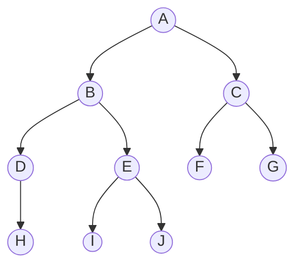

Tree is a 2d data structure 
parts: tree node(root or child or leaf)

root is starting point of a tree
child nodes are nodes connected from previous root node or child nodes

leaf nodes are nodes which are connected to previous root node or child nodes but they don't have any child or they don't expand further down

tree can't contain cycle

definition of a node:
```
class Node {
    public String name;
    public Node[] children;
}

 //tree class to wrap this node
 class Tree {
public Node root;
}
```

example of a tree



- **Root**: A
- **Internal nodes**: B, C, D, E
- **Leaf nodes**: H, I, J, F, G
- **Height**: 3
- **Depth of E**: 2
