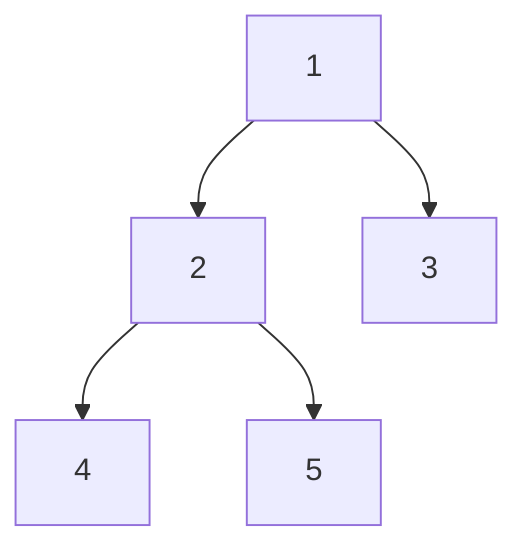

# Euler Tour Tree

## Overview
An Euler Tour Tree (ETT) is a data structure for dynamic connectivity problems. It represents a tree using an Euler tour (a traversal that visits each edge twice).

## Key Idea
- Perform a DFS traversal of the tree
- Record each node every time you visit it - both when entering and when backtracking
- This creates a sequence of length 2n-1 for a tree with n nodes
- Store this sequence in a balanced BST (e.g., treap)

## Example
Tree:


Euler Tour: `1 2 4 2 5 2 1 3 1`

## Operations

### Link(u, v)
Add edge between u and v:
1. Cut the tour at u's position
2. Insert v's tour segment

### Cut(u, v)
Remove edge between u and v:
1. Find positions of u and v in the tour
2. Remove the segment between them

### Connected(u, v)
Check if u and v are connected:
1. Find if u and v are in the same tour segment

## Pseudocode
```cpp
struct EulerTourTree {
    struct Node {
        int val;
        Node *left, *right, *parent;
        int size; // subtree size for order-statistics
    };
    
    Node* root;
    
    void dfs(Node* u, vector<int>& tour) {
        if (!u) return;
        tour.push_back(u->val);
        dfs(u->left, tour);
        dfs(u->right, tour);
    }
    
    void link(Node* u, Node* v) {
        // Add edge u-v
        // Rebuild tour with new edge
    }
    
    void cut(Node* u, Node* v) {
        // Remove edge u-v
        // Split tour at appropriate positions
    }
    
    bool connected(Node* u, Node* v) {
        // Check if u and v are in same connected component
        return findRoot(u) == findRoot(v);
    }
};
```

## Applications
- Dynamic connectivity
- Minimum spanning tree verification
- Network reliability

## Complexity
- Link, Cut, Connected: O(log n) amortized
- Space: O(n)
