##  Tree

### What is a Tree?

A **tree** is a **non-linear hierarchical data structure** used to store data in a **parent-child** relationship.

Unlike arrays or linked lists (which are linear), **trees branch out** like an actual tree — starting from a single **root** and growing through **nodes** connected by **edges**.

- each tree has a root node
- root node has zero or more child nodes
- each child node has zero or more child nodes

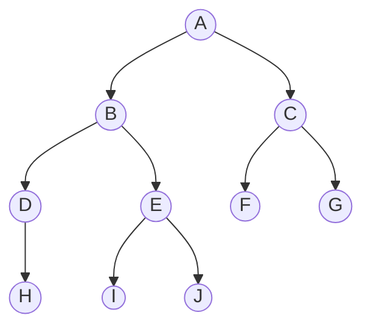

### Real-life Examples

- Folder structure in your computer
- Family tree
- Organization chart (CEO → Manager → Employees)

---

### Basic Terminology

| Term        | Meaning                                     |
| ----------- | ------------------------------------------- |
| **Node**    | A single element of the tree (stores data). |
| **Root**    | Topmost node (entry point).                 |
| **Child**   | Node directly connected below another node. Being pointed to |
| **Parent**  | Node directly above another node. Being pointed from           |
| **Leaf**    | Node with **no children** (end node).       |
| **Edge**    | The connection between parent and child.    |
| **Subtree** | A smaller tree within the main tree.        |
| **Height**  | Length of longest path from root to a leaf. |
| **Depth**   | Number of edges from root to the node.      |
| **Descendant**| All nodes that can be reached by following a path of child node from that node |
| **Ancestor** | ancestor of node is any other node that can reach it by following a series of children |
| **Diameter** | diameter of a tree is the maximum length of a path between two nodes.|


---

### Common Operations

- **Insertion**: Add a new node under a parent.
- **Traversal**: Visit all nodes in some order.

  - **Preorder** (Root → Left → Right)
    ```
      void preOrderTraversal(TreeNode node) {
        visit(node);
        preOrderTraversal(node,left);
        preOrderTraversal(node.right);
      }
    ```
  - **Inorder** (Left → Root → Right)
    ```
      void inOrderTraversal(TreeNode node) {
        if (node != null) {
          inOrderTraversal(node.left);
          visit(node);
          inOrderTraversal(node.right);
        }
      }
    ```
  - **Postorder** (Left → Right → Root)
    ```
      void postOrderTraversal(TreeNode node) {
        if (node != null) {
          postOrderTraversal(node.left);
          postOrderTraversal(node.right);
          visit(node);
        }
      }
    ```
  - **Level Order** (Breadth First)

- **Searching**: Find if a node exists.
- **Deletion**: Remove a node and restructure children if needed.

---

### Example (Simple Tree)

```
        A
       / \
      B   C
     / \
    D   E
```

- Root: A
- Children of A: B, C
- Parent of D: B
- Leaf nodes: D, E, C

---

### Why Use Trees?

- Fast hierarchical lookups
- Efficient insertion and deletion in sorted structure (like BSTs)
- Ideal for structured data: file systems, compilers, etc.

---

## Diameter of Tree
The diameter of a tree is the maximum length of a path between two nodes.
There are two algorithm, each having complexity of O(n) or linear time

### Algorithm 1

A general way to approach many tree problems is to first **root the tree arbitrarily**. After this, we can try to solve the problem separately for each subtree.

**Key Observation:** Every path in a rooted tree has a **highest point** — the highest node that belongs to the path. Thus, we can calculate for each node the length of the longest path whose highest point is that node. One of those paths corresponds to the diameter of the tree.

For example, in the following tree, node 1 is the highest point on the path that corresponds to the diameter:

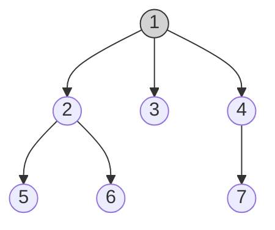

We calculate for each node $x$ two values:

- $\text{toLeaf}(x)$: the maximum length of a path from $x$ to any leaf
- $\text{maxLength}(x)$: the maximum length of a path whose highest point is $x$

For example, in the above tree:
- $\text{toLeaf}(1) = 2$, because there is a path $1 \to 2 \to 6$
- $\text{maxLength}(1) = 4$, because there is a path $6 \to 2 \to 1 \to 4 \to 7$

In this case, $\text{maxLength}(1)$ equals the diameter.

**Dynamic Programming (O(n)):**

1. To calculate $\text{toLeaf}(x)$: go through the children of $x$, choose a child $c$ with maximum $\text{toLeaf}(c)$, and add one to this value.
2. To calculate $\text{maxLength}(x)$: choose two distinct children $a$ and $b$ such that the sum $\text{toLeaf}(a) + \text{toLeaf}(b)$ is maximum, and add two to this sum.


### Algorithm 2

Another efficient way to calculate the diameter of a tree is based on **two depth-first searches**:

1. Choose an arbitrary node $a$ in the tree and find the farthest node $b$ from $a$.
2. Then, find the farthest node $c$ from $b$.
3. The diameter of the tree is the distance between $b$ and $c$.

**Example:** In the following graph, $a$, $b$ and $c$ could be:

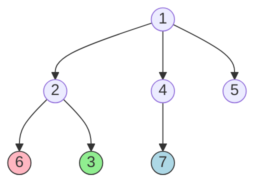

> $a$ = 3 (arbitrary start), $b$ = 6 (farthest from $a$), $c$ = 7 (farthest from $b$)

**Why does it work?**

It helps to draw the tree differently so that the path that corresponds to the diameter is **horizontal**, and all other nodes hang from it:

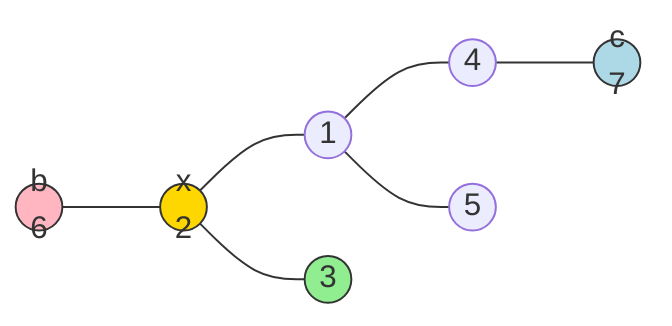

> Node $x$ indicates the place where the path from node $a$ joins the path that corresponds to the diameter.

The farthest node from $a$ is node $b$, node $c$, or some other node that is **at least as far** from node $x$. Thus, this node is always a valid choice for an endpoint of a path that corresponds to the diameter.

## All longest paths

Calculate for every node in the tree the maximum length of a path that begins at the node.

Time: **O(n)**

### Example

Consider the following tree:

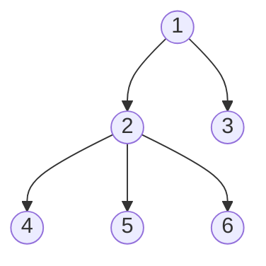

Let $\text{maxLength}(x)$ denote the maximum length of a path that begins at node $x$. For example, $\text{maxLength}(4) = 3$, because there is a path $4 \to 1 \to 2 \to 6$.

| node $x$ | 1 | 2 | 3 | 4 | 5 | 6 |
|-----------|---|---|---|---|---|---|
| $\text{maxLength}(x)$ | 2 | 2 | 3 | 3 | 3 | 3 |

### Part 1: Longest path through a child

Root the tree arbitrarily at node 1. Calculate for every node $x$ the maximum length of a path that goes **through a child** of $x$.

For example, the longest path from node 1 goes through its child 2:

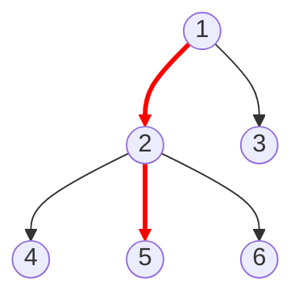

> Path: $1 \to 2 \to 5$ (length 2)

This part is easy to solve in **O(n)** time using dynamic programming as before.

### Part 2: Longest path through the parent

Calculate for every node $x$ the maximum length of a path through its **parent** $p$.

For example, the longest path from node 3 goes through its parent 1:

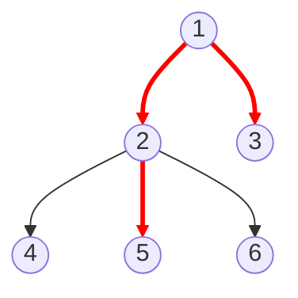

> Path: $3 \to 1 \to 2 \to 5$ (length 3)

**Problem:** The longest path from $p$ may go **through** $x$ itself. For example, the longest path from node 1 passes through node 2, so when computing for node 2, we can't reuse that same path.

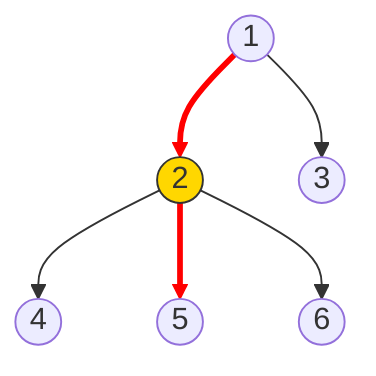

### Solution: Store two maximums

For each node $x$, store:

- $\text{maxLength}_1(x)$: the maximum length of a path from $x$ (through its best child)
- $\text{maxLength}_2(x)$: the maximum length of a path from $x$ in **another direction** than the first path

For example:
- $\text{maxLength}_1(1) = 2$ using path $1 \to 2 \to 5$
- $\text{maxLength}_2(1) = 1$ using path $1 \to 3$

**Final formula:** If the path corresponding to $\text{maxLength}_1(p)$ goes through $x$, then:

$$\text{max through parent} = \text{maxLength}_2(p) + 1$$

Otherwise:

$$\text{max through parent} = \text{maxLength}_1(p) + 1$$


---

## Tree Queries
example: 
- what is the kth ancestor of a node?
- what is the sum of values in the subtree of a node?
- what is the sum of values on a path between two nodes?
- what is the lowest common ancestor of two nodes?

### Finding Ancestor
kth ancestor of a node x in a rooted tree is the node that we will reach
if we move k levels up from x
denoted by ancestor(x,k) 

easy way to calculate any value of ancestor(x,k) is to perform a sequence
of k moves in the tree.

Time: O(k)

optimise by preprocessing {upto O(log k)}
idea is to precalculate all values ancestor(x,k) where k ≤ n is a power of two.

preprocessing takes O(nlogn) time, because O(logn) values are calculated for each node. 
After this, any value of ancestor(x,k) can be calculated in O(logk)
time by representing k as a sum where each term is a power of two.

---

## Subtrees and Path

A **tree traversal array** contains the nodes of a rooted tree in the order in which a depth-first search from the root node visits them.

### Example

Consider the following tree rooted at node 1:

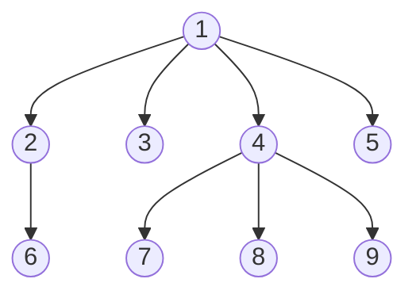

A depth-first search proceeds as follows:

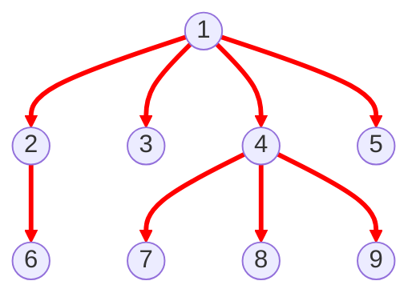

> DFS order: $1 \to 2 \to 6 \to 3 \to 4 \to 7 \to 8 \to 9 \to 5$

Hence, the corresponding tree traversal array is:

| 1 | 2 | 6 | 3 | 4 | 7 | 8 | 9 | 5 |
|---|---|---|---|---|---|---|---|---|

### Subtree Queries

Each subtree of a tree corresponds to a **subarray** of the tree traversal array such that the first element of the subarray is the root node.

For example, the subarray containing the nodes of the subtree of node 4:

| 1 | 2 | 6 | 3 | **4** | **7** | **8** | **9** | 5 |
|---|---|---|---|---|---|---|---|---|

> The highlighted portion `[4, 7, 8, 9]` is the subtree of node 4.

Using this fact, we can efficiently process queries related to subtrees.

---

### Example: Subtree Sum Queries

Consider a problem where each node is assigned a value, and we need to support:
- **Update** the value of a node
- **Calculate the sum** of values in the subtree of a node

Consider the following tree where the numbers below are the node values:

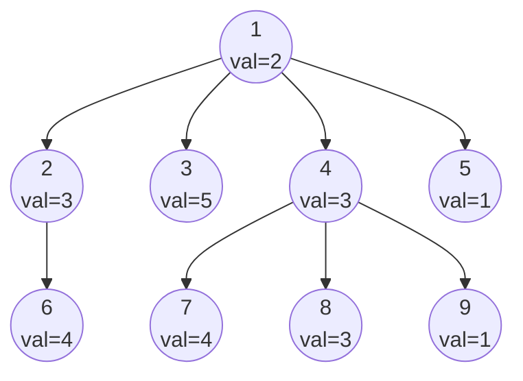

For example, the sum of the subtree of node 4 is $3 + 4 + 3 + 1 = 11$.

**Construct a tree traversal array** with three rows for each node:

| | 1 | 2 | 3 | 4 | 5 | 6 | 7 | 8 | 9 |
|---|---|---|---|---|---|---|---|---|---|
| **node id** | 1 | 2 | 6 | 3 | 4 | 7 | 8 | 9 | 5 |
| **subtree size** | 9 | 2 | 1 | 1 | 4 | 1 | 1 | 1 | 1 |
| **node value** | 2 | 3 | 4 | 5 | 3 | 4 | 3 | 1 | 1 |

To calculate the sum of values in any subtree:
1. Find the node's position in the traversal array
2. Read its subtree size $s$
3. Sum the next $s$ values starting from that position

For example, the values in the subtree of node 4 (position 5, size 4):

| | 1 | 2 | 3 | 4 | 5 | 6 | 7 | 8 | 9 |
|---|---|---|---|---|---|---|---|---|---|
| **node id** | 1 | 2 | 6 | 3 | **4** | **7** | **8** | **9** | 5 |
| **subtree size** | 9 | 2 | 1 | 1 | **4** | 1 | 1 | 1 | 1 |
| **node value** | 2 | 3 | 4 | 5 | **3** | **4** | **3** | **1** | 1 |

> Sum = $3 + 4 + 3 + 1 = 11$ ✓

**Efficient solution:** Store the node values in a **Binary Indexed Tree (Fenwick Tree)** or **Segment Tree**. This allows both updating a value and calculating the subtree sum in $O(\log n)$ time.


### Path Queries

Using a tree traversal array, we can also efficiently calculate **sums of values on paths from the root** to any node. Consider a problem where we need to support:

- **Change** the value of a node
- **Calculate the sum** of values on a path from the root to a node

#### Example

In the following tree, the sum of values from the root to node 7 is $4 + 5 + 5 = 14$:

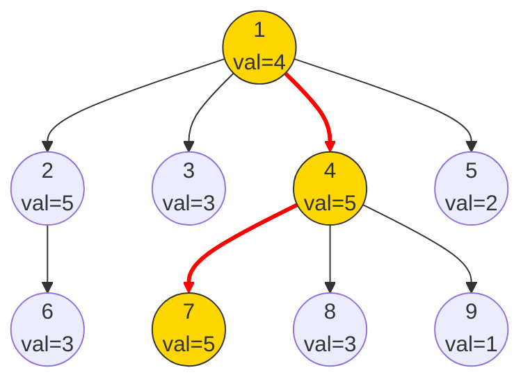

> Path: $1 \to 4 \to 7$, sum = $4 + 5 + 5 = 14$

We solve this like before, but now each value in the last row is the **sum of values on the path from the root** to that node:

| | 1 | 2 | 3 | 4 | 5 | 6 | 7 | 8 | 9 |
|---|---|---|---|---|---|---|---|---|---|
| **node id** | 1 | 2 | 6 | 3 | 4 | 7 | 8 | 9 | 5 |
| **subtree size** | 9 | 2 | 1 | 1 | 4 | 1 | 1 | 1 | 1 |
| **path sum** | 4 | 9 | 12 | 7 | 9 | 14 | 12 | 10 | 6 |

#### Handling Updates

When the value of a node increases by $x$, the path sums of **all nodes in its subtree** increase by $x$.

For example, if the value of node 4 increases by 1:

| | 1 | 2 | 3 | 4 | 5 | 6 | 7 | 8 | 9 |
|---|---|---|---|---|---|---|---|---|---|
| **node id** | 1 | 2 | 6 | 3 | 4 | 7 | 8 | 9 | 5 |
| **subtree size** | 9 | 2 | 1 | 1 | 4 | 1 | 1 | 1 | 1 |
| **path sum** | 4 | 9 | 12 | 7 | **10** | **15** | **13** | **11** | 6 |

> Node 4's subtree (positions 5–8) all increased by 1.

**Key insight:** To support both operations, we need to:
- **Increase all values in a range** (when a node value changes, update its subtree range)
- **Retrieve a single value** (query the path sum for a node)

This can be done in $O(\log n)$ time using a **Binary Indexed Tree** or **Segment Tree** with range updates and point queries.

---

## Lowest Common Ancestor (LCA)

The **lowest common ancestor** of two nodes of a rooted tree is the lowest node whose subtree contains both the nodes. A typical problem is to efficiently process queries that ask to find the LCA of two nodes.

### Example

In the following tree, the lowest common ancestor of nodes 5 and 8 is **node 2**:

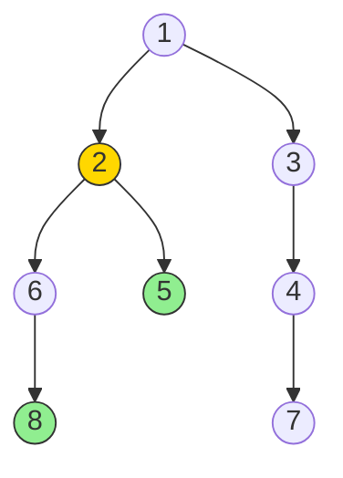

---

### Method 1: Using $k$-th Ancestor

Use the fact that we can efficiently find the $k$-th ancestor of any node. Divide the problem into two parts:

**Step 1:** Move one pointer upward so both pointers are at the **same depth**.

Move the pointer at node 8 one level up to node 6 (same level as node 5):

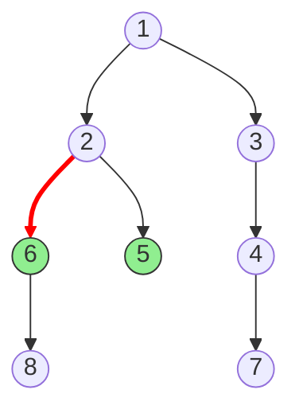

> Pointer moved: $8 \to 6$ (now both at depth 3)

**Step 2:** Move both pointers upward simultaneously until they meet. That node is the LCA.

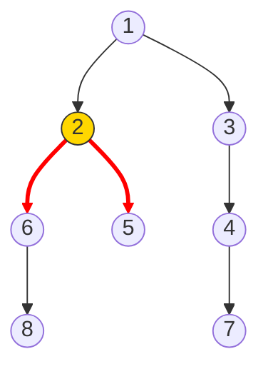

> Both pointers move up one step: $5 \to 2$ and $6 \to 2$. LCA = **node 2**.

Since both parts use precomputed $k$-th ancestor information, we can find the LCA in $O(\log n)$ time.

---

### Method 2: Euler Tour + Range Minimum Query

Add each node to the array **every time** the DFS walks through it (not just the first visit). A node with $k$ children appears $k + 1$ times, giving a total of $2n - 1$ entries.

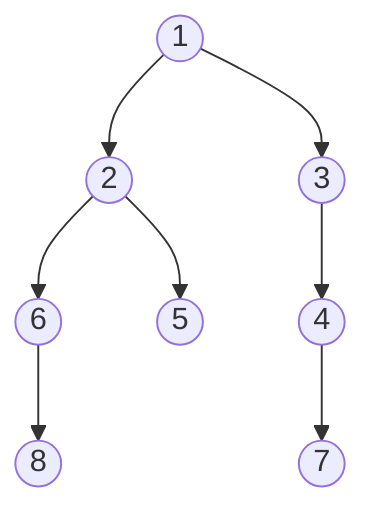

The Euler tour traversal array:

| position | 0 | 1 | 2 | 3 | 4 | 5 | 6 | 7 | 8 | 9 | 10 | 11 | 12 | 13 | 14 |
|---|---|---|---|---|---|---|---|---|---|---|---|---|---|---|---|
| **node id** | 1 | 2 | 5 | 2 | 6 | 8 | 6 | 2 | 1 | 3 | 1 | 4 | 7 | 4 | 1 |
| **depth** | 1 | 2 | 3 | 2 | 3 | 4 | 3 | 2 | 1 | 2 | 1 | 2 | 3 | 2 | 1 |

To find the LCA of nodes $a$ and $b$: find the node with **minimum depth** between positions of $a$ and $b$ in the array.

**Example:** LCA of nodes 5 and 8:

- Node 5 is at position 2, node 8 is at position 5
- Between positions 2...5, the minimum depth is **2** at position 3 (node 2)

| position | 0 | 1 | **2** | **3** | **4** | **5** | 6 | 7 | 8 | 9 | 10 | 11 | 12 | 13 | 14 |
|---|---|---|---|---|---|---|---|---|---|---|---|---|---|---|---|
| **node id** | 1 | 2 | **5** | **2** | **6** | **8** | 6 | 2 | 1 | 3 | 1 | 4 | 7 | 4 | 1 |
| **depth** | 1 | 2 | **3** | **2** ↑ | **3** | **4** | 3 | 2 | 1 | 2 | 1 | 2 | 3 | 2 | 1 |

> LCA(5, 8) = node 2 (minimum depth = 2 at position 3) ✓

Since the array is static, we can process range minimum queries in $O(1)$ time after $O(n \log n)$ preprocessing (sparse table).

---

## Distances of Nodes

The distance between nodes $a$ and $b$ equals the length of the path from $a$ to $b$. This problem **reduces to finding the LCA**.

After rooting the tree, the distance is:

$$\text{dist}(a, b) = \text{depth}(a) + \text{depth}(b) - 2 \cdot \text{depth}(c)$$

where $c = \text{LCA}(a, b)$.

### Example

Distance between nodes 5 and 8:

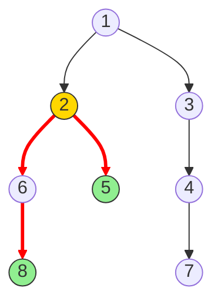

- $\text{LCA}(5, 8) = 2$
- $\text{depth}(5) = 3$, $\text{depth}(8) = 4$, $\text{depth}(2) = 2$

$$\text{dist}(5, 8) = 3 + 4 - 2 \cdot 2 = 3$$

> Path: $5 \to 2 \to 6 \to 8$ (length 3) ✓

