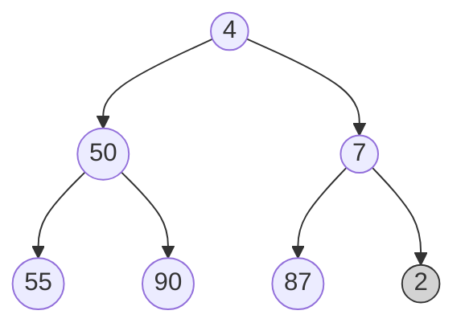
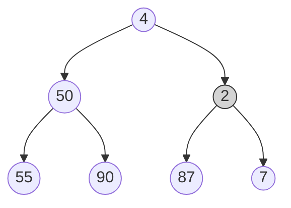
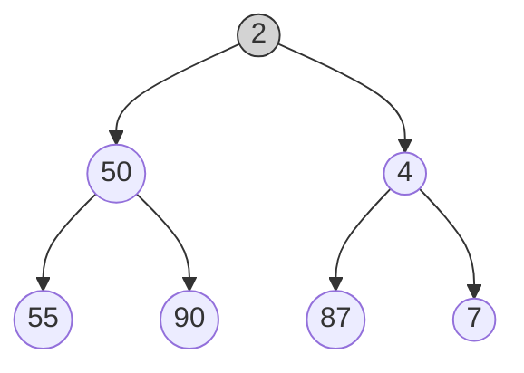

# Heap Data Structure

---

### 📌 What is a Heap?

A **Heap** is a special **complete binary tree** where the value at each node satisfies the **heap property**:

- **Max-Heap**: Every parent is **greater than or equal** to its children
- **Min-Heap**: Every parent is **less than or equal** to its children

👉 A heap is **not** a BST — ordering is only between **parent and children**, not among siblings or across subtrees.

---

### 🧠 Why Use a Heap?

- 🔍 **Fast access to the min/max element** in O(1)
- 🚀 **Priority Queues** (most common real-world use)
- 📉 Sorting (**Heap Sort** algorithm)
- 🔢 Efficient **median**, **top K**, and **Dijkstra’s shortest path**

---

### 🧱 Heap Properties

1. ✅ **Complete Binary Tree**: All levels are full except maybe the last, which is filled **left to right**
2. ✅ **Heap Property**:

   - **Max-Heap**: `parent >= children`
   - **Min-Heap**: `parent <= children`

3. ✅ Stored efficiently in **arrays**

---

### 🧮 Heap as Array

Heap is **not built with pointers**, it's often implemented using arrays.

#### For node at index `i`:

```
Parent:      (i - 1) / 2
Left Child:  (2 * i) + 1
Right Child: (2 * i) + 2
```

### Example (Max Heap):

Input array: `[50, 30, 40, 10, 5, 20, 30]`

Visual Tree:

```
         50
       /    \
     30      40
    /  \    /  \
  10   5  20   30
```

---

##  Operations in Heap

---

###  Insertion

**Steps**:

1. Insert the new element at the **end** (maintains complete tree)
2. **Heapify Up (Bubble Up)**: Compare with parent, swap if needed

**Step 1: Insert 2** (added at end)



**Step 2: Swap 2 and 7** (heapify up — 2 < 7)



**Step 3: Swap 2 and 4** (heapify up — 2 < 4)



**Time Complexity**: O(log n) — height of the tree


---

### Deletion (Usually remove max/min i.e., root)

**Steps**:

1. Replace root with the **last element**
2. Remove last element
3. **Heapify Down**: Swap root with its larger/smaller child until heap property is restored

**Time Complexity**: O(log n)

---

### 🔄 Heapify

`heapify()` is used to fix the heap from a node downward.

For **building a heap** from array in O(n), we apply heapify **bottom-up**.

---

## ⏱️ Time & Space Complexity

| Operation      | Time     | Space |
| -------------- | -------- | ----- |
| Insert         | O(log n) | O(1)  |
| Delete root    | O(log n) | O(1)  |
| Peek (min/max) | O(1)     | O(1)  |
| Heapify all    | O(n)     | O(1)  |

---

### 🔄 Build Heap in O(n)? Yes!

We can **build a heap from an array** using **heapify from bottom up**:

```cpp
for (int i = n/2 - 1; i >= 0; i--) {
    heapify(arr, n, i);
}
```

---

### 📦 Priority Queue = Heap with Interface

`std::priority_queue` in C++ = Max-Heap by default
Use custom comparator to create min-heap or custom objects.

---

### 🔁 Heap Sort

**Steps**:

1. Build a max-heap
2. Swap root with last
3. Reduce heap size and heapify root
4. Repeat

**Time Complexity**: O(n log n)
**Space**: In-place (O(1))

---

### ✅ C++ Code Example – Max Heap

```cpp
void heapify(vector<int>& arr, int n, int i) {
    int largest = i;
    int l = 2*i + 1;
    int r = 2*i + 2;

    if (l < n && arr[l] > arr[largest])
        largest = l;
    if (r < n && arr[r] > arr[largest])
        largest = r;
    if (largest != i) {
        swap(arr[i], arr[largest]);
        heapify(arr, n, largest);
    }
}

void buildHeap(vector<int>& arr, int n) {
    for (int i = n/2 - 1; i >= 0; i--)
        heapify(arr, n, i);
}
```

---

### 📚 Applications of Heap

- ✅ **Priority Queues**
- ✅ **Dijkstra's Algorithm** (Shortest path)
- ✅ **Huffman Coding**
- ✅ **Median in stream**
- ✅ **K largest/smallest elements**
- ✅ **Job Scheduling**
- ✅ **Load Balancing**

---

## 🔥 Summary

| Feature       | Description                      |
| ------------- | -------------------------------- |
| Tree Type     | Complete Binary Tree             |
| Heap Types    | Max-Heap, Min-Heap               |
| Data Storage  | Array-based                      |
| Insert/Delete | O(log n)                         |
| Peek Top      | O(1)                             |
| Applications  | Priority Queues, Graphs, Sorting |

---

## 🔄 Visual Recap

### Max-Heap:

```
Input: [10, 20, 30, 5, 7, 25]

          30
         /  \
       20    25
      /  \
    5     7
   /
 10
```

### Heap Insert:

```
Insert 27:

Before Insert:
          30
         /  \
       20    25
      /  \   /
    5    7  10

After Insert:
          30
         /  \
       27    25
      /  \   /
    20   7  10
   /
  5
```

---

### ✅ Advanced Types of Heaps

- **Binomial Heap**
- **Fibonacci Heap**
- **Pairing Heap**
- **Skew Heap**

For 99% real-world usage, **Binary Heaps (Min/Max)** are enough.
