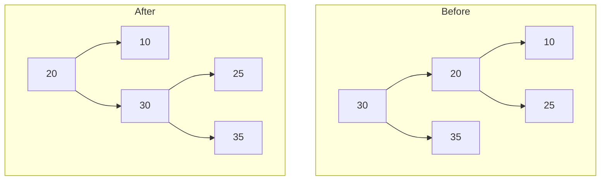
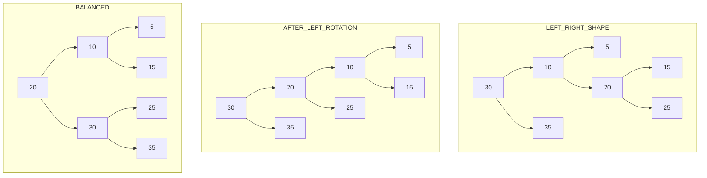
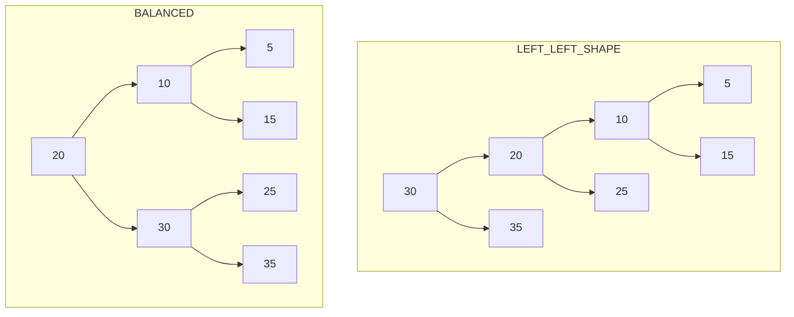
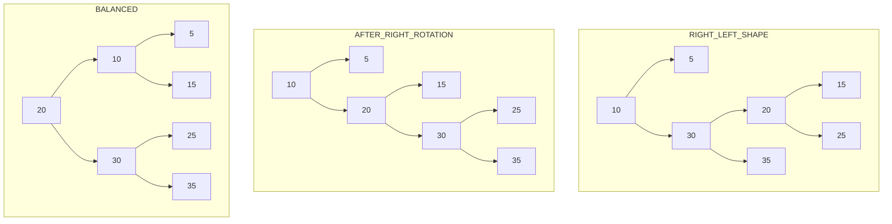
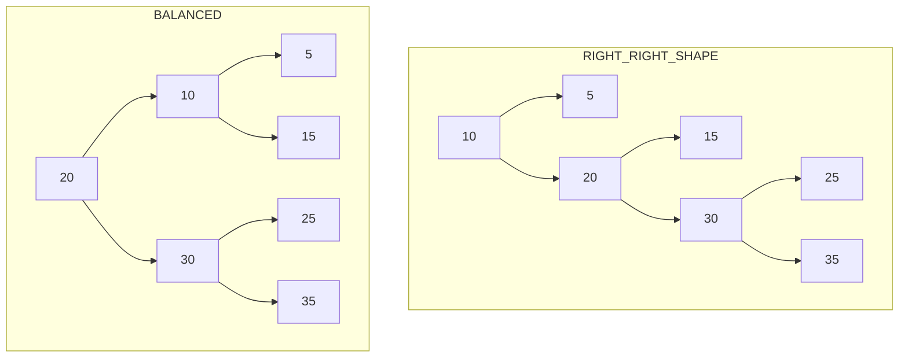

# Height Balanced Binary Search Tree/AVL Tree

one of two common ways to balance a tree: AVL Tree

An AVL tree stores in each node the height of the subtrees rooted at this node.
Then, for any node, we can check if it is height balanced:
height of the left subtree and the height of the right subtree differ by no more than one.
This prevents situations where the tree gets too lopsided.

balance(n) = n.left.height-n.right.height
-1 <= balance(n) <= 1

## Insertion

while inserting nodes into an height balanced tree, it may happen the the height balance get disturbed
might change to -2 or 2
hence we recursively balance each node after each insertion by rotations
rotations: left or right

There are only 2 cases: when balance is 2 or -2

### **Case 1: Balance = +2 (Left Heavy)**

**Left-Right (LR) Case → Left Rotation + Right Rotation**

Steps:

1. Left rotation on left child.
2. Right rotation on root.
3. Tree becomes balanced.

---

**Left-Left (LL) Case → Single Right Rotation**

**Step:**

- Single right rotation on root.

### Case 2: Balance = -2 (Right Heavy)

**Right-Left (RL) Case → Right Rotation + Left Rotation**

Steps:

1. Right rotation on right child.
2. Left rotation on root.
3. Tree becomes balanced.

---

**Right-Right (RR) Case → Single Left Rotation**

Step:

- Single left rotation on root.

---

# Important Notes (AVL Rule)

- Balance Factor = height(left) − height(right)
- Valid range: **−1, 0, +1**
- If +2 → Left heavy
- If −2 → Right heavy
- Fix locally, then recurse upward.
