# Red Black Tree

They are a type of self-balancing binary search tree that don't have strict balancing.
But their balancing is still good enough to ensure O(log N) insertions, deletions, and retrievals.
They require less memory & can rebalance faster.

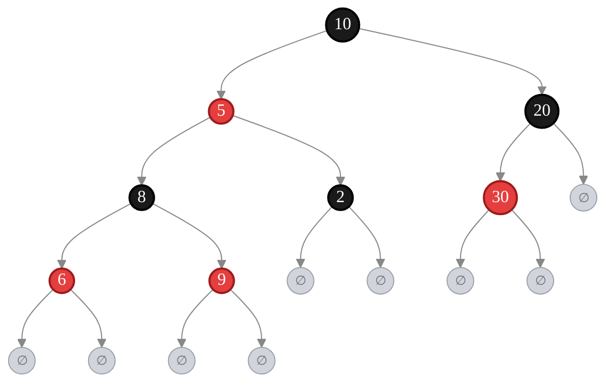

**Properties:**

1. Every node is either red or black.
2. The root is black.
3. The leaves, which are NULL nodes, are considered black.
4. Every red node must have two black children. That is, a red node cannot have red children (although a black node can have black children).
5. Every path from a node to its leaves must have the same number of black nodes.
6. A red-black tree with n internal nodes has height at most 2 lg(n +1).

---

## Rotations

Rotations are local pointer-restructuring operations that preserve the BST property. They run in O(1) time — only pointers change, no key comparisons needed.
There are two kinds: Left Rotate and Right Rotate. They are inverses of each other.

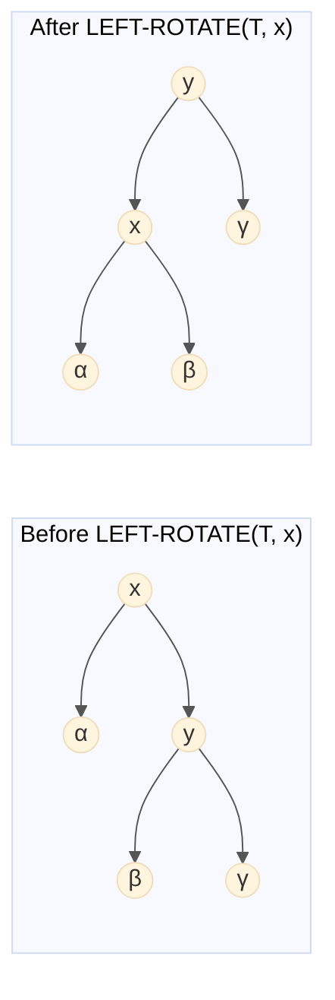

BST order preserved: α ≤ x ≤ β ≤ y ≤ γ — holds both before and after rotation.

**LEFT-ROTATE(T, x)**
Intuition: Pivot around the x → y link. y rises up, x descends left. y's left child (β) is "handed off" to x as its new right child.

```
LEFT-ROTATE(T, x):
 1  y = x.right              // Set y (must not be NIL)
 2  x.right = y.left         // Turn y's left subtree into x's right subtree
 3  if y.left ≠ T.nil
 4      y.left.parent = x
 5  y.parent = x.parent      // Link x's parent to y
 6  if x.parent = T.nil
 7      T.root = y            // x was root → y becomes new root
 8  else if x = x.parent.left
 9      x.parent.left = y     // x was a left child
10  else
11      x.parent.right = y    // x was a right child
12  y.left = x               // Put x on y's left
13  x.parent = y
```

**RIGHT-ROTATE(T, y)**
Intuition: The exact mirror of LEFT-ROTATE. Pivot around y → x link. x rises up, y descends right. x's right child (β) is "handed off" to y as its new left child.

```
RIGHT-ROTATE(T, y):
 1  x = y.left              // Set x (must not be NIL)
 2  y.left = x.right        // Turn x's right subtree into y's left subtree
 3  if x.right ≠ T.nil
 4      x.right.parent = y
 5  x.parent = y.parent     // Link y's parent to x
 6  if y.parent = T.nil
 7      T.root = x           // y was root → x becomes new root
 8  else if y = y.parent.right
 9      y.parent.right = x   // y was a right child
10  else
11      y.parent.left = x    // y was a left child
12  x.right = y             // Put y on x's right
13  y.parent = x
```

| Step               | LEFT-ROTATE(T, x) | RIGHT-ROTATE(T, y) |
| ------------------ | ----------------- | ------------------ |
| Rising node        | y = x.right       | x = y.left         |
| Handed-off subtree | y.left → x.right  | x.right → y.left   |
| Final link         | y.left = x        | x.right = y        |

> RIGHT-ROTATE is the symmetric inverse of LEFT-ROTATE — every left ↔ right reference is swapped.

**Example: LEFT-ROTATE(T, 11)**
Node 18 (y) rises to where 11 (x) was. Node 14 (y's old left child β) is handed off to 11 as its new right child.

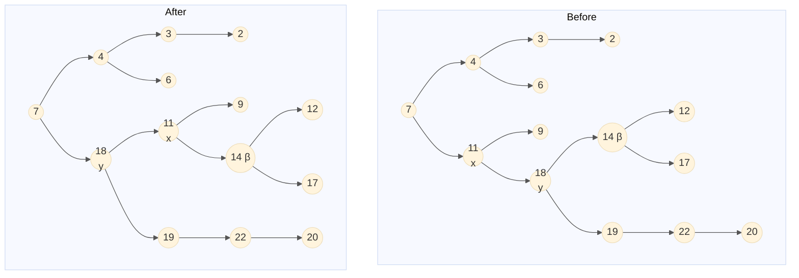

---

## Insertion

Inserting a new node into a red-black tree starts with a typical **binary search tree insertion**, then fixes any violations.

- New nodes are inserted at a leaf, replacing a NULL (black) node.
- New nodes are **always colored red** and given two black NULL leaf nodes.

After insertion, we fix any **red-black property violations**. There are two possible violations:

- **Red violation:** A red node has a red child (or the root is red).
- **Black violation:** One path has more black nodes than another.

Since we only insert a red node, we don't change the black-node count on any path → **no black violation possible**. But we **might** get a red violation.

> Special case: if the **root ends up red**, simply recolor it black. This satisfies Property 2 without breaking anything else.

### Terminology

Let:

- **z(N)** = newly inserted node (red)
- **p[z] (P)** = N's parent (red, since we have a red violation)
- **p[p[z]] (G)** = N's grandparent (must be **black**, since there was no prior red violation)
- **y (U)** = N's uncle (P's sibling) — color unknown

```
RB-INSERT(T, z):
 1  y = nil[T]               // y will track parent of x
 2  x = root[T]
 3  while x ≠ nil[T]         // Walk down the tree
 4      y = x
 5      if key[z] < key[x]
 6          x = left[x]
 7      else
 8          x = right[x]
 9  p[z] = y                 // Set z's parent
10  if y = nil[T]
11      root[T] = z          // Tree was empty
12  else if key[z] < key[y]
13      left[y] = z
14  else
15      right[y] = z
16  left[z]  = nil[T]        // Initialize z's children as NIL
17  right[z] = nil[T]
18  color[z] = RED           // Always insert red
19  RB-INSERT-FIXUP(T, z)    // Fix any violations

RB-INSERT-FIXUP(T, z):
 1  while color[p[z]] = RED
 2      if p[z] = left[p[p[z]]]       // Parent is a LEFT child
 3          y = right[p[p[z]]]        // y = uncle
 4          if color[y] = RED
 5              color[p[z]]    = BLACK   ▷ Case 1
 6              color[y]       = BLACK   ▷ Case 1
 7              color[p[p[z]]] = RED     ▷ Case 1
 8              z = p[p[z]]             ▷ Case 1 — move z up
 9          else
10              if z = right[p[z]]
11                  z = p[z]            ▷ Case 2 — move z up
12                  LEFT-ROTATE(T, z)   ▷ Case 2 — reduces to Case 3
13              color[p[z]]    = BLACK  ▷ Case 3
14              color[p[p[z]]] = RED    ▷ Case 3
15              RIGHT-ROTATE(T, p[p[z]]) ▷ Case 3
16      else                            // Parent is a RIGHT child (mirror)
17          (same as above with "left" and "right" exchanged)
18  color[root[T]] = BLACK              // Ensure root is always black
```

---

### Case 1: U is Red

It doesn't matter whether U/P/N are left or right children — this merges 4 of the 8 possible cases.

**Fix:** Toggle the colors of P, U, and G:

- Flip **G** from black → red
- Flip **P** and **U** from red → black

This preserves the black-node count on every path.

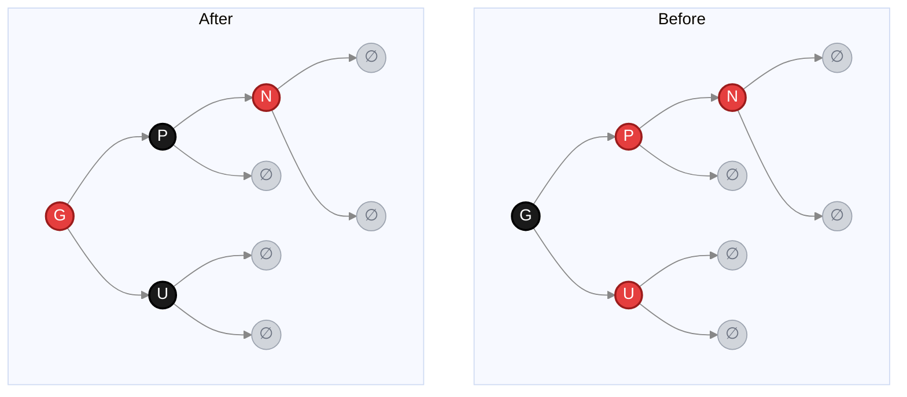

> Making G red might create a new red violation with G's parent. If so, **recursively apply the same logic** with G as the new N.

---

### Case 2: U is Black

Now we need to consider the relative positions (left/right) of N and P. We fix with **rotations + recoloring**. The goal is to fix the red violation without:

- Disrupting the BST ordering
- Introducing a black violation

In each subcase, **the middle element by value among N, P, G becomes the new root of the subtree**, and it swaps colors with G.

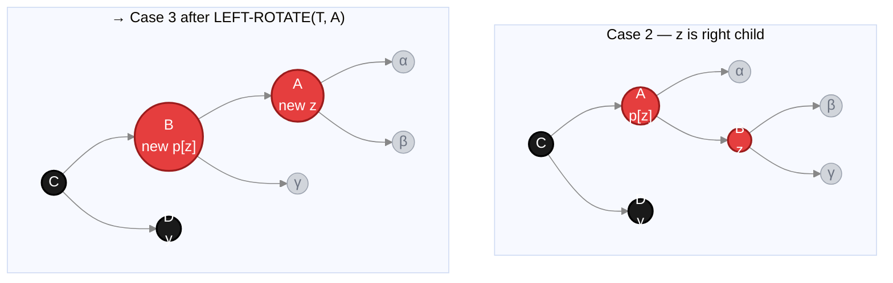

#### Case A: N and P are both left children

**Fix:** Right-rotate at G, then recolor — P becomes the new subtree root (black), G becomes red.

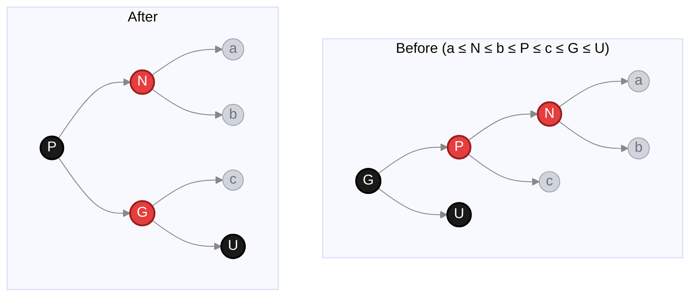

#### Case B: P is a left child, N is a right child

**Fix:** Left-rotate at P (reduces to Case A), then apply Case A's fix. N becomes the new subtree root (black), G becomes red.

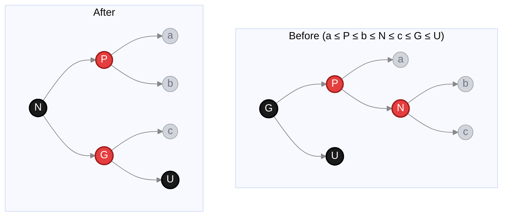

#### Case C: N and P are both right children

Mirror image of **Case A**. Left-rotate at G, recolor — P becomes new subtree root (black), G becomes red.

#### Case D: P is a right child, N is a left child

Mirror image of **Case B**. Right-rotate at P, then apply Case C's fix — N becomes new subtree root (black), G becomes red.

---

### Summary Table

| Case | U's color | Configuration               | Fix                                            |
| ---- | --------- | --------------------------- | ---------------------------------------------- |
| 1    | 🔴 Red    | Any                         | Recolor P, U → black; G → red. Recurse up.     |
| 2A   | ⚫ Black  | P and N both left children  | Right-rotate G; swap G & P colors              |
| 2B   | ⚫ Black  | P is left, N is right child | Left-rotate P → becomes Case A                 |
| 2C   | ⚫ Black  | P and N both right children | Left-rotate G; swap G & P colors (mirror of A) |
| 2D   | ⚫ Black  | P is right, N is left child | Right-rotate P → becomes Case C (mirror of B)  |

> **Key insight:** Don't memorize the cases — understand _why_ they work. Each rotation/recolor must preserve (1) BST ordering, (2) equal black-node counts on all paths, and (3) no red-red parent-child pair.

Time: O(log n)

---

## Deletion

Like insertion, deletion on an n-node RBT takes **O(log n)** time. It's a minor modification of regular BST deletion, followed by a fixup procedure that restores red-black properties.

**Key idea:** We splice out a node y (either z itself, or z's in-order successor). If y was **red**, no properties are violated. If y was **black**, we have a problem — we've lost a black node from some paths.

### When y is red — no fix needed:

- No black-heights changed.
- No two red nodes became adjacent.
- Root remains black (a red node can't be root).

### When y is black — three problems may arise:

1. If y was the root and a red child becomes the new root → **Property 2 violated**.
2. If x (y's replacement) and p[y] are both red → **Property 4 violated**.
3. Any path through where y was now has **one fewer black node** → **Property 5 violated**.

**Fix:** We "push" y's blackness onto its child x, making x **doubly black** (or **red-and-black**). The goal of FIXUP is to move this extra black up the tree until it can be absorbed.

---

### RB-DELETE(T, z) — Pseudocode

```
RB-DELETE(T, z):
 1  if left[z] = nil[T] or right[z] = nil[T]
 2      y = z                       // z has at most one child → splice out z
 3  else
 4      y = TREE-SUCCESSOR(z)       // z has two children → splice out successor
 5  if left[y] ≠ nil[T]
 6      x = left[y]                 // x = y's non-nil child (or nil if none)
 7  else
 8      x = right[y]
 9  p[x] = p[y]                     // Unconditional: link x's parent (even if x = nil)
10  if p[y] = nil[T]
11      root[T] = x                 // y was root
12  else if y = left[p[y]]
13      left[p[y]] = x
14  else
15      right[p[y]] = x
16  if y ≠ z
17      key[z] = key[y]             // Copy y's key (and satellite data) into z
18  if color[y] = BLACK
19      RB-DELETE-FIXUP(T, x)       // Only fix if we removed a black node
20  return y
```

> Line 9 sets `p[x] = p[y]` **unconditionally** — even if x is the nil sentinel. This ensures FIXUP can navigate upward from x correctly.

---

### RB-DELETE-FIXUP(T, x) — Pseudocode

Runs while x is not the root **and** x is "doubly black". Maintains a pointer **w** to x's sibling.

```
RB-DELETE-FIXUP(T, x):
 1  while x ≠ root[T] and color[x] = BLACK
 2      if x = left[p[x]]           // x is a LEFT child
 3          w = right[p[x]]         // w = sibling of x
 4          if color[w] = RED
 5              color[w]    = BLACK           ▷ Case 1
 6              color[p[x]] = RED             ▷ Case 1
 7              LEFT-ROTATE(T, p[x])          ▷ Case 1
 8              w = right[p[x]]               ▷ Case 1 — update sibling
 9          if color[left[w]] = BLACK and color[right[w]] = BLACK
10              color[w] = RED                ▷ Case 2
11              x = p[x]                      ▷ Case 2 — move x up
12          else
13              if color[right[w]] = BLACK
14                  color[left[w]] = BLACK    ▷ Case 3
15                  color[w]       = RED      ▷ Case 3
16                  RIGHT-ROTATE(T, w)        ▷ Case 3
17                  w = right[p[x]]           ▷ Case 3 — update sibling
18              color[w]        = color[p[x]] ▷ Case 4
19              color[p[x]]     = BLACK       ▷ Case 4
20              color[right[w]] = BLACK       ▷ Case 4
21              LEFT-ROTATE(T, p[x])          ▷ Case 4
22              x = root[T]                   ▷ Case 4 — terminates loop
23      else
24          (same as above with "left" and "right" exchanged)
25  color[x] = BLACK                // Remove extra black (or fix red-and-black)
```

---

### The Four Cases (when x is a LEFT child)

In all cases, x has an "extra" black. **w** is x's sibling. The goal: redistribute the extra black without breaking any properties.

---

#### Case 1: Sibling w is RED

w must have black children. Swap colors of w and p[x], then LEFT-ROTATE at p[x]. This converts Case 1 into Case 2, 3, or 4 — the loop does **not** terminate directly here.

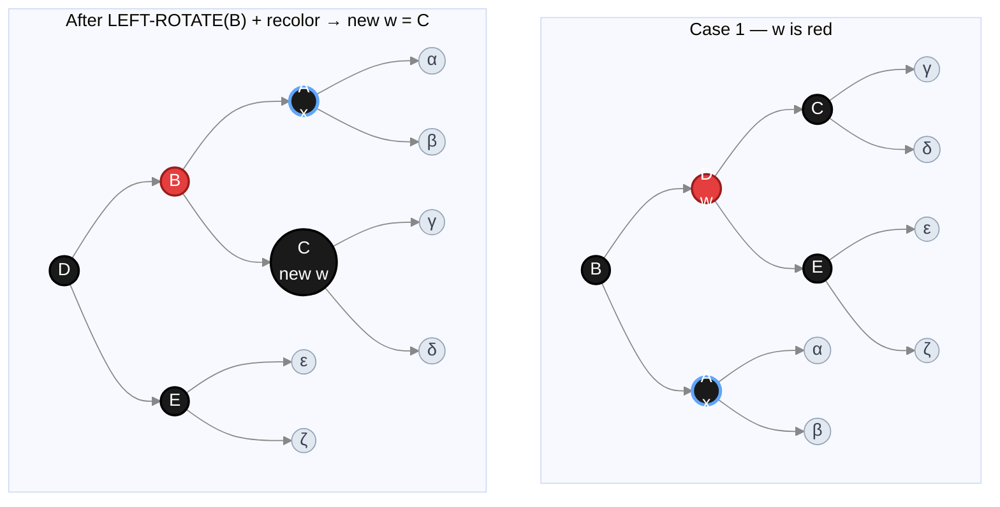

> New sibling C is black → now falls into Case 2, 3, or 4.

---

#### Case 2: Sibling w is BLACK, both of w's children are BLACK

Take one black off both x and w. Color w red, move x up to p[x]. If p[x] was red (red-and-black), the loop terminates immediately and line 25 makes it singly black.

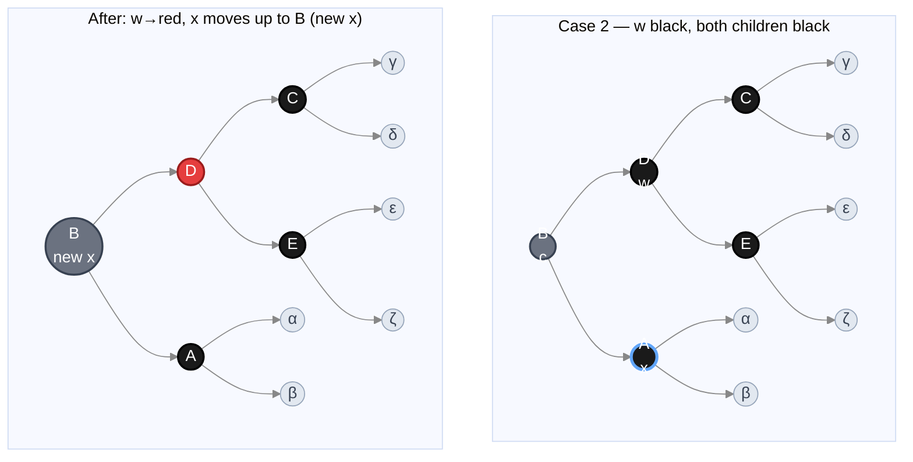

> Only case where loop **repeats**. x moves up the tree — O(log n) iterations possible.

---

#### Case 3: Sibling w is BLACK, w's left child is RED, w's right child is BLACK

Swap colors of w and left[w], then RIGHT-ROTATE at w. This transforms Case 3 into Case 4. Loop does **not** terminate here.

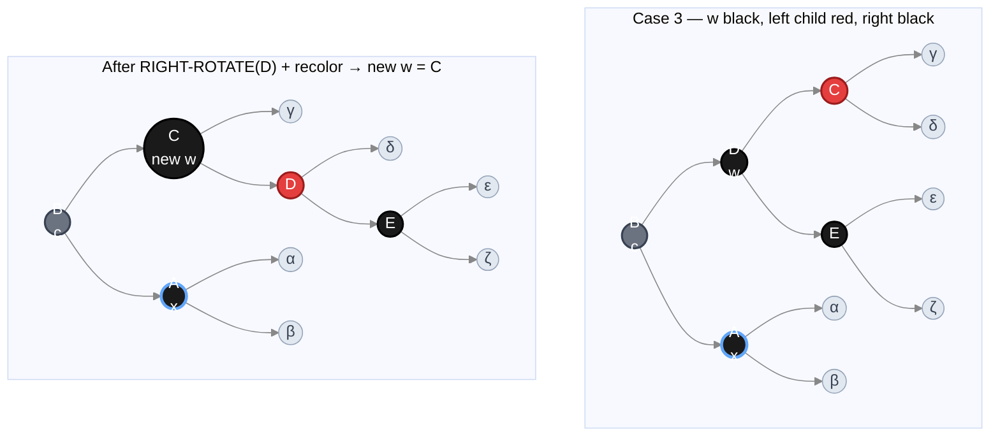

> New sibling C has a red right child D → now Case 4.

---

#### Case 4: Sibling w is BLACK, w's right child is RED

The "final" case — absorbs the extra black cleanly. Recolor + LEFT-ROTATE at p[x], then set x = root → **loop terminates**.

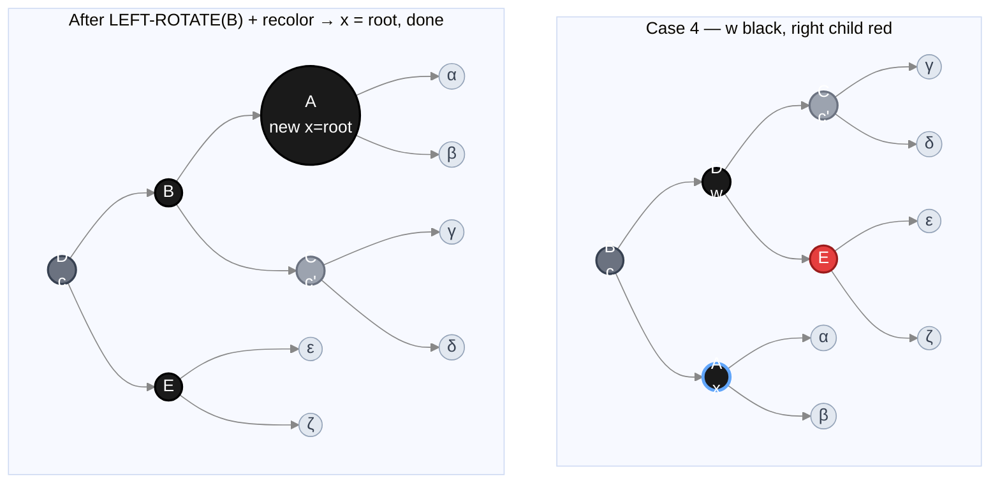

> x is set to root → while condition fails → loop exits. Extra black is removed.

---

### Summary Table

| Case | Sibling w | w's children          | Fix                                                                          | Loop?                                    |
| ---- | --------- | --------------------- | ---------------------------------------------------------------------------- | ---------------------------------------- |
| 1    | 🔴 Red    | (black, must be)      | Recolor w↔p[x], LEFT-ROTATE p[x]. Updates sibling.                          | → Case 2/3/4                             |
| 2    | ⚫ Black  | Both black            | w → red, x = p[x]. Push extra black up.                                      | **Continues** (or exits if p[x] was red) |
| 3    | ⚫ Black  | Left red, right black | Recolor left[w]↔w, RIGHT-ROTATE w. Updates sibling.                         | → Case 4                                 |
| 4    | ⚫ Black  | Right red             | w gets p[x]'s color, p[x]→black, right[w]→black, LEFT-ROTATE p[x]. x = root. | **Terminates**                           |

> **Flow:** Case 1 → (2, 3, or 4). Case 3 → Case 4. Cases 2, 4 terminate (directly or via root). Only Case 2 repeats the loop — and it moves x up each time.

---

### Analysis

| Operation                                                        | Time          |
| ---------------------------------------------------------------- | ------------- |
| RB-DELETE without FIXUP (BST walk)                               | O(log n)      |
| FIXUP — Cases 1, 3, 4 (constant rotations + recolors, terminate) | O(1) each     |
| FIXUP — Case 2 only (x moves up, no rotations)                   | O(log n)      |
| **Rotations total**                                              | **At most 3** |
| **RB-DELETE total**                                              | **O(log n)**  |

> RB-DELETE-FIXUP performs at most **3 rotations** overall and runs in O(log n) time.
