# Heap

A **heap** is a specialized tree-based data structure that satisfies the **heap property**. It is a complete binary tree stored efficiently in an array.

There are two types:

- **Max-Heap**: Every parent node is **greater than or equal to** its children. The largest element is at the root.
- **Min-Heap**: Every parent node is **less than or equal to** its children. The smallest element is at the root.

## Key Properties

- **Complete Binary Tree**: All levels are fully filled except possibly the last, which is filled left to right.
- **Heap Property**: Parent-child ordering is maintained throughout the tree.
- **Array Representation**: No pointers needed. For a node at index `i`:
  - Left child → `2i + 1`
  - Right child → `2i + 2`
  - Parent → `⌊(i - 1) / 2⌋`

**Visual Diagram — Max-Heap**

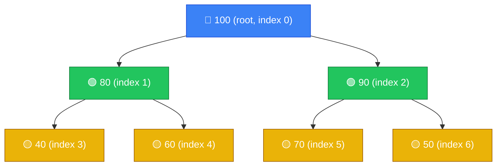

> Array representation: `[100, 80, 90, 40, 60, 70, 50]`

**Visual Diagram — Min-Heap**

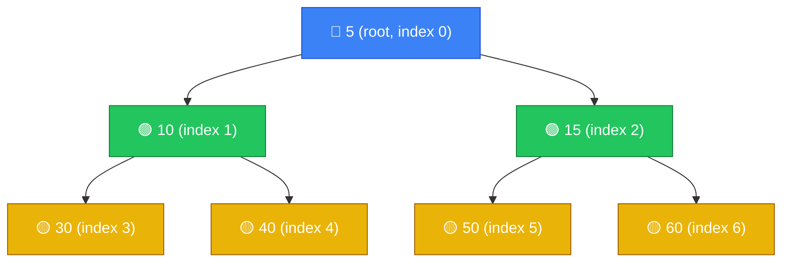

> Array representation: `[5, 10, 15, 30, 40, 50, 60]`

- `MAKE-HEAP()` creates and returns a new heap containing no elements.
- `INSERT(H, x)` inserts node x, whose key field has already been filled in, into heap H.
- `MINIMUM(H)` returns a pointer to the node in heap H whose key is minimum.
- `EXTRACT-MIN(H)` deletes the node from heap H whose key is minimum, returning a pointer to the node.
- `UNION(H1, H2)` creates and returns a new heap that contains all the nodes of heaps H1 and H2. Heaps H1 and H2 are “destroyed” by this operation.
- `DECREASE-KEY(H, x, k)` assigns to node x within heap H the new key value k, which is assumed to be no greater than its current key value.1
- `DELETE(H, x)` deletes node x from heap H.

Operations other than UNION run in worst-case time $O(lg n)$ (or better) on a binary heap.

## Binomial Tree

It is an ordered tree defined recursively.

**Properties:**
For the binomial tree Bk,

- **B₀** is a single node.
- **Bₖ** is formed by linking two Bₖ₋₁ trees — one becomes the leftmost child of the other's root.

1. there are $$2^{k}$$ nodes,
2. the height of the tree is k,
3. there are exactly K c i nodes at depth i for i=0, 1, . . . , k, and
4. the root has degree k, which is greater than that of any other node; moreover if
   the children of the root are numbered from left to right by k−1, k−2, . . . , 0,
   child i is the root of a subtree Bi.

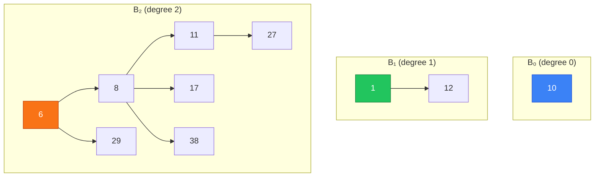

## Binomial Heap

A **binomial heap** H is a set of binomial trees that satisfies the following **binomial-heap properties**.

1. Each binomial tree in H obeys the **min-heap property**: the key of a node is greater than or equal to the key of its parent. We say that each such tree is **min-heap-ordered**.
2. For any nonnegative integer k, there is at most one binomial tree in H whose root has degree k.

n is no of nodes then binomial heap H contains at most ⌊lg n⌋+1 binomial trees.

> Property 1 → the root of each tree holds the **smallest key** in that tree.  
> Property 2 → the structure mirrors a **binary number**: n written in binary tells you exactly which trees exist.

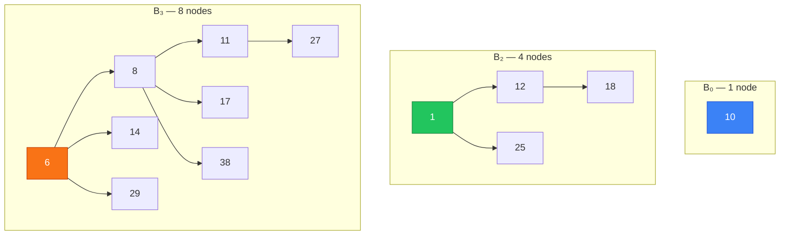

**Root List**
Roots are chained via `sibling` pointers in **strictly increasing degree** order.

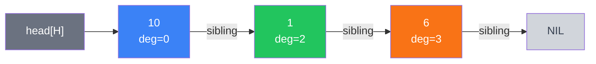

- `head[H]` → first root in the list
- `head[H] = NIL` if the heap is empty
- Degrees **strictly increase** left to right (no two roots share a degree)

**Node**
Each node x has **5 fields**:

| Field        | Meaning                             | NIL when…                          |
| ------------ | ----------------------------------- | ---------------------------------- |
| `key`        | The value stored                    | —                                  |
| `degree`     | Number of children of x             | 0 if leaf                          |
| `p[x]`       | Pointer to parent                   | x is a root                        |
| `child[x]`   | Pointer to **leftmost** child       | x has no children                  |
| `sibling[x]` | Pointer to next sibling / next root | x is rightmost child, or last root |

> **Dual role of `sibling`**: for non-root nodes it links siblings within a tree; for root nodes it chains the root list.

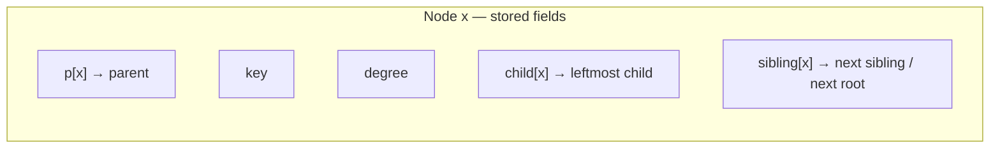

### Operations

| Operation                 | Time Complexity          |
| ------------------------- | ------------------------ |
| `find-min`                | O(lg n)                  |
| `insert`                  | O(lg n) — amortized O(1) |
| `union` (merge two heaps) | O(lg n)                  |
| `extract-min`             | O(lg n)                  |
| `decrease-key`            | O(lg n)                  |
| `delete`                  | O(lg n)                  |

> **Key advantage over binary heap**: merging two binomial heaps is **O(lg n)**; merging two binary heaps is O(n).

### 1. Creating a New Binomial Heap

Simply allocate an object H and set `head[H] = NIL`. Done in **Θ(1)**.

```
MAKE-BINOMIAL-HEAP()
1  allocate object H
2  head[H] ← NIL
3  return H
```

### 2. Finding the Minimum Key

Since the heap is min-heap-ordered, the minimum must be at a **root**. Scan all roots in the root list, tracking the smallest key seen.

```
BINOMIAL-HEAP-MINIMUM(H)
1  y ← NIL
2  x ← head[H]
3  min ← ∞
4  while x ≠ NIL
5      do if key[x] < min
6              then min ← key[x]
7                   y ← x
8          x ← sibling[x]
9  return y
```

There are at most ⌊lg n⌋ + 1 roots to scan → **O(lg n)**.

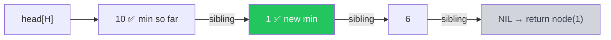

### 3. Uniting Two Binomial Heaps

Union is the core operation — most others reduce to it. It has two phases:

**Phase 1 — BINOMIAL-HEAP-MERGE**: Merge the two root lists into one list sorted by monotonically increasing degree. Similar to merge-sort's merge. Runs in **O(m)** where m is total number of roots.

**Phase 2 — Link equal-degree roots**: Walk the merged list and link pairs of trees with the same degree until at most one root of each degree remains. Four cases at each step:

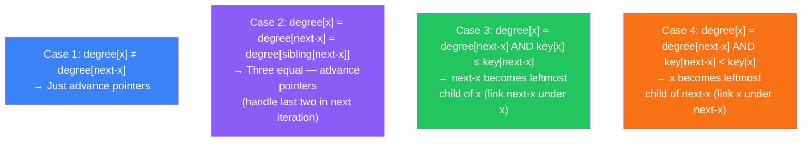

**BINOMIAL-LINK** — links Bₖ₋₁ tree rooted at y under Bₖ₋₁ tree rooted at z, making z the root of a new Bₖ tree:

```
BINOMIAL-LINK(y, z)
1  p[y] ← z
2  sibling[y] ← child[z]
3  child[z] ← y
4  degree[z] ← degree[z] + 1
```

**Full UNION procedure:**

```
BINOMIAL-HEAP-UNION(H₁, H₂)
1   H ← MAKE-BINOMIAL-HEAP()
2   head[H] ← BINOMIAL-HEAP-MERGE(H₁, H₂)
3   free H₁ and H₂ (but not their node lists)
4   if head[H] = NIL
5       then return H
6   prev-x ← NIL
7   x ← head[H]
8   next-x ← sibling[x]
9   while next-x ≠ NIL
10      do if (degree[x] ≠ degree[next-x]) or
              (sibling[next-x] ≠ NIL and degree[sibling[next-x]] = degree[x])
11             then prev-x ← x                          ▷ Cases 1 & 2
12                  x ← next-x                          ▷ Cases 1 & 2
13         else if key[x] ≤ key[next-x]
14             then sibling[x] ← sibling[next-x]        ▷ Case 3
15                  BINOMIAL-LINK(next-x, x)             ▷ Case 3
16         else if prev-x = NIL
17             then head[H] ← next-x                    ▷ Case 4
18             else sibling[prev-x] ← next-x            ▷ Case 4
19                  BINOMIAL-LINK(x, next-x)             ▷ Case 4
20                  x ← next-x                          ▷ Case 4
21         next-x ← sibling[x]
22  return H
```

**Three pointer invariant** maintained throughout the while loop:

| Pointer  | What it points to                                         |
| -------- | --------------------------------------------------------- |
| `prev-x` | Root just before x (`sibling[prev-x] = x`); NIL initially |
| `x`      | Current root being examined                               |
| `next-x` | Root just after x (`sibling[x] = next-x`)                 |

Total time: **O(lg n)**.

### 4. Inserting a Node

Wrap the new node as a single-node binomial heap H′ (a B₀ tree), then union it with H.

```
BINOMIAL-HEAP-INSERT(H, x)
1  H′ ← MAKE-BINOMIAL-HEAP()
2  p[x] ← NIL
3  child[x] ← NIL
4  sibling[x] ← NIL
5  degree[x] ← 0
6  head[H′] ← x
7  H ← BINOMIAL-HEAP-UNION(H, H′)
```

- Creates H′ in **O(1)**, unions in **O(lg n)**.
- Amortized cost is **O(1)** (like binary increment).


### 5. Extracting the Node with Minimum Key

```
BINOMIAL-HEAP-EXTRACT-MIN(H)
1  find root x with minimum key in root list of H,
   and remove x from the root list of H
2  H′ ← MAKE-BINOMIAL-HEAP()
3  reverse the order of the linked list of x's children,
   and set head[H′] to point to the head of the resulting list
4  H ← BINOMIAL-HEAP-UNION(H, H′)
5  return x
```

**Why reverse x's children?** If x is the root of a Bₖ tree, its children from left to right are roots of Bₖ₋₁, Bₖ₋₂, …, B₀. After reversing they become B₀, B₁, …, Bₖ₋₁ — a valid binomial heap H′, ready for union.

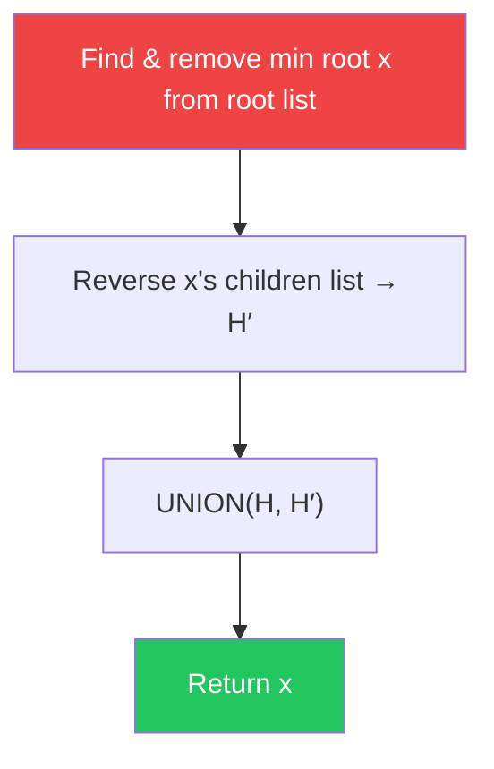

Each of the 4 lines takes **O(lg n)** → total **O(lg n)**.

### 6. Decreasing a Key

Decrease `key[x]` to k, then **bubble up** — swap keys with parent until min-heap order is restored (same idea as binary min-heap decrease-key).

```
BINOMIAL-HEAP-DECREASE-KEY(H, x, k)
1  if k > key[x]
2      then error "new key is greater than current key"
3  key[x] ← k
4  y ← x
5  z ← p[y]
6  while z ≠ NIL and key[y] < key[z]
7      do exchange key[y] ↔ key[z]
8         ▷ also exchange satellite data if any
9         y ← z
10         z ← p[y]
```

- While loop climbs up at most ⌊lg n⌋ levels (max depth of any node).
- Total time: **O(lg n)**.

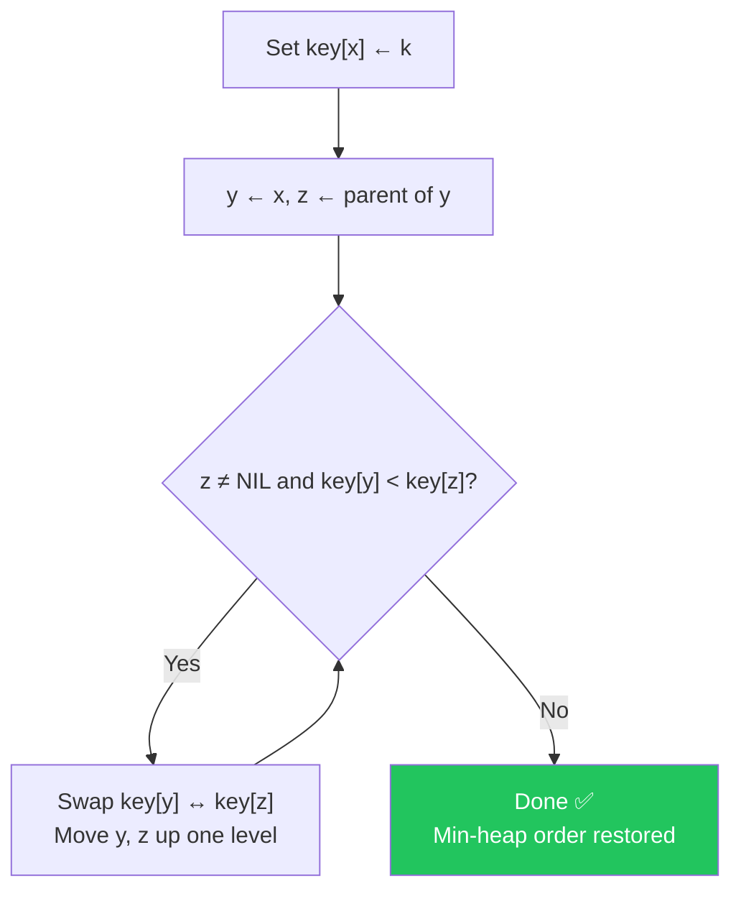

### 7. Deleting a Key

Combine decrease-key and extract-min: force the node's key to −∞ (making it the unique minimum), then extract it.

```
BINOMIAL-HEAP-DELETE(H, x)
1  BINOMIAL-HEAP-DECREASE-KEY(H, x, −∞)
2  BINOMIAL-HEAP-EXTRACT-MIN(H)
```

- Step 1 bubbles x up to become a root: **O(lg n)**.
- Step 2 removes it from the root list: **O(lg n)**.
- Total: **O(lg n)**.

---

# Fibonacci Heap

> A **Fibonacci heap** is a collection of min-heap-ordered trees with a **relaxed structure** — no cleanup happens on insert or union. Work is deferred until `extract-min`, giving excellent amortized bounds.

## Why Fibonacci Heaps?

| Operation    | Binary Heap | Binomial Heap | **Fibonacci Heap**    |
| ------------ | ----------- | ------------- | --------------------- |
| make-heap    | Θ(1)        | Θ(1)          | Θ(1)                  |
| insert       | O(lg n)     | O(lg n)       | **O(1)** amortized    |
| minimum      | O(1)        | O(lg n)       | **O(1)**              |
| extract-min  | O(lg n)     | O(lg n)       | **O(lg n)** amortized |
| union        | O(n)        | O(lg n)       | **O(1)** amortized    |
| decrease-key | O(lg n)     | O(lg n)       | **O(1)** amortized    |
| delete       | O(lg n)     | O(lg n)       | **O(lg n)** amortized |

> **Key insight**: Operations not involving deletion run in **O(1) amortized**. Critical for dense graph algorithms (Dijkstra, Prim) where decrease-key dominates.

---

## Structure

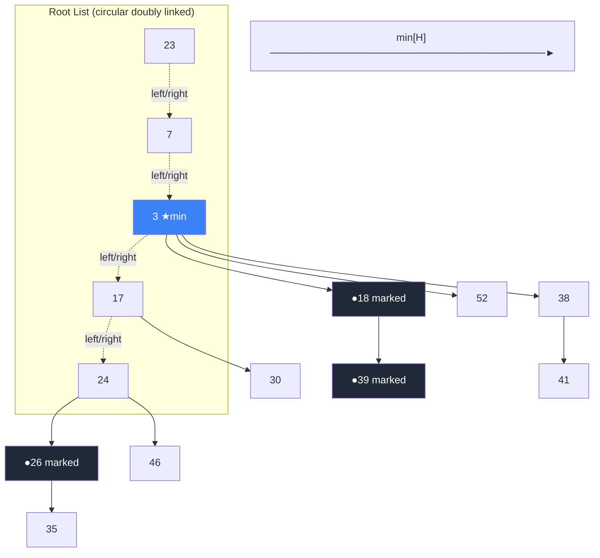

**Each node x stores:**

| Field                 | Meaning                                              |
| --------------------- | ---------------------------------------------------- |
| `key`                 | Value                                                |
| `degree[x]`           | Number of children                                   |
| `mark[x]`             | TRUE if x lost a child since last being made a child |
| `p[x]`                | Parent pointer (NIL if root)                         |
| `child[x]`            | Pointer to any one child                             |
| `left[x]`, `right[x]` | Circular doubly-linked list pointers                 |

**Heap-level fields:**

| Field    | Meaning                     |
| -------- | --------------------------- |
| `min[H]` | Pointer to minimum-key root |
| `n[H]`   | Total node count            |

> **Root list** uses `left`/`right` (circular). **Child lists** also circular. Order of siblings is arbitrary (unordered trees).

## Potential Function

Used for amortized analysis (potential method):

$$\Phi(H) = t(H) + 2 \cdot m(H)$$

- `t(H)` = number of trees in root list
- `m(H)` = number of marked nodes

Example from Figure 20.1: 5 trees + 2×3 marked = **Φ = 11**

---

## Operations

### 1. Make Heap — O(1)

```
MAKE-FIB-HEAP()
  allocate H
  n[H] ← 0
  min[H] ← NIL
  return H
```

---

### 2. Insert — O(1) amortized

Just make x a single-node tree and splice into root list. **No consolidation.**

```
FIB-HEAP-INSERT(H, x)
  degree[x] ← 0
  p[x] ← NIL
  child[x] ← NIL
  left[x] ← x; right[x] ← x      ▷ self-loop: its own circular list
  mark[x] ← FALSE
  concatenate {x} into root list of H
  if min[H] = NIL or key[x] < key[min[H]]
      then min[H] ← x
  n[H] ← n[H] + 1
```

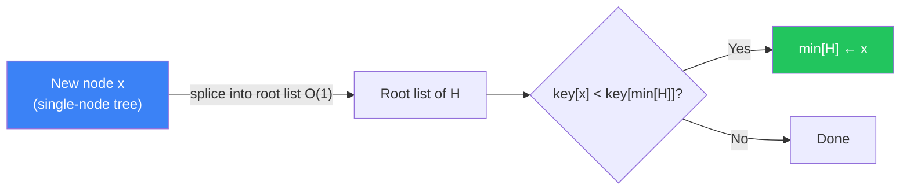

**Amortized cost**: actual O(1) + ΔΦ = +1 → **O(1)**

---

### 3. Find Minimum — O(1)

```
FIB-HEAP-MINIMUM(H)
  return min[H]          ▷ direct pointer, O(1)
```

---

### 4. Union — O(1) amortized

Concatenate two root lists (circular list splice). Pick new minimum. **No consolidation.**

```
FIB-HEAP-UNION(H₁, H₂)
  H ← MAKE-FIB-HEAP()
  min[H] ← min[H₁]
  concatenate root list of H₂ with root list of H
  if min[H₁] = NIL or (min[H₂] ≠ NIL and key[min[H₂]] < key[min[H₁]])
      then min[H] ← min[H₂]
  n[H] ← n[H₁] + n[H₂]
  free H₁, H₂
  return H
```

**Amortized cost**: ΔΦ = 0 (tree count preserved) → **O(1)**

---

### 5. Extract-Min — O(lg n) amortized

The only "expensive" operation — this is where all deferred cleanup happens via **CONSOLIDATE**.

```
FIB-HEAP-EXTRACT-MIN(H)
  z ← min[H]
  if z ≠ NIL
      for each child x of z
          add x to root list of H
          p[x] ← NIL
      remove z from root list of H
      if z = right[z]          ▷ z was the only node
          then min[H] ← NIL
          else min[H] ← right[z]
               CONSOLIDATE(H)
      n[H] ← n[H] - 1
  return z
```

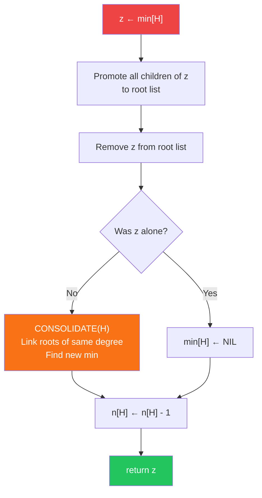

#### CONSOLIDATE — the core cleanup

Goal: ensure at most **one root per degree**. Uses array `A[0..D(n)]` where `A[i]` = root with degree i.

```
CONSOLIDATE(H)
  for i ← 0 to D(n[H])
      A[i] ← NIL
  for each node w in root list of H
      x ← w
      d ← degree[x]
      while A[d] ≠ NIL
          y ← A[d]                    ▷ y has same degree as x
          if key[x] > key[y]
              exchange x ↔ y          ▷ ensure x has smaller key
          FIB-HEAP-LINK(H, y, x)      ▷ make y a child of x
          A[d] ← NIL
          d ← d + 1
      A[d] ← x
  min[H] ← NIL
  for i ← 0 to D(n[H])               ▷ rebuild root list from A
      if A[i] ≠ NIL
          add A[i] to root list
          if min[H] = NIL or key[A[i]] < key[min[H]]
              then min[H] ← A[i]
```

```
FIB-HEAP-LINK(H, y, x)
  remove y from root list of H
  make y a child of x, incrementing degree[x]
  mark[y] ← FALSE
```

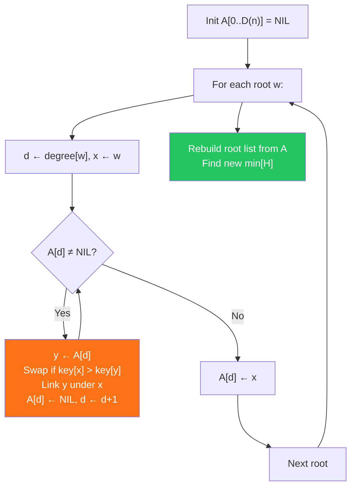

---

### 6. Decrease-Key — O(1) amortized

Set new key, then **cut** x from its parent if heap order is violated. **Cascading cuts** propagate up through marked nodes.

```
FIB-HEAP-DECREASE-KEY(H, x, k)
  if k > key[x]  →  error
  key[x] ← k
  y ← p[x]
  if y ≠ NIL and key[x] < key[y]
      CUT(H, x, y)
      CASCADING-CUT(H, y)
  if key[x] < key[min[H]]
      then min[H] ← x
```

```
CUT(H, x, y)
  remove x from child list of y, decrement degree[y]
  add x to root list of H
  p[x] ← NIL
  mark[x] ← FALSE
```

```
CASCADING-CUT(H, y)
  z ← p[y]
  if z ≠ NIL
      if mark[y] = FALSE
          then mark[y] ← TRUE          ▷ first child lost — just mark
          else CUT(H, y, z)            ▷ second child lost — cut!
               CASCADING-CUT(H, z)     ▷ recurse up
```

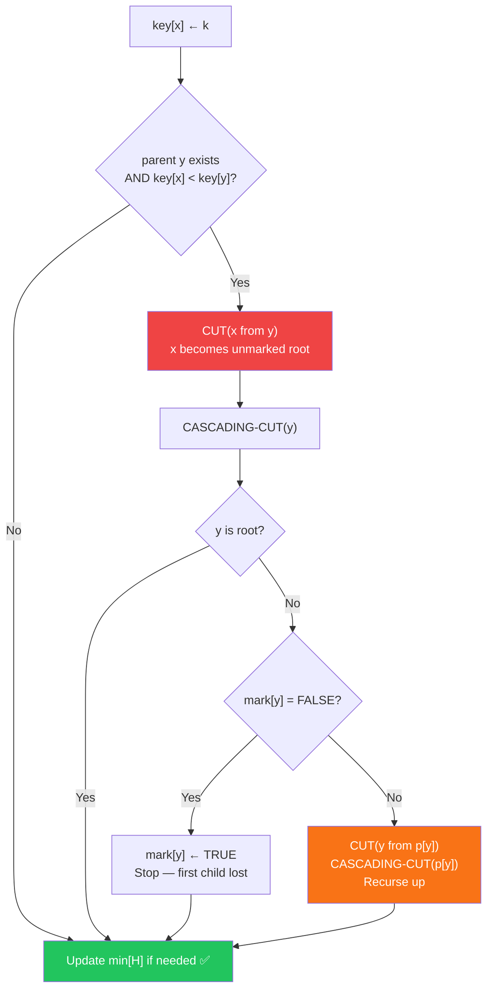

**The `mark` field explained:**

> A node x is **marked** (TRUE) if it has **lost one child** since the last time x was made a child of another node. When it loses a **second child**, it is immediately cut and promoted to the root list (mark cleared). This prevents trees from becoming too unbalanced.

**Amortized cost**: c cascading cuts → actual O(c), ΔΦ ≤ 4 - c → total **O(1)**

---

### 7. Delete — O(lg n) amortized

```
FIB-HEAP-DELETE(H, x)
  FIB-HEAP-DECREASE-KEY(H, x, −∞)
  FIB-HEAP-EXTRACT-MIN(H)
```

Force x to become minimum via −∞, then extract it. O(1) + O(lg n) = **O(lg n)**.

---

## Fibonacci Heap vs Binomial Heap — Key Differences

| Aspect             | Binomial Heap                      | Fibonacci Heap                 |
| ------------------ | ---------------------------------- | ------------------------------ |
| Tree structure     | Strict binomial trees              | Relaxed / unordered trees      |
| Root list order    | Strictly increasing degree         | Arbitrary                      |
| Children linked by | Left-child, right-sibling (singly) | Circular doubly linked list    |
| Insert             | O(lg n)                            | **O(1)** — no consolidation    |
| Union              | O(lg n)                            | **O(1)** — just splice lists   |
| Decrease-key       | O(lg n) — bubble up                | **O(1)** — cut & cascading-cut |
| Mark field         | Not used                           | Used to control cascading cuts |
| Cleanup timing     | Eager (on insert/union)            | **Lazy** (only on extract-min) |

---

## Quick Mental Model

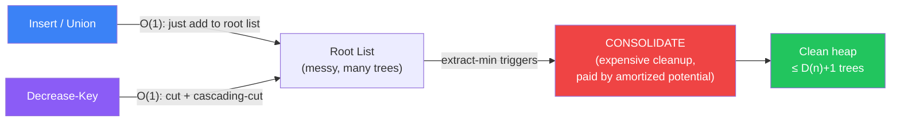

> The **potential Φ = t(H) + 2m(H)** is the "stored work" — insert pays a +1 unit of potential, which extract-min later spends to do the consolidation. The math always balances.
