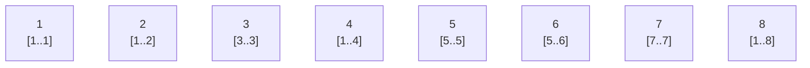
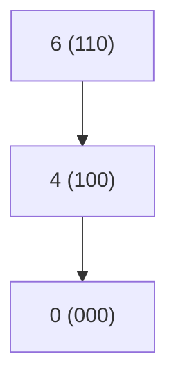
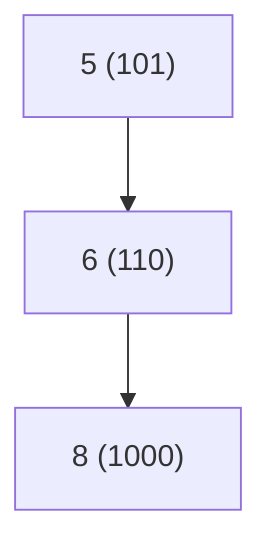

# Fenwick Trees (Binary Indexed Trees – BIT)

A **Fenwick Tree** (or **Binary Indexed Tree, BIT**) is a data structure that can be seen as a **dynamic prefix sum array**.

It supports two operations in **O(log n)** time:

- **Range Sum Query (RSQ)**
- **Point Update**

It is much simpler than a Segment Tree and is ideal for dynamic cumulative frequency tables.

---

## Why Not Prefix Sum?

If the array is static:

- Build prefix sum in **O(n)**
- Query in **O(1)**

But if we update a value:

- We must rebuild prefix sums → **O(n)**

Fenwick Tree avoids this and supports both operations in **O(log n)**.

---

# Core Idea

Let:

```
p(k) = largest power of 2 that divides k
```

We can compute it using:

```cpp
p(k) = k & -k
```

Also called:

```
LSOne(k) = k & (-k)
```

Each index `k` in the Fenwick Tree stores:

```
tree[k] = sum of range [k - p(k) + 1, k]
```

So each position stores the sum of a block ending at `k` whose length is `p(k)`.

---

## Example

If:

```
p(6) = 2
```

Then:

```
tree[6] = sum(5, 6)
```

---

# Visualization of Ranges

For indices 1..8:



Each node shows:

```
index
range it is responsible for
```

Example:

- `tree[4]` stores sum of `[1..4]`
- `tree[6]` stores sum of `[5..6]`
- `tree[8]` stores sum of `[1..8]`

---

# Range Sum Query

To compute:

```
rsq(1, b)
```

We repeatedly subtract the least significant bit:

```
b = b - LSOne(b)
```

This strips off the last set bit each time.

---

## Example: rsq(6)

Binary view:

```
6 = 110₂
```

Sequence:

```
6 → 4 → 0
```

We compute:

```
rsq(6) = tree[6] + tree[4]
```

Which covers:

- tree[6] → [5..6]
- tree[4] → [1..4]

Together → [1..6]

---

## Diagram for rsq(6)



---

# Range Query [a, b]

We compute:

```
rsq(a, b) = rsq(b) - rsq(a-1)
```

Example:

```
rsq(4,6) = rsq(6) - rsq(3)
```

---

# Point Update

To increase value at index `k` by `v`:

```
k = k + LSOne(k)
```

We keep moving upward updating all responsible nodes.

---

## Example: adjust(5, +1)

Binary:

```
5 = 101₂
```

Update sequence:

```
5 → 6 → 8 → stop
```



These are exactly the nodes whose range includes index 5.

---

# Time Complexity

Both operations:

```
O(log n)
```

Because each step removes or adds one set bit.

Since an integer has at most `log n` bits → at most `log n` steps.

---

# Complete C++ Implementation

```cpp
class FenwickTree {
private:
    vector<int> ft;

public:
    FenwickTree(int n) {
        ft.assign(n + 1, 0); // 1-based indexing
    }

    int LSOne(int S) {
        return S & (-S);
    }

    // returns sum of range [1..b]
    int rsq(int b) {
        int sum = 0;
        for (; b; b -= LSOne(b))
            sum += ft[b];
        return sum;
    }

    // returns sum of range [a..b]
    int rsq(int a, int b) {
        return rsq(b) - (a == 1 ? 0 : rsq(a - 1));
    }

    // adjust value at index k by v
    void adjust(int k, int v) {
        for (; k < (int)ft.size(); k += LSOne(k))
            ft[k] += v;
    }
};
```

---

# Example Usage

```cpp
int f[] = {2,4,5,5,6,6,6,7,7,8,9};
FenwickTree ft(10);

for (int i = 0; i < 11; i++)
    ft.adjust(f[i], 1);

cout << ft.rsq(1,1) << endl;   // 0
cout << ft.rsq(1,2) << endl;   // 1
cout << ft.rsq(1,6) << endl;   // 7
cout << ft.rsq(3,6) << endl;   // 6

ft.adjust(5, 2);               // update
cout << ft.rsq(1,10) << endl;  // 13
```

---

# Summary

| Feature                   | Fenwick Tree                      |
| ------------------------- | --------------------------------- |
| Space                     | O(n)                              |
| Build                     | O(n log n) (or O(n) optimized)    |
| RSQ                       | O(log n)                          |
| Update                    | O(log n)                          |
| Simpler than Segment Tree | Yes                               |
| Supports range min/max    | No (only invertible ops like sum) |

---

# When to Use Fenwick Tree

Use when:

- You need **dynamic prefix sums**
- Operation is invertible (sum, frequency, count)
- You want simpler code than Segment Tree
- Range is discrete `[1..n]`

---

# Sparse Table — RMQ


## Use Case  
**Use when:**
- Static array (no updates)
- Idempotent operations: min, max, gcd

**Not for:**
- sum, product, xor → overlap causes double counting


## Definition  
```
m[i][j] = answer for range [i,  i + 2^j - 1]

i → starting index
j → power  (block size = 2^j)
```


## Build — O(n log n)  
**Base:**
```
m[i][0] = a[i]
```

**Transition:**
```
m[i][j] = min(
    m[i        ][j-1],
    m[i + 2^(j-1)][j-1]
)

i : 0 .. n-1
j : 1 .. log n
```


## Precomputation Intuition  
```
j=0  [ ][ ][ ][ ][ ][ ][ ][ ]   ← covers 1 element each
j=1  [    ][    ][    ][    ]    ← covers 2 elements each
j=2  [        ][        ]        ← covers 4 elements each

Total layers = log n
```


## Query — O(1)  
```
len = r - l + 1
k   = floor(log2(len))

return min(
    m[l         ][k],   ← block starting at l
    m[r - 2^k+1 ][k]   ← block ending at r
)
```

> Two overlapping blocks of size 2^k fully cover [l, r]


## Why Overlap Works  
```
min(x, x) = x   → OK to overlap
sum(x, x) ≠ x   → NOT OK to overlap
```


## Sparse Table vs Segment Tree   
| | Segment Tree | Sparse Table |
|---|---|---|
| Query | O(log n) | O(1) |
| Update | O(log n) | ✗ not supported |
| Operations | any | idempotent only |


## Complexity Summary 
```
Build   →  O(n log n)
Space   →  O(n log n)
Query   →  O(1)
Update  →  not supported
```

