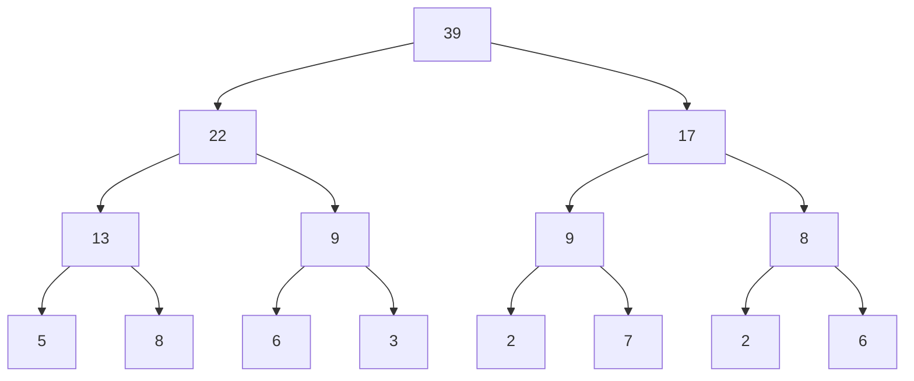

# Segment Trees

A **Segment Tree** is a tree-based data structure that supports:

- Processing **range queries** (sum, minimum, maximum, etc.)
- **Updating** array values

Both operations work in **O(log n)** time.

It is especially useful when the array is **dynamic** (values change frequently).

---

## Range Minimum Query (RMQ)

One important application is the **Range Minimum Query (RMQ)** problem:

> Given an array `A`, find the **index of the minimum element** in range `[i, j]`.

Example:

```
Array Values : 18  17  13  19  15  11  20
Indices      :  0   1   2   3   4   5   6
```

- RMQ(1,3) = 2 (minimum is 13)
- RMQ(4,6) = 5 (minimum is 11)
- RMQ(0,6) = 5

A naive approach scans the range in **O(n)** per query — too slow for many queries.

Segment Tree solves this in:

- **Build:** O(n)
- **Query:** O(log n)
- **Update:** O(log n)

---

## Structure of a Segment Tree

A segment tree is a **binary tree** where:

- Leaves correspond to array elements.
- Internal nodes store information about a segment.
- Root represents the whole range `[0, n−1]`.

Each node represents a segment `[L, R]`.

If `L != R`, it splits into:

- Left child → `[L, mid]`
- Right child → `[mid+1, R]`

where `mid = (L+R)/2`.

---

## Example

Array:

```
[5, 8, 6, 3, 2, 7, 2, 6]
```

Its corresponding segment tree (sum example):



- Root = 39 (sum of entire array)
- Each internal node = sum of its children

---

## Why Queries Are O(log n)

Any range `[a, b]` can be decomposed into **O(log n)** disjoint segments stored in tree nodes.

Example:

```
Index: 0 1 2 3 4 5 6 7
Value: 5 8 6 3 2 7 2 6
```

Range `(2,7)`:

```
sum(2,7) = 6+3+2+7+2+6 = 26
```

Instead of scanning all elements, the tree jumps across relevant segments.

In worst case, we traverse at most **two root-to-leaf paths**, which is:

```
O(2 log n) = O(log n)
```

---

# Implementation Approaches

There are **two common implementations**:

---

# 1. Recursive (4n size, general approach)

Used commonly for RMQ and flexible queries.

### Storage

- Use array `st` of size `4n`
- `st[p]` stores the result for segment represented by node `p`
- Left child: `2*p`
- Right child: `2*p+1`

---

### Build (O(n))

```cpp
void build(int p, int L, int R) {
    if (L == R)
        st[p] = L;  // store index for RMQ
    else {
        int mid = (L + R) / 2;
        build(2*p, L, mid);
        build(2*p+1, mid+1, R);

        int p1 = st[2*p];
        int p2 = st[2*p+1];

        st[p] = (A[p1] <= A[p2]) ? p1 : p2;
    }
}
```

---

### RMQ Query (O(log n))

```cpp
int rmq(int p, int L, int R, int i, int j) {
    if (i > R || j < L) return -1;       // outside
    if (L >= i && R <= j) return st[p]; // fully inside

    int mid = (L + R) / 2;

    int p1 = rmq(2*p, L, mid, i, j);
    int p2 = rmq(2*p+1, mid+1, R, i, j);

    if (p1 == -1) return p2;
    if (p2 == -1) return p1;

    return (A[p1] <= A[p2]) ? p1 : p2;
}
```

---

### Update (O(log n))

If `A[k]` changes:

- Update leaf
- Recompute all ancestors up to root

Only one root-to-leaf path → `O(log n)`.

---

# 2. Iterative (2n size, power-of-two method)

Simpler and memory-efficient. Often used for sum queries.

Assume `n` is a power of two.

### Storage Layout

- `tree[1]` → root
- `tree[2]`, `tree[3]` → children
- Leaves stored from `tree[n]` to `tree[2n-1]`

Parent of `k` → `k/2`

---

## Range Sum Query

```cpp
int sum(int a, int b) {
    a += n;
    b += n;
    int s = 0;

    while (a <= b) {
        if (a % 2 == 1) s += tree[a++];
        if (b % 2 == 0) s += tree[b--];
        a /= 2;
        b /= 2;
    }
    return s;
}
```

Time complexity: **O(log n)**

---

## Point Update

Increase value at index `k` by `x`:

```cpp
void add(int k, int x) {
    k += n;
    tree[k] += x;

    for (k /= 2; k >= 1; k /= 2)
        tree[k] = tree[2*k] + tree[2*k+1];
}
```

Time complexity: **O(log n)**

---

# Segment Tree vs Other Approaches

| Method                        | Build      | Query    | Update     |
| ----------------------------- | ---------- | -------- | ---------- |
| Naive                         | —          | O(n)     | O(1)       |
| DP (Sparse Table, static RMQ) | O(n log n) | O(1)     | O(n log n) |
| Segment Tree                  | O(n)       | O(log n) | O(log n)   |

Use:

- **Sparse Table** → when array is static
- **Segment Tree** → when array is dynamic

---

# Key Takeaways

- Height of tree = **O(log n)**
- Nodes ≈ **O(2n)** (often allocated as 4n)
- Query visits at most **2 root-to-leaf paths**
- Extremely flexible (sum, min, max, gcd, etc.)
- Core tool for competitive programming & system design problems involving ranges
