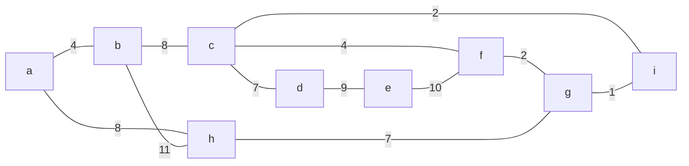
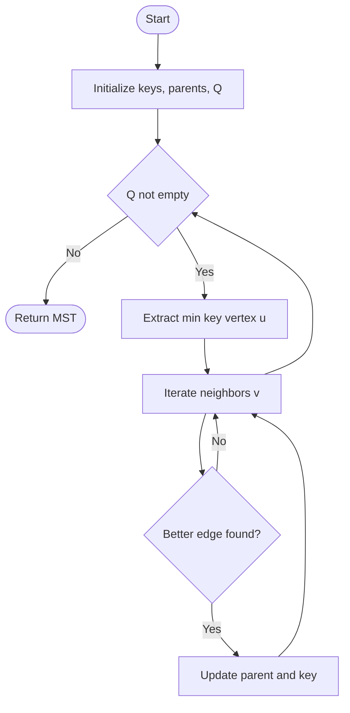

# Prim's Algorithm

Also known as **Jarník's Algorithm** (discovered by Vojtěch Jarník in 1929, independently by Prim in 1957, and Dijkstra in 1958).
It is a greedy algorithm for finding a **minimum spanning tree (MST)** in a weighted, undirected, connected graph.
Prim's algorithm always grows a single tree, starting from any root, and repeatedly adds the lightest edge that connects a vertex in the tree to a vertex outside the tree.
The process continues until all vertices are included.
It simply selects the minimum weight edge that adds a new node to the tree.
It is conceptually similar to Dijkstra's algorithm for shortest paths, but always chooses the minimum-weight edge to expand the tree.

## Key Ideas
- Start with any vertex as the root.
- At each step, add the minimum-weight edge that connects a vertex in the tree to a vertex outside the tree.
- Repeat until all vertices are included.


## Pseudocode: Prim's Algorithm

```text
MST-PRIM(G, w, r):
1  for each u ∈ V[G]
2      do key[u] ← ∞
3         π[u] ← NIL
4  key[r] ← 0
5  Q ← V[G]
6  while Q ≠ ∅
7      do u ← EXTRACT-MIN(Q)
8         for each v ∈ Adj[u]
9             do if v ∈ Q and w(u, v) < key[v]
10                then π[v] ← u
11                     key[v] ← w(u, v)
```

---

## Pseudocode (Priority Queue Version)

```cpp
vi taken;                // global boolean flag to avoid cycles
priority_queue<ii> pq;   // min-heap for (weight, vertex)
void process(int vtx) {
    taken[vtx] = 1;
    for (auto [v, w] : AdjList[vtx])
        if (!taken[v]) pq.push({-w, -v}); // use -ve for min-heap
}
// main
taken.assign(V, 0);
process(0); // start from vertex 0
mst_cost = 0;
while (!pq.empty()) {
    auto [neg_w, neg_u] = pq.top(); pq.pop();
    int u = -neg_u, w = -neg_w;
    if (!taken[u]) {
        mst_cost += w;
        process(u);
    }
}
```

---

## Step-by-Step Example

Below is a sequence of diagrams simulating Prim's algorithm on a sample graph:

### Step 1: Start from root `a`


### Step 2: Add edge a-b (weight 4)

```mermaid
graph LR
    a ---|4| b
    a ---|8| h
    b ---|8| c
    b ---|11| h
    c ---|7| d
    c ---|2| i
    c ---|4| f
    d ---|9| e
    e ---|10| f
    f ---|2| g
    g ---|1| i
    h ---|7| g
    style a fill:#000,stroke:#fff
    style b fill:#000,stroke:#fff
    linkStyle 0 stroke:#f00,stroke-width:3px
```


### Step 3: Add edge b-c (weight 8)

```mermaid
graph LR
    a ---|4| b
    a ---|8| h
    b ---|8| c
    b ---|11| h
    c ---|7| d
    c ---|2| i
    c ---|4| f
    d ---|9| e
    e ---|10| f
    f ---|2| g
    g ---|1| i
    h ---|7| g
    style a fill:#000,stroke:#fff
    style b fill:#000,stroke:#fff
    style c fill:#000,stroke:#fff
    linkStyle 0 stroke:#f00,stroke-width:3px
    linkStyle 2 stroke:#f00,stroke-width:3px
```


### Step 4: Add edge c-f (weight 4)

```mermaid
graph LR
    a ---|4| b
    a ---|8| h
    b ---|8| c
    b ---|11| h
    c ---|7| d
    c ---|2| i
    c ---|4| f
    d ---|9| e
    e ---|10| f
    f ---|2| g
    g ---|1| i
    h ---|7| g
    style a fill:#000,stroke:#fff
    style b fill:#000,stroke:#fff
    style c fill:#000,stroke:#fff
    style f fill:#000,stroke:#fff
    linkStyle 0 stroke:#f00,stroke-width:3px
    linkStyle 2 stroke:#f00,stroke-width:3px
    linkStyle 6 stroke:#f00,stroke-width:3px
```


### Step 5: Add edge f-g (weight 2)

```mermaid
graph LR
    a ---|4| b
    a ---|8| h
    b ---|8| c
    b ---|11| h
    c ---|7| d
    c ---|2| i
    c ---|4| f
    d ---|9| e
    e ---|10| f
    f ---|2| g
    g ---|1| i
    h ---|7| g
    style a fill:#000,stroke:#fff
    style b fill:#000,stroke:#fff
    style c fill:#000,stroke:#fff
    style f fill:#000,stroke:#fff
    style g fill:#000,stroke:#fff
    linkStyle 0 stroke:#f00,stroke-width:3px
    linkStyle 2 stroke:#f00,stroke-width:3px
    linkStyle 6 stroke:#f00,stroke-width:3px
    linkStyle 10 stroke:#f00,stroke-width:3px
```


### Step 6: Add edge g-i (weight 1)

```mermaid
graph LR
    a ---|4| b
    a ---|8| h
    b ---|8| c
    b ---|11| h
    c ---|7| d
    c ---|2| i
    c ---|4| f
    d ---|9| e
    e ---|10| f
    f ---|2| g
    g ---|1| i
    h ---|7| g
    style a fill:#000,stroke:#fff
    style b fill:#000,stroke:#fff
    style c fill:#000,stroke:#fff
    style f fill:#000,stroke:#fff
    style g fill:#000,stroke:#fff
    style i fill:#000,stroke:#fff
    linkStyle 0 stroke:#f00,stroke-width:3px
    linkStyle 2 stroke:#f00,stroke-width:3px
    linkStyle 6 stroke:#f00,stroke-width:3px
    linkStyle 10 stroke:#f00,stroke-width:3px
    linkStyle 11 stroke:#f00,stroke-width:3px
```


### Step 7: Add edge c-d (weight 7)

```mermaid
graph LR
    a ---|4| b
    a ---|8| h
    b ---|8| c
    b ---|11| h
    c ---|7| d
    c ---|2| i
    c ---|4| f
    d ---|9| e
    e ---|10| f
    f ---|2| g
    g ---|1| i
    h ---|7| g
    style a fill:#000,stroke:#fff
    style b fill:#000,stroke:#fff
    style c fill:#000,stroke:#fff
    style f fill:#000,stroke:#fff
    style g fill:#000,stroke:#fff
    style i fill:#000,stroke:#fff
    style d fill:#000,stroke:#fff
    linkStyle 0 stroke:#f00,stroke-width:3px
    linkStyle 2 stroke:#f00,stroke-width:3px
    linkStyle 6 stroke:#f00,stroke-width:3px
    linkStyle 10 stroke:#f00,stroke-width:3px
    linkStyle 11 stroke:#f00,stroke-width:3px
    linkStyle 4 stroke:#f00,stroke-width:3px
```


### Step 8: Add edge d-e (weight 9)

```mermaid
graph LR
    a ---|4| b
    a ---|8| h
    b ---|8| c
    b ---|11| h
    c ---|7| d
    c ---|2| i
    c ---|4| f
    d ---|9| e
    e ---|10| f
    f ---|2| g
    g ---|1| i
    h ---|7| g
    style a fill:#000,stroke:#fff
    style b fill:#000,stroke:#fff
    style c fill:#000,stroke:#fff
    style f fill:#000,stroke:#fff
    style g fill:#000,stroke:#fff
    style i fill:#000,stroke:#fff
    style d fill:#000,stroke:#fff
    style e fill:#000,stroke:#fff
    linkStyle 0 stroke:#f00,stroke-width:3px
    linkStyle 2 stroke:#f00,stroke-width:3px
    linkStyle 6 stroke:#f00,stroke-width:3px
    linkStyle 10 stroke:#f00,stroke-width:3px
    linkStyle 11 stroke:#f00,stroke-width:3px
    linkStyle 4 stroke:#f00,stroke-width:3px
    linkStyle 7 stroke:#f00,stroke-width:3px
```



## Prim's vs Kruskal's: Key Differences
- **Prim's** always grows a single tree, adding the lightest edge from the tree to a new vertex.
- **Kruskal's** adds the lightest edge that connects any two components, possibly joining two trees.

---

## Applications & Variants
- **Maximum Spanning Tree:** Use Prim's/Kruskal's but sort edges in decreasing order.
- **Minimum Spanning Subgraph:** Some edges are fixed; run MST on remaining edges.
- **Minimum Spanning Forest:** Stop when you have K components.
- **Second Best Spanning Tree:** Remove each MST edge in turn, find MST of the rest.
- **Minimax Path:** Build MST, then for any two nodes, the minimax path is the path in the MST with the smallest maximum edge.

---

## Pseudocode Flowchart



## Complexity
- Using a binary min-heap: $O(E \log V)$
- Using a Fibonacci heap: $O(E + V \log V)$