# Union-Find + Kruskal's algorithm

`5.cpp`, `6.cpp`
---

# Spanning Tree
consists of all nodes of the graph and some of the edges of the graph so that there is a path between any two nodes.
spanning trees are connected and acyclic. Usually there are several ways to construct a spanning tree.

A **minimum spanning tree** is a spanning tree whose weight is as small as possible.

## Kruskal Algorithm
the initial spanning tree only contains the nodes of the graph and does not contain any edges. 
Then the algorithm goes through the edges ordered by their weights, and always adds an edge to the tree if it does not
create a cycle.

- each node of the graph belongs to a separate component
- while adding egde 2 components are joined
- all nodes belong to the same component, and a minimum spanning tree has been found.

---

# Kruskal's Algorithm & Union-Find Structure

## Kruskal's Algorithm Example

Given the following weighted graph:

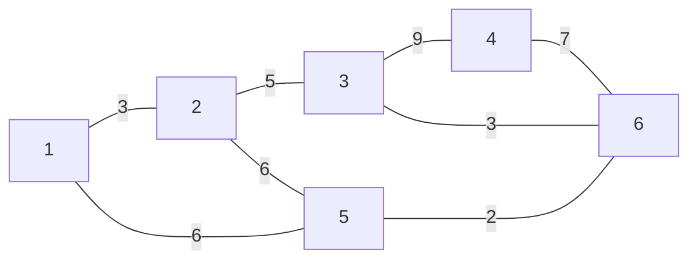

### Edge List (sorted by weight)
| edge  | weight |
|-------|--------|
| 5-6   | 2      |
| 1-2   | 3      |
| 3-6   | 3      |
| 1-5   | 5      |
| 2-3   | 5      |
| 2-5   | 6      |
| 4-6   | 7      |
| 3-4   | 9      |

### Kruskal's Steps
- Start with each node in its own component.
- Add edges in increasing order, only if they join separate components.

#### Step 1: Initial components
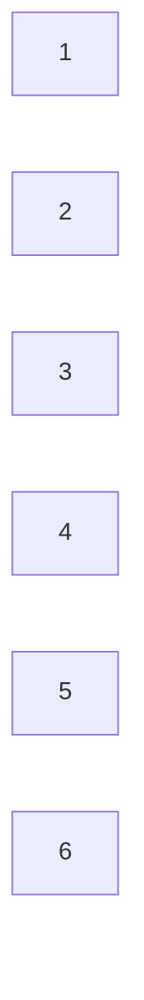

#### Step 2: Add edge 5-6 (weight 2)
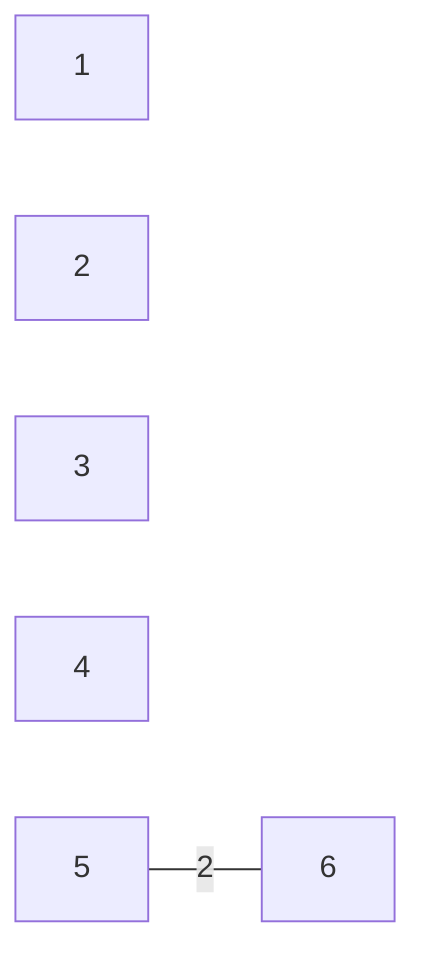

#### Step 3: Add edge 1-2 (weight 3)
#### Step 4: Add edge 3-6 (weight 3)
#### Step 5: Add edge 1-5 (weight 5)
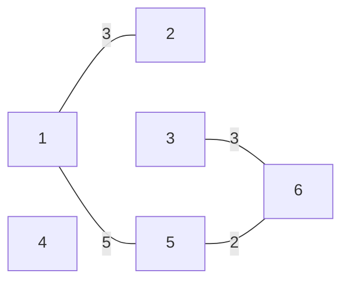

#### Step 6: Add edge 4-6 (weight 7)
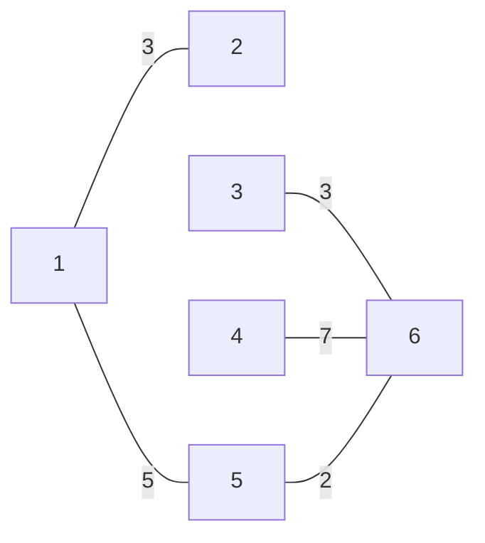

- Edges 2-3 and 2-5 are skipped (would form cycles).
- Edge 3-4 is skipped (would form cycle).

**Final MST weight:** $2 + 3 + 3 + 5 + 7 = 20$

---

## Why Kruskal's Algorithm Works
- Always include the minimum weight edge to produce a minimum spanning tree.
- If a minimum weight edge is not included, it can always be swapped in to reduce the total weight.
- Greedy strategy guarantees optimality.

---

## Kruskal's Algorithm Implementation
- Use edge list representation.
- Sort edges by weight ($O(m \log m)$).
- Use Union-Find to efficiently check and join components.

```cpp
for (...) {
    if (!same(a, b)) unite(a, b);
}
```

---

## Union-Find Structure
- Maintains disjoint sets.
- Supports $O(\log n)$ operations:
    - `unite`: joins two sets
    - `find`: finds representative of a set

### Structure Example
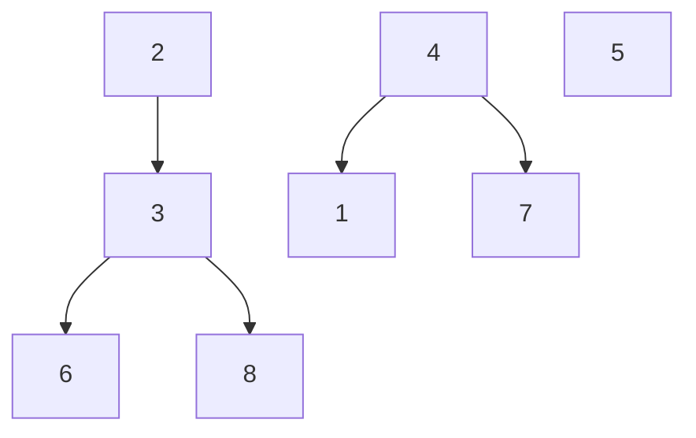

### Joining Sets
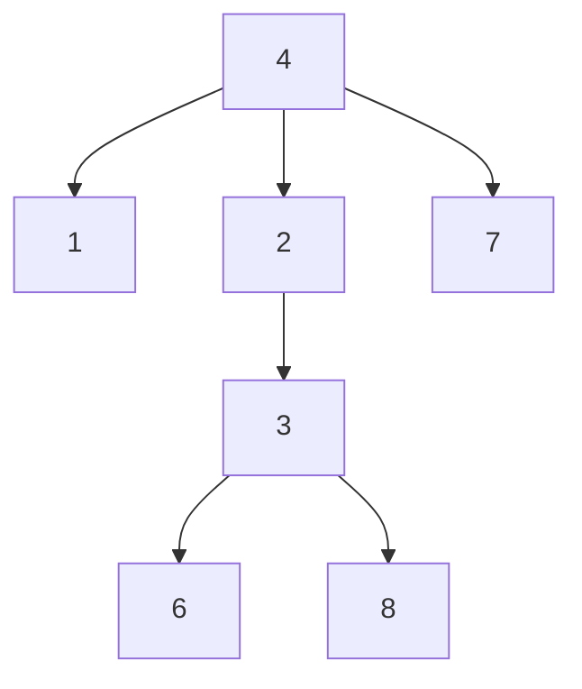

---

## Union-Find Implementation (Arrays)

```cpp
for (int i = 1; i <= n; i++) link[i] = i;
for (int i = 1; i <= n; i++) size[i] = 1;

int find(int x) {
    while (x != link[x]) x = link[x];
    return x;
}

bool same(int a, int b) {
    return find(a) == find(b);
}

void unite(int a, int b) {
    a = find(a);
    b = find(b);
    if (size[a] < size[b]) swap(a, b);
    size[a] += size[b];
    link[b] = a;
}
```

- `find`: $O(\log n)$
- `same` and `unite`: $O(\log n)$

overall runtime of this algorithm is O(sorting
+ trying to add each edge × cost of Union-Find operations) = O(E log E + E × (≈ 1)) =
O(E log E) = O(E log V 2) = O(2 × E log V ) = O(E log V ).

---

## Pseudocode: Kruskal's Algorithm

```text
MST-KRUSKAL(G, w)
1  A ← ∅
2  for each vertex v ∈ V[G]
3      do MAKE-SET(v)
4  sort the edges of E into nondecreasing order by weight w
5  for each edge (u, v) ∈ E, taken in nondecreasing order by weight
6      do if FIND-SET(u) ≠ FIND-SET(v)
7          then A ← A ∪ {(u, v)}
8               UNION(u, v)
9  return A
```

---

## Animation: Kruskal's Algorithm Step-by-Step

Below is a sequence of Mermaid diagrams simulating the animation of Kruskal's algorithm for a Minimum Spanning Tree (MST) problem:

### Step 1: Connect 1 and 2 (smallest edge)
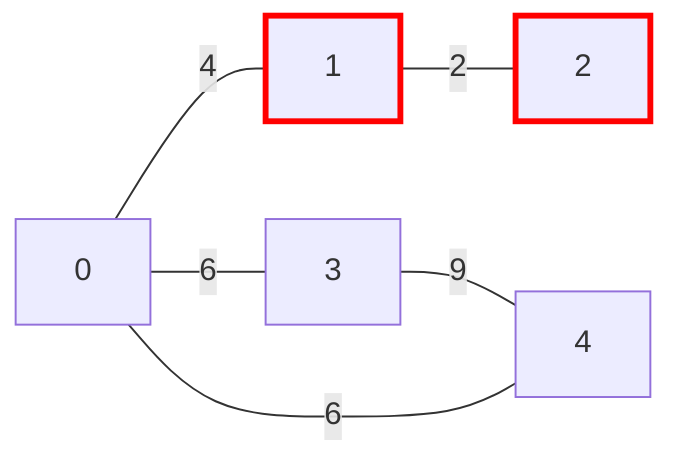

### Step 2: Connect 0 and 1 (no cycle)
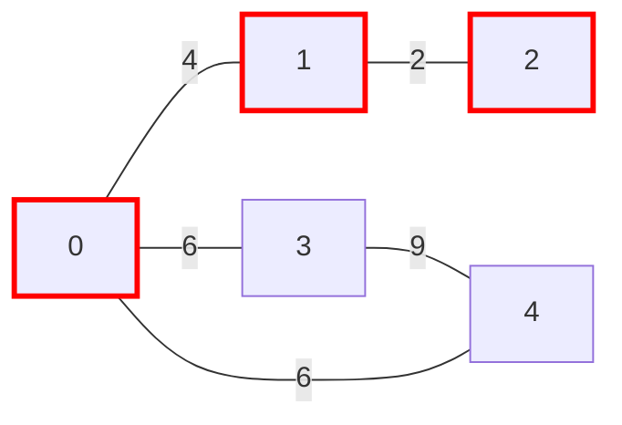

### Step 3: Cannot connect 1 and 2 again (would form cycle)
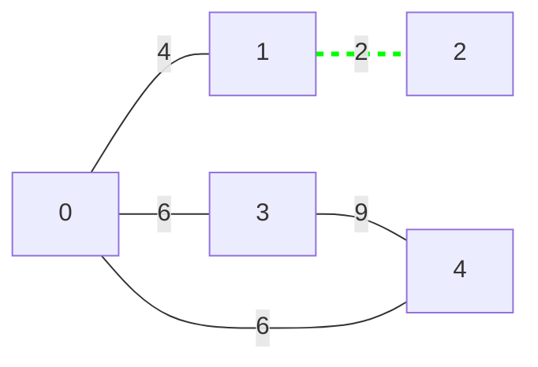

### Step 4: Connect 0 and 3 (next smallest edge)
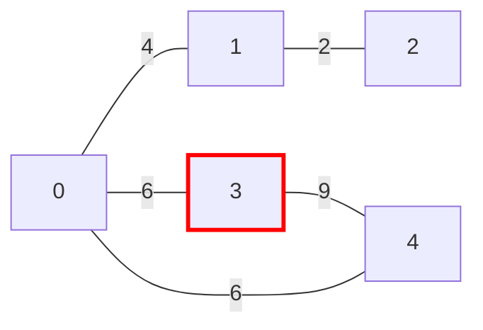

### Step 5: Connect 0 and 4 (MST is formed)
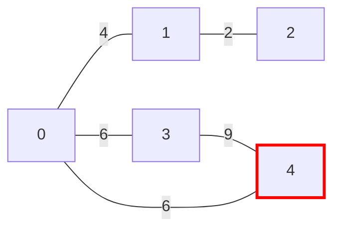

*Each diagram above represents a step in Kruskal's algorithm, simulating an animation by showing the MST construction process.*

---

## Kruskal's Algorithm Implementation
- Use edge list representation.
- Sort edges by weight ($O(m \log m)$).
- Use Union-Find to efficiently check and join components.

```cpp
for (...) {
    if (!same(a, b)) unite(a, b);
}
```

---

## Union-Find Structure
- Maintains disjoint sets.
- Supports $O(\log n)$ operations:
    - `unite`: joins two sets
    - `find`: finds representative of a set

### Structure Example


### Joining Sets


---

## Union-Find Implementation (Arrays)

```cpp
for (int i = 1; i <= n; i++) link[i] = i;
for (int i = 1; i <= n; i++) size[i] = 1;

int find(int x) {
    while (x != link[x]) x = link[x];
    return x;
}

bool same(int a, int b) {
    return find(a) == find(b);
}

void unite(int a, int b) {
    a = find(a);
    b = find(b);
    if (size[a] < size[b]) swap(a, b);
    size[a] += size[b];
    link[b] = a;
}
```

- `find`: $O(\log n)$
- `same` and `unite`: $O(\log n)$

overall runtime of this algorithm is O(sorting
+ trying to add each edge × cost of Union-Find operations) = O(E log E + E × (≈ 1)) =
O(E log E) = O(E log V 2) = O(2 × E log V ) = O(E log V ).

---