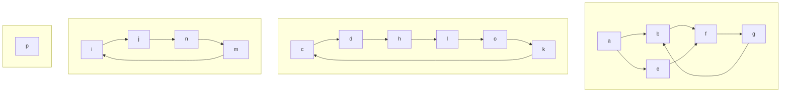

# Articulation Points, Bridges, and Strongly Connected Components

## Articulation Points and Bridges (Undirected Graph)

- **Articulation Point:** A vertex whose removal increases the number of connected components.
- **Bridge:** An edge whose removal increases the number of connected components.

### Naive Algorithm
1. Count connected components (CCs) with DFS/BFS.
2. For each vertex v:
    - Remove v and its edges.
    - Count CCs again. If CCs increase, v is an articulation point.
    - Restore v and its edges.

This runs in $O(V^2 + VE)$ time.

### Efficient Algorithm (Tarjan's Algorithm)
- Use DFS and maintain two arrays:
    - `dfs_num[u]`: Discovery time of u.
    - `dfs_low[u]`: Lowest discovery time reachable from u (including back edges).
- A vertex u is an articulation point if:
    - u is root and has more than one child in DFS tree, or
    - u is not root and for any child v, `dfs_low[v] >= dfs_num[u]`.
- An edge (u, v) is a bridge if `dfs_low[v] > dfs_num[u]`.

**Mermaid Example:**
```mermaid
graph TD
    0 -- 1
    1 -- 2
    2 -- 3
    3 -- 4
    1 -- 4
    1 -- 5
    5 -- 6
    6 -- 7
    6 -- 8
    %% Articulation points: 1, 6
    style 1 fill:#fdd
    style 6 fill:#fdd
    %% Bridges: 1-5, 5-6
    linkStyle 5 stroke:#f00,stroke-width:3px
    linkStyle 6 stroke:#f00,stroke-width:3px
```

---

## Strong Connectivity (Directed Graph)

- **Strongly Connected:** u and v are strongly connected if u can reach v and v can reach u.
- **Strongly Connected Component (SCC):** Maximal subgraph where every pair of vertices is strongly connected.

### Kosaraju-Sharir Algorithm (O(V+E))
1. Run DFS on $G^T$ (reverse graph), push vertices to stack in postorder.
2. Run DFS on G, in stack order. Each DFS call gives one SCC.

**Mermaid Example:**


### Tarjan's Algorithm (O(V+E))
- Single DFS, maintain stack and low-link values.
- When `low[v] == pre[v]`, pop stack to get one SCC.

---

## References
- Tarjan, R. E. (1972). Depth-first search and linear graph algorithms.
- Kosaraju, S. R. (1978). Analysis of structured programs.
- Cormen, Leiserson, Rivest, Stein. Introduction to Algorithms.
