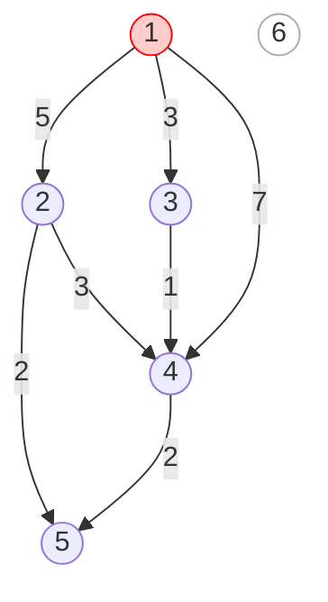
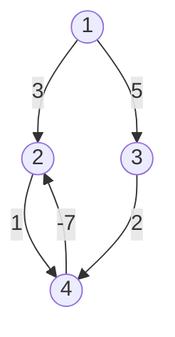

# Single-Source Shortest Paths / Bellman-Ford (can handle negatives)

It's like Dijkstra but for Weighted Edges that also have Negative Weights
The algorithms can process all kind of graphs provided graph does not contain a cycle with negative length.
If it is there then the algorithm can detect it

**Key Idea**:
- keeps track of distances from the starting node to all nodes of the graph
- the distance to the starting node is 0 and the distance to all other nodes in infinite.
- reduces the distances by finding edges that shorten the paths until it is not possible to reduce any distance.

**Example**:

Consider the following graph:

Nodes: 1, 2, 3, 4, 5, 6
Edges:
1 → 2 (weight 5)
1 → 3 (weight 3)
1 → 4 (weight 7)
2 → 5 (weight 2)
3 → 4 (weight 1)
4 → 5 (weight 2)
2 → 4 (weight 3)

**Step-by-step execution:**

1. **Initialization:**
	- Distance to node 1 (start): 0
	- Distance to all other nodes: ∞

2. **First pass (relax edges from node 1):**
	- 1 → 2: distance[2] = 5
	- 1 → 3: distance[3] = 3
	- 1 → 4: distance[4] = 7

3. **Second pass (relax edges):**
	- 2 → 5: distance[5] = 5 + 2 = 7
	- 3 → 4: distance[4] = min(7, 3 + 1) = 4

4. **Third pass (relax edges):**
	- 4 → 5: distance[5] = min(7, 4 + 2) = 6

5. **Final distances:**
	- 1: 0
	- 2: 5
	- 3: 3
	- 4: 4
	- 5: 6
	- 6: ∞ (unreachable)

**Shortest path example:**
- Shortest distance from 1 to 5: 1 → 3 → 4 → 5 (distance = 3 + 1 + 2 = 6)

*See diagram for visual step-by-step updates.*



## Implementation

The following implementation of the Bellman–Ford algorithm determines the shortest distances from a node x to all nodes of the graph. The code assumes that the graph is stored as an edge list edges that consists of tuples of the form (a, b, w), meaning that there is an edge from node a to node b with weight w.

The algorithm consists of n − 1 rounds, and on each round the algorithm goes through all edges of the graph and tries to reduce the distances. The algorithm constructs an array distance that will contain the distances from x to all nodes of the graph. The constant INF denotes an infinite distance.

```cpp
for (int i = 1; i <= n; i++) distance[i] = INF;
distance[x] = 0;
for (int i = 1; i <= n-1; i++) {
    for (auto e : edges) {
        int a, b, w;
        tie(a, b, w) = e;
        distance[b] = min(distance[b], distance[a]+w);
    }
}
```

The time complexity of the algorithm is O(nm), because the algorithm consists of n − 1 rounds and iterates through all m edges during a round. If there are no negative cycles in the graph, all distances are final after n − 1 rounds, because each shortest path can contain at most n − 1 edges.

In practice, the final distances can usually be found faster than in n − 1 rounds. Thus, a possible way to make the algorithm more efficient is to stop the algorithm if no distance can be reduced during a round.

## Negative cycles

The Bellman–Ford algorithm can also be used to check if the graph contains a cycle with negative length. For example, the graph:



contains a negative cycle 2 → 3 → 4 → 2 with length −4.

A negative cycle can be detected using the Bellman–Ford algorithm by running the algorithm for n rounds. If the last round reduces any distance, the graph contains a negative cycle. Note that this algorithm can be used to search for a negative cycle in the whole graph regardless of the starting node.

## SPFA algorithm

The **SPFA algorithm** ("Shortest Path Faster Algorithm") is a variant of the Bellman–Ford algorithm, that is often more efficient than the original algorithm. The SPFA algorithm does not go through all the edges on each round, but instead, it chooses the edges to be examined in a more intelligent way.

The algorithm maintains a queue of nodes that might be used for reducing the distances. First, the algorithm adds the starting node x to the queue. Then, the algorithm always processes the first node in the queue, and when an edge a → b reduces a distance, node b is added to the queue.

The efficiency of the SPFA algorithm depends on the structure of the graph: the algorithm is often efficient, but its worst case time complexity is still O(nm) and it is possible to create inputs that make the algorithm as slow as the original Bellman–Ford algorithm.

---

## Bellman-Ford Algorithm: Comprehensive Overview

The **Bellman-Ford algorithm** solves the single-source shortest-paths problem for graphs with negative edge weights. It returns the shortest paths and their weights, and can also detect negative-weight cycles.

### Algorithm (Pseudocode)

```pseudo
Bellman-Ford(G, w, s):
    Initialize-Single-Source(G, s)
    for i ← 1 to |V[G]| − 1
        for each edge (u, v) ∈ E[G]
            Relax(u, v, w)
    for each edge (u, v) ∈ E[G]
        if d[v] > d[u] + w(u, v)
            return FALSE // Negative cycle detected
    return TRUE // No negative cycle
```

### Dynamic Programming Formulation

Bellman derived the algorithm via dynamic programming:

$$
dist(v) = \begin{cases}
0 & \text{if } v = s \\
\min_{u \to v}(dist(u) + w(u \to v)) & \text{otherwise}
\end{cases}
$$

### Final Efficient Implementation

```pseudo
BellmanFordFinal(s):
    dist[s] ← 0
    for every vertex v ≠ s
        dist[v] ← ∞
    for i ← 1 to V − 1
        for every edge u→v
            if dist[v] > dist[u] + w(u→v)
                dist[v] ← dist[u] + w(u→v)
```

### Negative Cycle Detection

After V−1 passes, check for negative cycles:

```pseudo
for every edge u→v
    if dist[v] > dist[u] + w(u→v)
        return "Negative cycle exists"
```

### Key Properties
- Handles negative weights and cycles.
- Runs in O(VE) time.
- If no negative cycles, computes correct shortest paths.
- If negative cycle exists, reports it.

### Moore's Improvement (SPFA)
- Uses a queue to only process "tense" edges.
- Often faster in practice, but worst-case O(VE).

### Dijkstra vs Bellman-Ford
- Dijkstra is faster for graphs without negative weights.
- Bellman-Ford is robust for graphs with negative weights/cycles.

### DAG Shortest Paths
- For DAGs, topologically sort vertices and relax edges in order.
- Runs in O(V+E) time.

---

### SSSP on Graph with Negative Weight Cycle

If the input graph has negative edge weight, typical Dijkstra’s implementation can produce wrong answers. However, Dijkstra’s variant works fine if there is no negative weight cycle. If there is a negative weight cycle, Bellman-Ford’s algorithm must be used.

**Example:**
Path 1-2-1 is a negative cycle. The weight of this cycle is 15 + (-42) = -27.

To solve the SSSP problem in the presence of negative weight cycles, Bellman-Ford’s algorithm is used. The main idea is simple: Relax all E edges (in arbitrary order) V-1 times!

```cpp
vi dist(V, INF); dist[s] = 0;
for (int i = 0; i < V - 1; i++) // relax all E edges V-1 times
    for (int u = 0; u < V; u++) // these two loops = O(E), overall O(VE)
        for (int j = 0; j < (int)AdjList[u].size(); j++) {
            ii v = AdjList[u][j]; // record SP spanning here if needed
            dist[v.first] = min(dist[v.first], dist[u] + v.second); // relax
        }
```

The complexity of Bellman-Ford’s algorithm is O(V^3) if the graph is stored as an Adjacency Matrix or O(VE) if the graph is stored as an Adjacency List. Both time complexities are slower compared to Dijkstra’s. However, Bellman-Ford’s algorithm will never be trapped in an infinite loop even if the graph has a negative cycle.

**Negative Cycle Detection:**
After running the O(VE) Bellman-Ford’s algorithm, check for negative cycles:

```cpp
bool hasNegativeCycle = false;
for (int u = 0; u < V; u++) // one more pass to check
    for (int j = 0; j < (int)AdjList[u].size(); j++) {
        ii v = AdjList[u][j];
        if (dist[v.first] > dist[u] + v.second) // if this is still possible
            hasNegativeCycle = true; // then negative cycle exists!
    }
printf("Negative Cycle Exist? %s\n", hasNegativeCycle ? "Yes" : "No");
```

In programming contests, the slowness of Bellman-Ford’s and its negative cycle detection feature causes it to be used only to solve the SSSP problem on small graphs which are not guaranteed to be free from negative weight cycles.

[Implementation](./10.cpp)