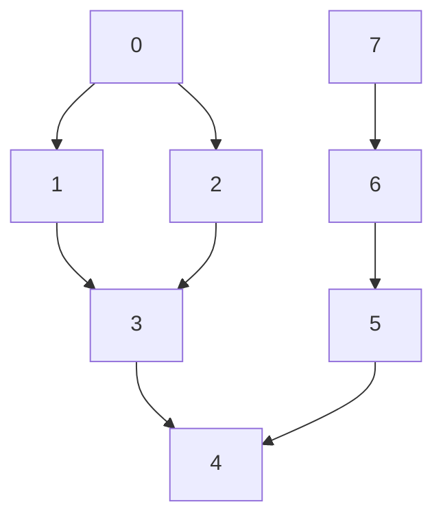

# Applications of Graph Traversal

## 1. Connectivity Check
A graph is connected if there is a path between any two nodes. To check connectivity, start DFS/BFS from any node and see if all nodes are visited.

**Example:**

### Graph
```mermaid
graph undirected
    1 --- 3
    3 --- 4
    1 --- 4
    2
    5
```

### DFS from node 1
```mermaid
graph undirected
    1 --- 3
    3 --- 4
    1 --- 4
    2
    5
    style 1 fill:#ccc
    style 3 fill:#ccc
    style 4 fill:#ccc
```
DFS visits nodes 1, 3, 4. Since not all nodes are visited, the graph is not connected.

---

## 2. Finding Cycles
A cycle exists if, during traversal, a node is revisited (other than the parent).

**Example:**

### Graph
```mermaid
graph undirected
    1 --- 3
    2 --- 3
    3 --- 4
    3 --- 5
    4 --- 5
```

### Cycle found: 3 → 2 → 5 → 3
```mermaid
graph undirected
    1 --- 3
    2 --- 3
    3 --- 4
    3 --- 5
    4 --- 5
    linkStyle 1 stroke:#f00,stroke-width:3px
    linkStyle 3 stroke:#f00,stroke-width:3px
    linkStyle 4 stroke:#f00,stroke-width:3px
```

---

## 3. Bipartiteness Check
A graph is bipartite if nodes can be colored with two colors so no adjacent nodes share the same color.

**Example:**

### Graph
```mermaid
graph undirected
    1 --- 2
    2 --- 3
    2 --- 5
    1 --- 4
    4 --- 5
```

### Coloring attempt (fails)
```mermaid
graph undirected
    1 --- 2
    2 --- 3
    2 --- 5
    1 --- 4
    4 --- 5
    style 1 fill:#88f
    style 2 fill:#f88
    style 3 fill:#88f
    style 5 fill:#f88
```
Nodes 2 and 5 are both red and adjacent, so the graph is not bipartite.

---

## 4.2.3 Finding Connected Components (Undirected Graph)
DFS/BFS can be used to find and count connected components in an undirected graph. Start DFS/BFS from each unvisited node to find new components.

**Pseudocode:**
```cpp
numCC = 0;
dfs_num.assign(V, UNVISITED);
for (int i = 0; i < V; i++)
    if (dfs_num[i] == UNVISITED)
        printf("CC %d:", ++numCC), dfs(i), printf("\n");
```

**Example Output:**
- CC 1: 0 1 2 3 4
- CC 2: 5
- CC 3: 6 7 8

**Mermaid Diagram:**
```mermaid
graph undirected
    subgraph CC1
        0 --- 1
        1 --- 2
        2 --- 3
        3 --- 4
    end
    5
    subgraph CC3
        6 --- 7
        7 --- 8
    end
```

---

## 4.2.4 Flood Fill - Labeling/Coloring Connected Components
Flood fill (DFS/BFS) is used to label/count the size of each component, especially in 2D grids.

**Pseudocode:**
```cpp
int dr[] = {1,1,0,-1,-1,-1,0,1};
int dc[] = {0,1,1,1,0,-1,-1,-1};
int floodfill(int r, int c, char c1, char c2) {
    if (r < 0 || r >= R || c < 0 || c >= C) return 0;
    if (grid[r][c] != c1) return 0;
    int ans = 1;
    grid[r][c] = c2;
    for (int d = 0; d < 8; d++)
        ans += floodfill(r + dr[d], c + dc[d], c1, c2);
    return ans;
}
```

**Sample Application:**
- Wetlands of Florida: Count size of connected 'W' cells.

**Mermaid Diagram:**
```mermaid
grid
    L L L L L L L L
    L L W L L L L L
    L W W L L L L L
    L L W W W L L L
    L L L L L L L L
```

---

## 4.2.5 Topological Sort (Directed Acyclic Graph)
Topological sort orders vertices so that for every edge u → v, u comes before v. Useful for scheduling tasks/modules with prerequisites.

**DFS Pseudocode:**
```cpp
void dfs2(int u) {
    dfs_num[u] = VISITED;
    for (int j = 0; j < AdjList[u].size(); j++) {
        ii v = AdjList[u][j];
        if (dfs_num[v.first] == UNVISITED)
            dfs2(v.first);
    }
    ts.push_back(u);
}
```

**Example Output:**
- 7 6 0 1 2 5 3 4

**Mermaid Diagram:**


---

## 4.2.6 Bipartite Graph Check
A graph is bipartite if it can be colored with two colors so no adjacent nodes share the same color. BFS/DFS can be used for checking.

**BFS Pseudocode:**
```cpp
queue<int> q; q.push(s);
vi color(V, INF); color[s] = 0;
bool isBipartite = true;
while (!q.empty() && isBipartite) {
    int u = q.front(); q.pop();
    for (int j = 0; j < AdjList[u].size(); j++) {
        ii v = AdjList[u][j];
        if (color[v.first] == INF) {
            color[v.first] = 1 - color[u];
            q.push(v.first);
        } else if (color[v.first] == color[u]) {
            isBipartite = false; break;
        }
    }
}
```

**Mermaid Diagram:**
```mermaid
graph undirected
    1 --- 2
    2 --- 3
    2 --- 5
    1 --- 4
    4 --- 5
    style 1 fill:#88f
    style 2 fill:#f88
    style 3 fill:#88f
    style 5 fill:#f88
```