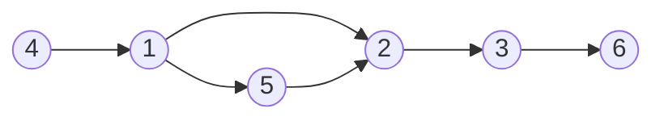
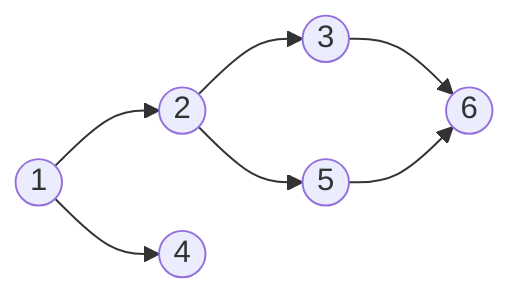
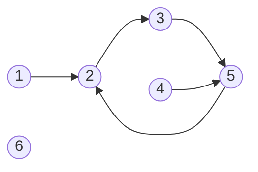
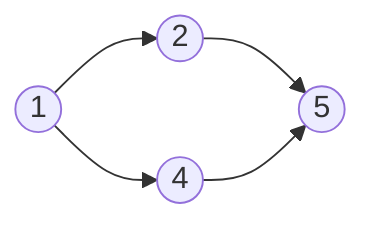
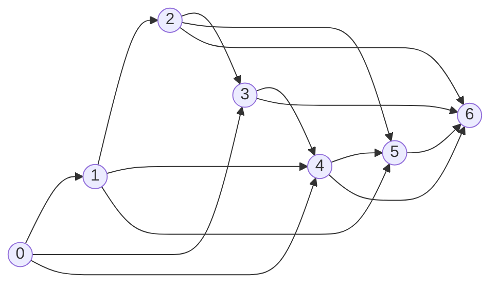

# Directed Acyclic Graphs (DAG) and Topological Sorting

## Directed Graphs

In this section, we focus on two classes of directed graphs:

- **Acyclic graphs**: There are no cycles in the graph, so there is no path from any node to itself.
- **Successor graphs**: The outdegree of each node is 1, so each node has a unique successor.

Both types of graphs allow for efficient algorithms based on their special properties.

## Topological Sorting

A **topological sort** is an ordering of the nodes of a directed graph such that if there is a path from node `a` to node `b`, then node `a` appears before node `b` in the ordering. For example, consider the graph below:




One possible topological sort is `[4, 1, 5, 2, 3, 6]`.

### Properties of Topological Sort

- An acyclic graph always has a topological sort.
- If the graph contains a cycle, it is not possible to form a topological sort.
- Depth-first search (DFS) can be used to check for cycles and construct a topological sort.

### Algorithm for Topological Sort

The algorithm uses DFS to traverse the graph and assigns states to nodes:

1. **State 0 (White)**: The node has not been processed.
2. **State 1 (Light Gray)**: The node is under processing.
3. **State 2 (Dark Gray)**: The node has been processed.

#### Steps:
1. Initialize all nodes to state 0.
2. For each unprocessed node, perform a DFS.
3. During the DFS:
   - Mark the node as state 1 when it is first visited.
   - If a node is revisited while in state 1, a cycle is detected, and topological sorting is not possible.
   - Once all successors of a node are processed, mark it as state 2 and add it to the topological sort list.
4. The reverse of the topological sort list is the final result.

### Example 1: Acyclic Graph

Consider the following graph:



The DFS proceeds as follows:
1. Start at node 1 and traverse to node 6.
2. Add node 6 to the list after processing.
3. Continue processing nodes 3, 2, and 1.
4. Start at node 4 and process nodes 4 and 5.

The final topological sort is `[4, 5, 1, 2, 3, 6]`.


DFS processing idea:

```
6 → add
3 → add
5 → add
2 → add
1 → add
4 → add
```

Reverse result → final ordering.


### Example 2: Cyclic Graph

If the graph contains a cycle, topological sorting is not possible. For example:



In this graph, the DFS detects a cycle when revisiting node 2 while it is in state 1. The cycle is `2 → 3 → 5 → 2`.

---

## Dynamic Programming on DAGs

If a directed graph is acyclic, dynamic programming can be applied to solve various problems efficiently, such as:

- Counting the number of paths between two nodes.
- Finding the shortest/longest path.
- Determining the minimum/maximum number of edges in a path.
- Identifying nodes that certainly appear in any path.

### Counting the Number of Paths

To calculate the number of paths from node 1 to node 6 in the graph below:


There are three paths:
1. `1 → 2 → 3 → 6`
2. `1 → 4 → 5 → 2 → 3 → 6`
3. `1 → 4 → 5 → 3 → 6`

Using dynamic programming, let `paths(x)` denote the number of paths from node 1 to node `x`. The recurrence relation is:

$$
paths(x) = \sum_{a_i \to x} paths(a_i)
$$

where $a_1, a_2, \dots, a_k$ are the nodes from which there is an edge to $x$. The base case is $paths(1) = 1$.

### Extending Dijkstra's Algorithm

Dynamic programming can also extend Dijkstra's algorithm to calculate the number of shortest paths in a DAG. For example, in the graph below:



The shortest paths from node 1 to node 5 are calculated using dynamic programming, resulting in the following path counts:

- `paths(5) = paths(2) + paths(4)`
- `paths(2) = 1`
- `paths(4) = 1`

Thus, `paths(5) = 1 + 1 = 2`.

### Representing Problems as Graphs

Dynamic programming problems can often be represented as directed acyclic graphs. For example, consider the problem of forming a sum of money $n$ using coins $\{c_1, c_2, \dots, c_k\}$. Each node corresponds to a sum of money, and edges indicate how the states depend on each other.

For example, for coins $\{1, 3, 4\}$ and $n = 6$, the graph is as follows:



The shortest path from node 0 to node $n$ corresponds to the solution with the minimum number of coins, and the total number of paths from node 0 to node $n$ equals the total number of solutions.

Interpretation:

* Nodes = **sum values**
* Edges = **adding a coin**

Properties:

* **Shortest path from 0 → n** = minimum number of coins
* **Total paths from 0 → n** = number of possible combinations

Dynamic programming is often just **running algorithms on an implicit DAG of states**.

```
DP = Graph problem where states are nodes and transitions are edges
```

## Associated Code File

The implementation of DAG and Topological Sort can be found in the following file:

- [DAG and Topological Sort Implementation](./1.cpp)
