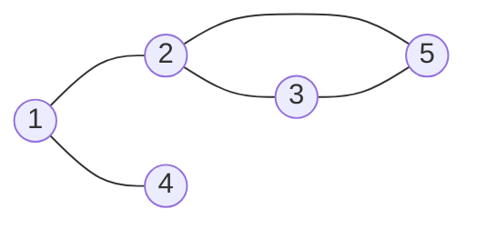
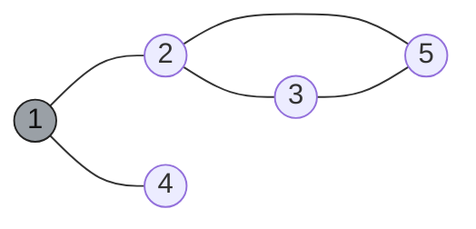
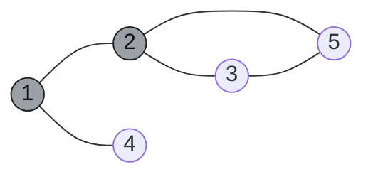
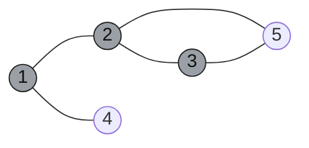
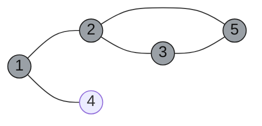
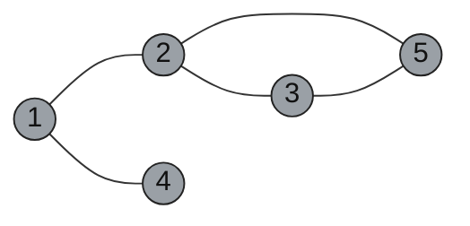
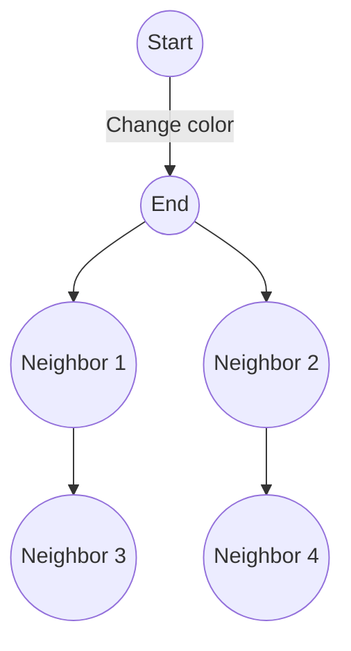

# Depth-First Search (DFS)

Depth-First Search (DFS) explores a graph by going as deep as possible along one branch before backtracking. It is a specific instance of a broader family of algorithms called **Whatever-First Search (WFS)**, which uses a "bag" data structure to manage the traversal order. Depending on the type of bag used (stack, queue, or priority queue), WFS can implement DFS, BFS, or other traversal strategies.

---

## 1) Core idea

- Start from a source vertex.
- Mark it visited.
- Recur (or iterate with stack) on an unvisited neighbor.
- When a vertex has no unvisited neighbor left, backtrack.
- Repeat for remaining unvisited vertices to build a DFS forest.

This gives a traversal order that depends on adjacency-list order.

---

## 2) Recursive and Iterative DFS

### Recursive DFS

```text
RecursiveDFS(v):
  if v is unmarked:
    mark v
    for each edge v-w:
      RecursiveDFS(w)
```

### Iterative DFS

```text
IterativeDFS(s):
  Push(s)
  while the stack is not empty:
    v ← Pop
    if v is unmarked:
      mark v
      for each edge v-w:
        Push(w)
```

Both versions are equivalent in functionality. The iterative version explicitly uses a stack, which mirrors the recursion stack in the recursive version.

---

## 3) Whatever-First Search (WFS)

DFS is a specific case of the **Whatever-First Search (WFS)** algorithm, which uses a generic "bag" data structure to manage traversal. The behavior of WFS depends on the type of bag used:

- **Stack**: Depth-First Search (DFS)
- **Queue**: Breadth-First Search (BFS)
- **Priority Queue**: Best-First Search (e.g., Dijkstra's algorithm)

### Generic WFS Algorithm

```text
WhateverFirstSearch(s):
  put s into the bag
  while the bag is not empty:
    take v from the bag
    if v is unmarked:
      mark v
      for each edge v-w:
        put w into the bag
```

### Analysis

- Time complexity: $O(V + E)$ with adjacency list, $O(V^2 + ET)$ with adjacency matrix.
- Space complexity: Depends on the size of the bag.

---

## 4) Step-by-step DFS traversal (Mermaid)

We use this undirected graph and start from node `1`. One valid DFS order is:

$$1 \rightarrow 2 \rightarrow 3 \rightarrow 5 \rightarrow 4$$

Common edge set used below:

- `1-2`, `1-4`, `2-3`, `2-5`, `3-5`

Color meaning in diagrams:

- light: unvisited
- dark: visited (processed or in process for this simple walkthrough)

### Step 0: Initial graph



### Step 1: Visit 1



### Step 2: Move 1 -> 2



### Step 3: Move 2 -> 3



### Step 4: Move 3 -> 5



### Step 5: Backtrack and then move 1 -> 4



Traversal complete: all vertices visited.

---

## 5) Preorder and Postorder

DFS can compute **preorder** and **postorder** traversals of rooted trees or directed graphs. These traversals are defined by introducing two black-box subroutines:

- **PreVisit(v)**: Called when a vertex is first discovered.
- **PostVisit(v)**: Called when a vertex is finished.

### Algorithm

```text
DFSAll(G):
  Preprocess(G)
  for all vertices v:
    if v is unmarked:
      DFS(v)

DFS(v):
  mark v
  PreVisit(v)
  for each edge v-w:
    if w is unmarked:
      parent(w) ← v
      DFS(w)
  PostVisit(v)
```

---

## 6) Edge classification in DFS (directed graph)

DFS classifies edges using discovery/finish times and colors.

1. **Tree edge**: discovers a new vertex (`WHITE -> GRAY` transition on target).
2. **Back edge**: goes to an ancestor in DFS tree.
3. **Forward edge**: goes to a descendant but is not a tree edge.
4. **Cross edge**: all other edges (between unrelated subtrees or finished branches).

Color-based quick rule when edge `(u, v)` is explored:

- `v` is `WHITE`  => tree edge
- `v` is `GRAY`   => back edge
- `v` is `BLACK`  => forward or cross edge

### Undirected graph property

In an undirected graph, DFS yields only:

- tree edges, and
- back edges.

Forward and cross edges do not occur.

---

## 7) Applications of DFS

- **Connected components**: Identify all connected components in an undirected graph.
- **Cycle detection**: Detect cycles in directed or undirected graphs.
- **Topological sort (DAG)**: Order vertices in a directed acyclic graph.
- **Strongly connected components (SCC)**: Identify SCCs in directed graphs (e.g., Kosaraju's or Tarjan's algorithm).
- **Bridges and articulation points**: Find critical edges and vertices in a graph.
- **Edge classification**: Classify edges as tree, back, forward, or cross edges.
- **Ancestor/descendant queries**: Answer queries about relationships in DFS trees.

---

## 8) Flood-Fill Algorithm

The flood-fill problem, commonly used in raster graphics, can be reduced to a reachability problem in a graph. The algorithm changes every pixel in a connected region to a new color.

### Algorithm

```text
FloodFill(i, j, newColor):
  if color[i][j] == newColor:
    return
  oldColor = color[i][j]
  DFS(i, j, oldColor, newColor)

DFS(i, j, oldColor, newColor):
  if color[i][j] != oldColor:
    return
  color[i][j] = newColor
  for each neighbor (x, y) of (i, j):
    DFS(x, y, oldColor, newColor)
```

### Example



---

## 9) Strongly Connected Components (SCC)

### Kosaraju's Algorithm

Kosaraju's algorithm finds all SCCs in a directed graph in $O(V + E)$ time by performing two passes of DFS:

1. Perform a DFS on the reversed graph to compute finishing times.
2. Perform a DFS on the original graph in the order of decreasing finishing times.

### Tarjan's Algorithm

Tarjan's algorithm finds SCCs in $O(V + E)$ time using a single DFS pass. It uses a low-link value to identify the root of each SCC.

```text
TarjanDFS(v):
  mark v
  v.pre ← clock
  v.low ← v.pre
  Push(S, v)
  for each edge v-w:
    if w is unmarked:
      TarjanDFS(w)
      v.low ← min(v.low, w.low)
    else if w is in S:
      v.low ← min(v.low, w.pre)
  if v.low == v.pre:
    repeat:
      w ← Pop(S)
      w.root ← v
    until w == v
```

---

## 10) DFS and Topological Sort

DFS can be used to compute a **topological ordering** of a directed acyclic graph (DAG). The vertices are ordered such that for every directed edge $u \to v$, $u$ appears before $v$ in the ordering.

### Algorithm

```text
TopologicalSort(G):
  for all vertices v:
    v.status ← NEW
  clock ← V
  for all vertices v:
    if v.status == NEW:
      TopSortDFS(v, clock)
  return S[1..V]

TopSortDFS(v, clock):
  v.status ← ACTIVE
  for each edge v-w:
    if w.status == NEW:
      TopSortDFS(w, clock)
  S[clock] ← v
  clock ← clock - 1
  v.status ← FINISHED
```

---

## 11) Merge-ready placeholders

As you upload more material, we will append/merge into these slots:

- **Book A additions**: intuition variants, pedagogical diagrams
- **Book B additions**: formal theorems and proofs
- **Book C additions**: competitive-programming idioms and tricks
- **Book D additions**: edge cases, exercises, interview patterns

I will keep one unified section ordering and reconcile notation (`d/f`, `tin/tout`, `color/visited`) so final notes stay consistent.
