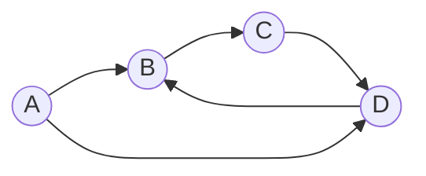
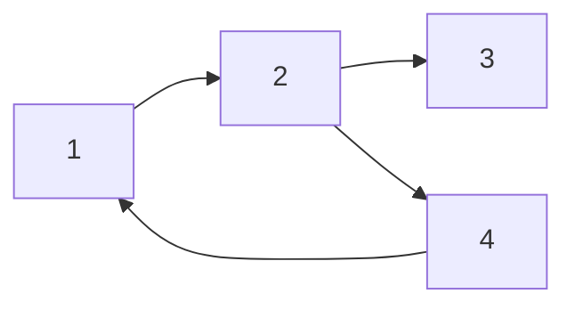
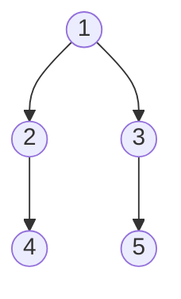
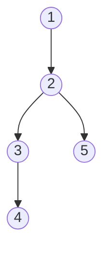
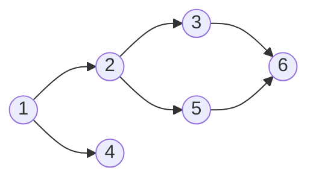
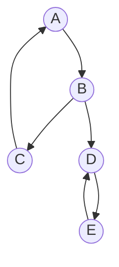
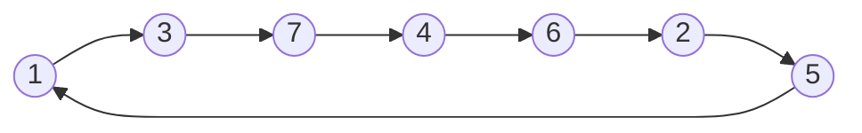
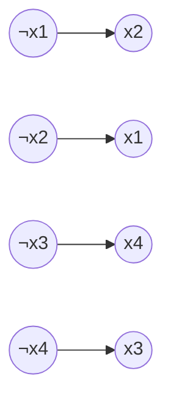
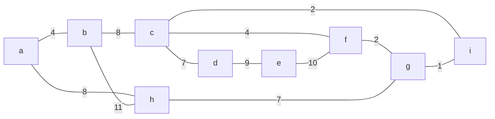

# Directed Graphs

---

## 1. Directed Graph Basics
- **Directed graph (digraph):** Edges have direction (u → v).
- Used to model one-way relationships (web links, dependencies, etc).
- Key terms: in-degree, out-degree, strongly/weakly connected, cycles, DAG.

**Example:**


---

## 2. Representation
- **Adjacency List:** `vector<pair<int,int>> adj[N];` (for weighted)
- **Adjacency Matrix:** `int g[n][n];` (1 if edge exists, else 0)
- **Edge List:** `vector<tuple<int,int,int>> edges;` (u, v, w)

**Example (Adjacency List):**


---

## 3. Traversal
### Breadth-First Search (BFS)
- Explores all neighbors at current depth before going deeper.
- Finds shortest path in unweighted graphs.
```cpp
queue<int> q; q.push(s);
vector<int> dist(n, INF); dist[s] = 0;
while (!q.empty()) {
    int u = q.front(); q.pop();
    for (int v : adj[u]) if (dist[v] == INF) {
        dist[v] = dist[u] + 1;
        q.push(v);
    }
}
```

**BFS Tree Example:**


### Depth-First Search (DFS)
- Explores as deep as possible before backtracking.
- Used for cycle detection, topological sort, SCCs.
```cpp
void dfs(int u) {
    vis[u] = 1;
    for (int v : adj[u]) if (!vis[v]) dfs(v);
}
```

**DFS Example:**


---

## 4. Topological Sort (DAGs)
- Linear ordering of nodes such that for every edge u→v, u comes before v.
- Only possible if the graph is acyclic (DAG).
- **DFS method:** Add node to list after visiting all descendants, then reverse the list.
- **Kahn’s algorithm:** Use in-degree, repeatedly remove nodes with in-degree 0.

**DAG Example:**


---

## 5. Shortest Paths in Directed Graphs
### Dijkstra’s Algorithm
- Finds shortest paths from source to all nodes (non-negative weights).
- Uses priority queue for efficiency.
```cpp
vector<int> dist(n, INF); dist[s] = 0;
priority_queue<pair<int,int>, vector<pair<int,int>>, greater<>> pq;
pq.push({0, s});
while (!pq.empty()) {
    auto [d, u] = pq.top(); pq.pop();
    if (d > dist[u]) continue;
    for (auto [v, w] : adj[u]) if (dist[u] + w < dist[v]) {
        dist[v] = dist[u] + w;
        pq.push({dist[v], v});
    }
}
```

### Bellman-Ford Algorithm
- Handles negative weights, detects negative cycles.
- Relaxes all edges up to n-1 times.
```cpp
vector<int> dist(n, INF); dist[s] = 0;
for (int i = 0; i < n-1; ++i)
  for (auto [u, v, w] : edges)
    if (dist[u] + w < dist[v]) dist[v] = dist[u] + w;
// Check for negative cycles
for (auto [u, v, w] : edges)
  if (dist[u] + w < dist[v]) // negative cycle exists
```

### Floyd-Warshall Algorithm
- All-pairs shortest paths (handles negatives, not negative cycles).
```cpp
vector<vector<int>> dist(n, vector<int>(n, INF));
for (int u = 0; u < n; ++u) dist[u][u] = 0;
for (auto [u, v, w] : edges) dist[u][v] = w;
for (int k = 0; k < n; ++k)
  for (int i = 0; i < n; ++i)
    for (int j = 0; j < n; ++j)
      dist[i][j] = min(dist[i][j], dist[i][k] + dist[k][j]);
```

---

## 6. Strongly Connected Components (SCC)
- Maximal subgraphs where every node is reachable from every other node in the component.
- **Kosaraju’s Algorithm:** Two DFS passes (original, then reversed graph).
- **Tarjan’s Algorithm:** Single DFS, uses low-link values and stack.

**SCC Example:**


---

## 7. Special Topics
### Successor Graphs (Functional Graphs)
- Each node has exactly one outgoing edge.
- Use binary lifting for fast k-step queries: precompute succ(x, 2^i).
- Cycle detection: Floyd’s algorithm (tortoise and hare).

**Successor Graph Example:**


### 2SAT Problem
- Each clause (a ∨ b) gives two implications: (¬a → b), (¬b → a).
- Satisfiable iff no variable x and ¬x are in the same SCC.

**2SAT Implication Graph Example:**


---

## 8. Minimum Spanning Tree (for undirected graphs)
- **Prim’s Algorithm:** Grow MST from any node, always add minimum-weight edge to tree.
- **Kruskal’s Algorithm:** Add edges in increasing order of weight, avoid cycles (Union-Find).

**Prim's Example:**


---

## 9. Practice & Patterns
- Always check for cycles in directed graphs (DAGs are cycle-free).
- Use topological sort for scheduling, DP on DAGs, etc.
- For shortest paths, pick the right algorithm based on edge weights (Dijkstra, Bellman-Ford, Floyd-Warshall).
- For SCCs, use Kosaraju or Tarjan for fast decomposition.
