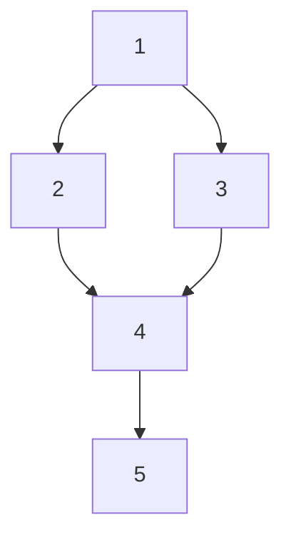
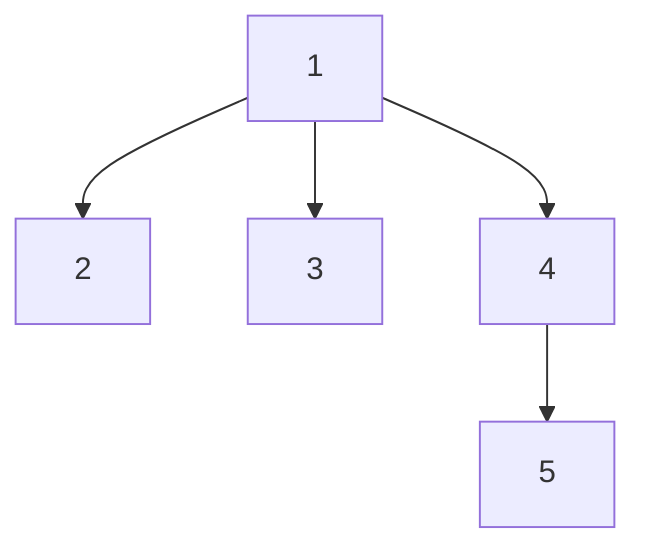

# Dominator Tree

## Overview
A dominator tree represents dominance relationships in a directed graph. Node u dominates node v if every path from the start node to v passes through u.

## Key Concepts

- **Dominator:** u dominates v if all paths from start to v go through u
- **Immediate Dominator (idom):** The closest dominator of v (except v itself)
- **Dominator Tree:** Tree where parent is immediate dominator

## Example

Control flow graph:


Dominator tree:


- Node 1 dominates all nodes
- Node 4 dominates node 5

## Lengauer-Tarjan Algorithm

Computes dominator tree in O((V+E) * α(V+E)) time.

```cpp
struct DominatorTree {
    vector<int> idom;      // immediate dominator
    vector<int> semi;      // semidominator
    vector<int> ancestor;
    vector<int> label;
    vector<int> vertex;
    vector<vector<int>> pred;
    vector<vector<int>> bucket;
    int N;
    
    void init(int n) {
        N = n;
        idom.resize(N, -1);
        semi.resize(N, -1);
        ancestor.resize(N, -1);
        label.resize(N, -1);
        vertex.resize(N);
        pred.resize(N);
        bucket.resize(N);
    }
    
    void dfs(int u, vector<int>& adj[]) {
        semi[u] = N;
        label[u] = u;
        vertex[N] = u;
        N--;
        
        for (int v : adj[u]) {
            if (semi[v] == -1) {
                dfs(v, adj);
                pred[v].push_back(u);
            }
        }
    }
    
    int eval(int v) {
        if (ancestor[v] == -1)
            return v;
        compress(ancestor[v]);
        if (semi[label[ancestor[v]]] < semi[label[v]])
            label[v] = label[ancestor[v]];
        return label[v];
    }
    
    void compress(int v) {
        if (ancestor[ancestor[v]] != -1) {
            compress(ancestor[v]);
            if (semi[label[ancestor[v]]] < semi[label[v]])
                label[v] = label[ancestor[v]];
            ancestor[v] = ancestor[ancestor[v]];
        }
    }
};
```

## Applications

- **Compiler optimization:** Data flow analysis
- **Dead code elimination:** Find unreachable code
- **Program slicing:** Extract relevant code
- **Static analysis:** Bug detection

## Complexity

- Time: O((V+E) * α(V+E)) ≈ O(V+E)
- Space: O(V+E)
