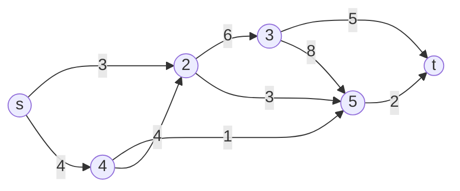
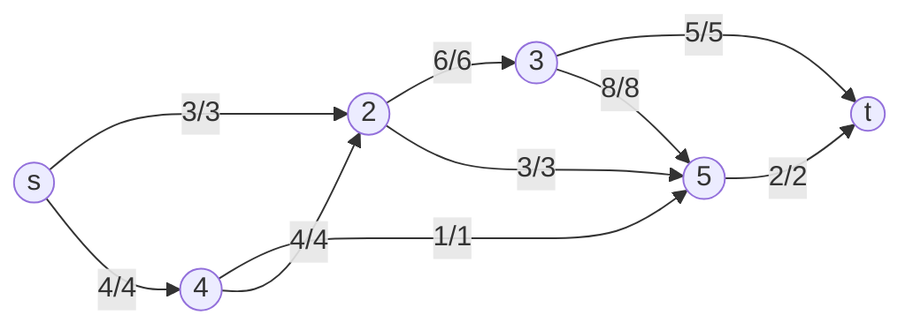
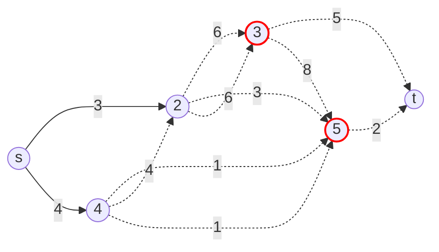

# Flows and Cuts in Graphs

## 1. Introduction

Flows and cuts are central concepts in network and graph theory, with applications in transport, communication, matching, and connectivity.

**Key Problems:**
- **Maximum Flow:** Largest amount of flow that can be sent from a source $s$ to a sink $t$ in a directed, weighted graph.
- **Minimum Cut:** Smallest total weight of edges that, if removed, would disconnect $s$ from $t$.

---

## 2. Flow Networks: Definitions

- **Flow Network:** Directed graph $G = (V, E)$ with capacity $c(u, v) \geq 0$ for each edge $(u, v) \in E$.
- **Source ($s$):** Node with no incoming edges.
- **Sink ($t$):** Node with no outgoing edges.
- **Flow ($f$):** Function $f: E \to \mathbb{R}$ satisfying:
	- **Capacity constraint:** $0 \leq f(u, v) \leq c(u, v)$
	- **Skew symmetry:** $f(u, v) = -f(v, u)$
	- **Flow conservation:** $\sum_{u} f(u, v) = 0$ for all $v \neq s, t$

---

## 3. Value of a Flow

The value of a flow is the total net flow out of the source:

$$
|f| = \sum_{v} f(s, v)
$$

---

## 4. Cuts in Flow Networks

- **Cut $(S, T)$:** Partition of $V$ into $S$ and $T$ with $s \in S$, $t \in T$.
- **Capacity of a cut:**
  $$
  ||S, T|| = \sum_{v \in S} \sum_{w \in T} c(v, w)
  $$

---

## 5. Max-Flow Min-Cut Theorem

> In every flow network, the value of the maximum $(s, t)$-flow equals the capacity of the minimum $(s, t)$-cut.

**Implications:**
- Any flow is upper-bounded by any cut.
- If a flow saturates all edges from $S$ to $T$ and avoids all edges from $T$ to $S$, then the flow value equals the cut capacity.

---

## 6. Residual Graphs & Augmenting Paths

- **Residual capacity:** $c_f(u, v) = c(u, v) - f(u, v)$
- **Residual graph $G_f$:** Edges with $c_f(u, v) > 0$
- **Augmenting path:** Path from $s$ to $t$ in $G_f$

---

## 7. Algorithms

### Ford-Fulkerson Algorithm (Overview)

1. Start with $f(u, v) = 0$ for all $(u, v)$
2. While there is an augmenting path $p$ from $s$ to $t$ in $G_f$:
	- Find $f = \min$ residual capacity along $p$
	- Augment flow along $p$ by $f$
	- Update residual graph
3. When no augmenting path exists, $f$ is a maximum flow

### Edmonds-Karp Algorithm (Overview)

- Special case of Ford-Fulkerson: always choose shortest augmenting path (BFS)
- Guarantees $O(VE^2)$ time

---

## 8. Pseudocode

### Ford-Fulkerson Algorithm
```
function FordFulkerson(G, s, t):
	initialize flow f(e) = 0 for all edges e
	while there exists an augmenting path p from s to t in residual graph G_f:
		let F = minimum residual capacity along p
		for each edge (u, v) in p:
			if (u, v) is a forward edge:
				f(u, v) += F
			else:
				f(v, u) -= F
	return total flow out of s
```

### Edmonds-Karp Algorithm (BFS version)
```
function EdmondsKarp(G, s, t):
	initialize flow f(e) = 0 for all edges e
	while there exists a path p from s to t in residual graph G_f (found by BFS):
		let F = minimum residual capacity along p
		for each edge (u, v) in p:
			if (u, v) is a forward edge:
				f(u, v) += F
			else:
				f(v, u) -= F
	return total flow out of s
```

---

## 9. Visualizations

### Example Flow Network


### Example Network with Maximum Flow


### Minimum Cut Example


---

## 10. Applications

- Bipartite matching
- Network connectivity
- Project selection

---

## 11. Related Terms

| Term | Definition |
|------|------------|
| **Bridge (Cut edge)** | An edge whose removal increases the number of connected components |
| **Articulation point (Cut vertex)** | A vertex whose removal (along with its edges) disconnects the graph |

---


## 11. Advanced Applications of Flows and Cuts

### 11.1 Edge-Disjoint and Node-Disjoint Paths

**Edge-disjoint paths:** Find the maximum number of paths from $s$ to $t$ such that no edge is used in more than one path. This is equivalent to the maximum flow with unit edge capacities.

**Node-disjoint paths:** Find the maximum number of $s$-$t$ paths such that no node (except $s, t$) is used in more than one path. Reduce to max flow by splitting each node $v$ (except $s, t$) into $v_{in}$ and $v_{out}$, connect with edge of capacity 1, redirect all incoming edges to $v_{in}$ and all outgoing from $v_{out}$.

---

### 11.2 Bipartite Matching, Hall’s and König’s Theorems

**Maximum matching in bipartite graphs:**
- Construct a flow network: add source $s$, connect to all left nodes; add sink $t$, connect all right nodes to $t$; all original edges go left $\to$ right with capacity 1.
- The size of the maximum matching equals the value of the max flow.

**Hall’s theorem:** A bipartite graph $G=(L \cup R, E)$ has a matching that covers all nodes in $L$ if and only if for every subset $X \subseteq L$, $|N(X)| \geq |X|$, where $N(X)$ is the set of neighbors of $X$.

**König’s theorem:** In bipartite graphs, the size of a minimum node cover equals the size of a maximum matching.

**Minimum node cover:** A set of nodes such that every edge is incident to at least one node in the set.

**Maximum independent set:** The set of nodes not in a minimum node cover. In bipartite graphs, its size is $n-$ (max matching).

---

### 11.3 Path Covers, Node-Disjoint Path Cover, and Dilworth’s Theorem

**Path cover:** A set of paths such that every node is in at least one path.

**Node-disjoint path cover:** Each node is in exactly one path. In DAGs, the minimum number of node-disjoint paths equals $n - c$, where $n$ is the number of nodes and $c$ is the size of a maximum matching in the associated bipartite graph:
- For each node $v$, create $v_{in}$ and $v_{out}$, add an edge $v_{out} \to u_{in}$ for every edge $v \to u$ in the original graph.
- Add source and sink, connect as needed.
- The minimum node-disjoint path cover is $n -$ (max matching).

**Dilworth’s theorem:** In a DAG, the size of a minimum path cover equals the size of a maximum antichain (set of nodes with no path between any pair).

---

### 11.4 Real-World Modeling: Vertex Splitting, Assignment, Scheduling, Baseball Elimination, Project Selection

**Vertex capacities:** To enforce a limit on how much flow passes through a node, split each node $v$ into $v_{in}$ and $v_{out}$, connect with edge of capacity $c(v)$, redirect all incoming edges to $v_{in}$ and all outgoing from $v_{out}$.

**Assignment problems:** Model as bipartite matching with capacities. For example, assign jobs to machines, students to projects, or applications to computers. Construct a flow network as above, with capacities as needed.

**Scheduling (tuple selection):** Reduce to max flow by creating layers for each resource (e.g., classes, rooms, times, proctors), connect with edges of appropriate capacity, and find a maximum flow.

**Baseball elimination:** Build a flow network with nodes for games and teams, connect source to game nodes, game nodes to team nodes, and team nodes to sink. Team is eliminated if max flow does not saturate all game edges.

**Project selection (min-cut):** Given projects with profits/costs and dependencies, build a flow network:
  - Source to profitable jobs (capacity = profit)
  - Costly jobs to sink (capacity = -cost)
  - Infinite capacity edges for dependencies
  - The minimum $s$-$t$ cut gives the optimal set of projects to select.

---

## 12. Further Reading

- See also: [ford-fulkerson.md], [edmonds-karp.md], [bipartite-matching.md], [vertex-splitting.md], [project-selection.md] for more details and code examples.