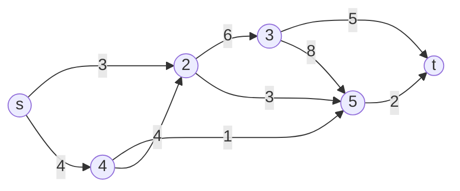
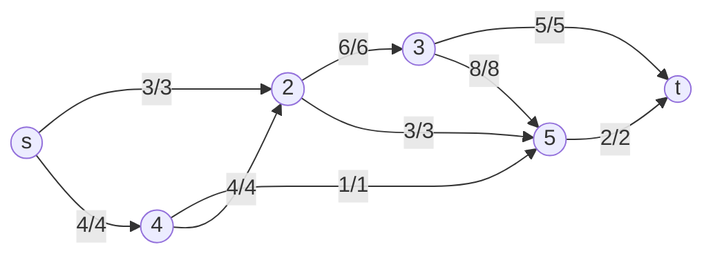
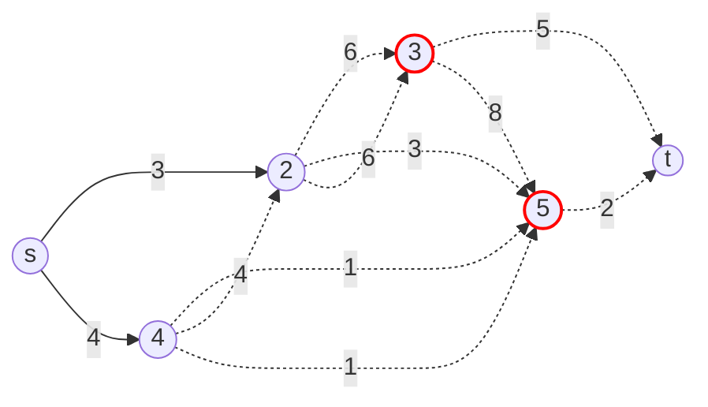

# Maximum Flow & Minimum Cut

## 1. Introduction
Maximum flow and minimum cut problems are fundamental in combinatorial optimization and graph theory. They model the transport of material (or information) through a network, subject to capacity constraints on the edges.

**Key Problems:**
- **Maximum Flow:** What is the largest amount of flow that can be sent from a source $s$ to a sink $t$ in a directed, weighted graph?
- **Minimum Cut:** What is the smallest total weight of edges that, if removed, would disconnect $s$ from $t$?

## 2. Flow Networks: Definitions

- **Flow Network:** Directed graph $G = (V, E)$ with capacity $c(u, v) \geq 0$ for each edge $(u, v) \in E$.
- **Source ($s$):** Node with no incoming edges.
- **Sink ($t$):** Node with no outgoing edges.
- **Flow ($f$):** Function $f: E \to \mathbb{R}$ satisfying:
	- **Capacity constraint:** $0 \leq f(u, v) \leq c(u, v)$
	- **Skew symmetry:** $f(u, v) = -f(v, u)$
	- **Flow conservation:** $\sum_{u} f(u, v) = 0$ for all $v \neq s, t$

## 3. Value of a Flow

The value of a flow is the total net flow out of the source:

$$
|f| = \sum_{v} f(s, v)
$$

## 4. Cuts in Flow Networks

- **Cut $(S, T)$:** Partition of $V$ into $S$ and $T$ with $s \in S$, $t \in T$.
- **Capacity of a cut:**
$$
||S, T|| = \sum_{v \in S} \sum_{w \in T} c(v, w)
$$

## 5. Max-Flow Min-Cut Theorem

> In every flow network, the value of the maximum $(s, t)$-flow equals the capacity of the minimum $(s, t)$-cut.

**Proof Sketch:**
- Any flow is upper-bounded by any cut.
- If a flow saturates all edges from $S$ to $T$ and avoids all edges from $T$ to $S$, then the flow value equals the cut capacity.

## 6. Residual Graphs & Augmenting Paths

- **Residual capacity:** $c_f(u, v) = c(u, v) - f(u, v)$
- **Residual graph $G_f$:** Edges with $c_f(u, v) > 0$
- **Augmenting path:** Path from $s$ to $t$ in $G_f$

## 7. Ford-Fulkerson Algorithm (Overview)

1. Start with $f(u, v) = 0$ for all $(u, v)$
2. While there is an augmenting path $p$ from $s$ to $t$ in $G_f$:
		- Find $f = \min$ residual capacity along $p$
		- Augment flow along $p$ by $f$
		- Update residual graph
3. When no augmenting path exists, $f$ is a maximum flow

## 8. Edmonds-Karp Algorithm (Overview)

- Special case of Ford-Fulkerson: always choose shortest augmenting path (BFS)
- Guarantees $O(VE^2)$ time

## 9. Applications
- Bipartite matching
- Network connectivity
- Project selection, etc.

---
## 10. Visualizations (Mermaid Diagrams)

### Example Flow Network


### Example Network with Maximum Flow


### Minimum Cut Example


---
## 11. Pseudocode

### Ford-Fulkerson Algorithm
```
function FordFulkerson(G, s, t):
	initialize flow f(e) = 0 for all edges e
	while there exists an augmenting path p from s to t in residual graph G_f:
		let F = minimum residual capacity along p
		for each edge (u, v) in p:
			if (u, v) is a forward edge:
				f(u, v) += F
			else:
				f(v, u) -= F
	return total flow out of s
```

### Edmonds-Karp Algorithm (BFS version)
```
function EdmondsKarp(G, s, t):
	initialize flow f(e) = 0 for all edges e
	while there exists a path p from s to t in residual graph G_f (found by BFS):
		let F = minimum residual capacity along p
		for each edge (u, v) in p:
			if (u, v) is a forward edge:
				f(u, v) += F
			else:
				f(v, u) -= F
	return total flow out of s
```