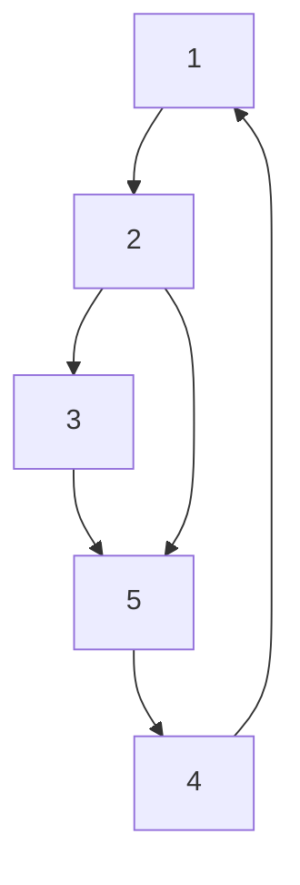
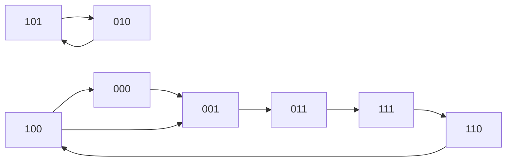

# Paths and Circuits

---

## 1. Eulerian Paths and Circuits

- **Eulerian path:** Visits every edge exactly once.
- **Eulerian circuit:** Eulerian path that starts and ends at the same node.

### Existence Criteria (Undirected)
- Eulerian circuit: All nodes have even degree, single connected component.
- Eulerian path: Exactly 0 or 2 nodes have odd degree, rest even, single component.

### Existence Criteria (Directed)
- Eulerian circuit: For every node, indegree = outdegree, single component.
- Eulerian path: At most one node with outdegree = indegree + 1 (start), one with indegree = outdegree + 1 (end), rest equal, single component.

### Example (Undirected)
```mermaid
graph LR
    1 -- 2
    2 -- 3
    3 -- 5
    5 -- 4
    4 -- 1
    2 -- 5
```
- Eulerian path: 2 → 1 → 4 → 5 → 2 → 3 → 5

### Example (Directed)

- Eulerian path: 2 → 1 → 4 → 5 → 2 → 3 → 5

### Hierholzer's Algorithm (for Eulerian Circuit)
1. Start at any vertex, follow unused edges until returning to start (form a cycle).
2. While unused edges remain, start a new cycle from a vertex on the current cycle with unused edges, and merge cycles.
3. Repeat until all edges are used.
- Time: $O(E)$

---

## 2. Hamiltonian Paths and Circuits

- **Hamiltonian path:** Visits every node exactly once.
- **Hamiltonian circuit:** Hamiltonian path that starts and ends at the same node.
- NP-hard to check existence in general.

### Sufficient Conditions
- **Dirac's theorem:** If every node has degree $\geq n/2$, graph has Hamiltonian circuit.
- **Ore's theorem:** If $deg(u) + deg(v) \geq n$ for every non-adjacent $u, v$, graph has Hamiltonian circuit.

### Example
```mermaid
graph LR
    1 -- 2
    2 -- 3
    3 -- 5
    5 -- 4
    4 -- 1
    2 -- 5
```
- Hamiltonian path: 1 → 2 → 3 → 5 → 4
- Hamiltonian circuit: 1 → 2 → 3 → 5 → 4 → 1

### Backtracking/DP (for small $n$)
- Try all permutations (backtracking): $O(n!)$
- DP: $dp[S][v]$ = true if there is a path visiting nodes in $S$ ending at $v$.
- Time: $O(2^n n^2)$

---

## 3. De Bruijn Sequences
- String containing every substring of length $n$ over $k$-alphabet exactly once.
- Corresponds to Eulerian path in De Bruijn graph.

### Example ($n=3$, $k=2$)


---

## 4. Knight's Tours
- Sequence of knight moves visiting every square exactly once.
- Hamiltonian path in knight-move graph.
- Warnsdorff's rule: Always move to square with fewest onward moves.

---

## 5. Bipartite Graphs
- Vertices can be split into two sets, all edges go between sets.
- No odd cycles.
- Max matching: Reduce to flow problem.

---

## 6. Key Algorithms

### Hierholzer's Algorithm (Eulerian Circuit)
```cpp
void EulerTour(int u) {
    for (auto& e : adj[u]) {
        if (!used[e]) {
            used[e] = true;
            EulerTour(e.to);
        }
    }
    path.push_back(u);
}
```

### Hamiltonian Path (DP)
```cpp
for (int mask = 1; mask < (1<<n); ++mask)
    for (int u = 0; u < n; ++u)
        if (mask & (1<<u))
            for (int v : adj[u])
                if (mask & (1<<v) && v != u)
                    dp[mask][u] |= dp[mask ^ (1<<u)][v];
```