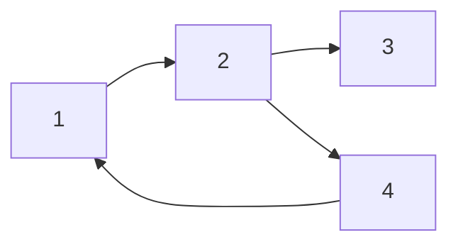
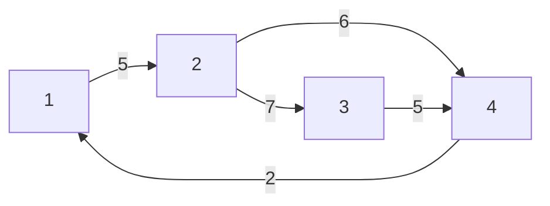
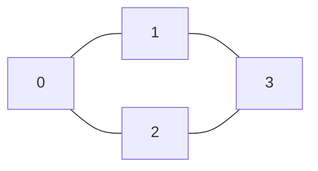

# Graph

A **Graph** is a **non-linear data structure** consisting of:

- **Vertices (nodes)**
- **Edges (connections between nodes)**

It's used to represent relationships (networks, paths, connections).

---

## Types of Graphs

| Property         | Description                           |
| ---------------- | ------------------------------------- |
| **Directed**     | Edges have direction (A → B)          |
| **Undirected**   | Edges don't have direction (A — B)    |
| **Weighted**     | Edges have weights (cost/time/etc.)   |
| **Unweighted**   | All edges are equal                   |
| **Cyclic**       | Contains at least one cycle           |
| **Acyclic**      | No cycles (e.g., trees, DAGs)         |
| **Connected**    | Every node can reach every other node |
| **Disconnected** | Some nodes can't reach others         |

---

## Graph Terminology

### Vertex & Edge Basics

| Term | Definition |
|------|-----------|
| **Vertex (Node)** | A fundamental unit/point in a graph |
| **Edge (Arc)** | A connection between two vertices. In directed graphs, also called an **arc** |
| **Adjacent (Neighbor)** | Two vertices u, v are adjacent if edge (u, v) exists. v is a **neighbor** of u |
| **Incident** | An edge (u, v) is incident to both u and v |
| **Self-loop** | An edge from a vertex to itself: (v, v) |
| **Multi-edge** | Multiple edges between the same pair of vertices |
| **Simple graph** | A graph with no self-loops and no multi-edges |
| **Multigraph** | A graph that allows multi-edges (and possibly self-loops) |

### Degree

| Term | Definition |
|------|-----------|
| **Degree (deg(v))** | Number of edges incident to v. For undirected graphs: $\sum_{v \in V} deg(v) = 2|E|$ |
| **In-degree (deg⁻(v))** | (Directed) Number of edges coming **into** v |
| **Out-degree (deg⁺(v))** | (Directed) Number of edges going **out of** v |
| **Isolated vertex** | A vertex with degree 0 |
| **Pendant vertex (Leaf)** | A vertex with degree 1 |
| **Regular graph** | Every vertex has the same degree. A k-regular graph: every vertex has degree k |

### Paths, Walks & Cycles

| Term | Definition |
|------|-----------|
| **Walk** | A sequence of vertices where each consecutive pair is connected by an edge. Vertices and edges **can repeat** |
| **Trail** | A walk with **no repeated edges** (vertices can repeat) |
| **Path** | A walk with **no repeated vertices** (and hence no repeated edges) |
| **Simple path** | Same as path — no repeated vertices |
| **Cycle** | A path that starts and ends at the same vertex (length ≥ 1) |
| **Simple cycle** | A cycle with no repeated vertices (except start = end) |
| **Length** | Number of edges in a path/walk/cycle |
| **Distance d(u,v)** | Length of the shortest path from u to v. ∞ if no path exists |
| **Diameter** | Maximum distance between any pair of vertices: $\max_{u,v} d(u,v)$ |
| **Girth** | Length of the shortest cycle in the graph. ∞ if acyclic |

### Connectivity

| Term | Definition |
|------|-----------|
| **Connected graph** | (Undirected) There is a path between every pair of vertices |
| **Disconnected graph** | (Undirected) At least one pair of vertices has no path between them |
| **Connected component** | A maximal connected subgraph. Every vertex belongs to exactly one component |
| **Strongly connected** | (Directed) For every pair u, v: there is a path u→v **and** v→u |
| **Weakly connected** | (Directed) Connected if we ignore edge directions (treat as undirected) |
| **Strongly connected component (SCC)** | A maximal strongly connected subgraph of a directed graph |
| **Bridge (Cut edge)** | An edge whose removal increases the number of connected components |
| **Articulation point (Cut vertex)** | A vertex whose removal (along with its edges) disconnects the graph |

### Special Graph Types

| Term | Definition |
|------|-----------|
| **DAG** | Directed Acyclic Graph — directed graph with no cycles |
| **Tree** | A connected acyclic undirected graph. |V| vertices, |V|−1 edges. Any two vertices connected by exactly one path |
| **Forest** | An acyclic undirected graph (a collection of trees) |
| **Rooted tree** | A tree with one designated root vertex |
| **Spanning tree** | A subgraph that is a tree and includes **all** vertices of the original graph |
| **Complete graph (K_n)** | Every pair of distinct vertices is connected by an edge. Has $\binom{n}{2}$ edges |
| **Bipartite graph** | Vertices can be partitioned into two disjoint sets U, V such that every edge connects a vertex in U to one in V. Equivalently: no odd-length cycles |
| **Complete bipartite (K_{m,n})** | Bipartite graph where every vertex in U is connected to every vertex in V |
| **Planar graph** | Can be drawn in a plane with no edge crossings. Euler's formula: V − E + F = 2 |
| **Sparse graph** | |E| is much less than |V|² (closer to O(V)) |
| **Dense graph** | |E| is close to |V|² |
| **Complement graph (Ḡ)** | Has the same vertices as G, but edge (u,v) exists in Ḡ iff it does NOT exist in G |
| **Transpose graph (G^T)** | (Directed) Same vertices, every edge (u,v) reversed to (v,u). Used in Kosaraju's SCC |

### Substructures

| Term | Definition |
|------|-----------|
| **Subgraph** | A graph formed from a subset of vertices and edges of G |
| **Induced subgraph** | Subgraph formed by a vertex subset S and **all** edges of G between vertices in S |
| **Clique** | A subset of vertices where every pair is adjacent (a complete subgraph) |
| **Independent set** | A subset of vertices where **no** two are adjacent |
| **Vertex cover** | A subset of vertices such that every edge has at least one endpoint in the subset |
| **Matching** | A set of edges with no shared endpoints |
| **Maximum matching** | A matching with the largest possible number of edges |
| **Euler path** | A trail that visits every **edge** exactly once |
| **Euler circuit** | An Euler path that starts and ends at the same vertex |
| **Hamiltonian path** | A path that visits every **vertex** exactly once |
| **Hamiltonian cycle** | A Hamiltonian path that starts and ends at the same vertex |

---

## Representation of Graphs


### 1. **Adjacency List**

- Array of vectors
- Efficient for sparse graphs

```cpp
vector<int> graph[5];
graph[1].push_back(2);
graph[2].push_back(3);
graph[2].push_back(4);
graph[3].push_back(4);
graph[4].push_back(1);
// etc.
```



for graph G= (V, E) consists of an array Adj of |V |lists, one for each vertex in V.
For each u ∈ V , the adjacency list Adj[u] contains all the vertices v such that there is an edge (u, v) ∈ E. 
That is, Adj[u] consists of all the vertices adjacent to u in G.

If G is a directed graph, the sum of the lengths of all the adjacency lists is |E|,
since an edge of the form (u, v) is represented by having v appear in Adj[u].

the adjacency list of node a contains the pair (b,w) always when
there is an edge from node a to node b with weight w



```cpp
vector<pair<int,int>> adj[N];
adj[1].push_back({2,5});
adj[2].push_back({3,7});
adj[2].push_back({4,6});
adj[3].push_back({4,5});
adj[4].push_back({1,2});
```

If G is an undirected graph, the sum of the lengths of all the adjacency lists is 2 |E|, since if (u, v) is an undirected edge, then u appears in v’s adjacency list and vice versa.

amount of memory it requires is O(V +E).

determine whether u->v is an edge
in O(1 + deg(u)) time by scanning the neighbor list of u.

### 2. **Adjacency Matrix**

- 2D matrix `G[n][n]`
- `G[i][j] = 1` if there's an edge from i → j
- Good for dense graphs

• if the graph is undirected, then A[u, v] := 1 if and only if uv ∈ E, and
• if the graph is directed, then A[u, v] := 1 if and only if u->v ∈ E.



```cpp
int graph[4][4] = {
  {0, 1, 1, 0},
  {1, 0, 0, 1},
  {1, 0, 0, 1},
  {0, 1, 1, 0}
};
```

since it is a undirected graph hence A=AT

if G=(V, E) is a weighted
graph with edge-weight function w, the weight w(u, v) of the edge (u, v) ∈ E is
simply stored as the entry in row u and column v of the adjacency matrix.

- decide in O(1) timewhethertwovertices are connected by an edge just by looking in the appropriate slot in the matrix.

- list all the neighbors of a vertex in `O(V)` time by scanning the corresponding row

- adjacency matrices require `O(V^2)` space

### 3. **Edge List**

- A list of all edges as pairs (u, v) or triples (u, v, w) for weighted graphs
- Simplest representation, useful for Kruskal's algorithm
- Memory: O(E)


```cpp
vector<pair<int,int>> edges;       // unweighted

edges.push_back({a,b}); //there is an edge from node a to node b

edges.push_back({1,2});
edges.push_back({2,3});
edges.push_back({2,4});
edges.push_back({3,4});
edges.push_back({4,1});
```


```cpp
// weighted: vector<tuple<int,int,int>> edges; // (u, v, weight)
vector<tuple<int,int,int>> edges;
edges.push_back({1,2,5});
edges.push_back({2,3,7});
edges.push_back({2,4,6});
edges.push_back({3,4,5});
edges.push_back({4,1,2});
```

### Representation Comparison

| Operation | Std Adjacency List (linked lists) | Fast Adjacency List (hash tables) | Adjacency Matrix |
|---|---|---|---|
| **Space** | Θ(V + E) | Θ(V + E) | Θ(V²) |
| **Test if uv ∈ E** | O(1 + min{deg(u), deg(v)}) = O(V) | O(1) | O(1) |
| **Test if u→v ∈ E** | O(1 + deg(u)) = O(V) | O(1) | O(1) |
| **List v's (out-)neighbors** | Θ(1 + deg(v)) = O(V) | Θ(1 + deg(v)) = O(V) | Θ(V) |
| **List all edges** | Θ(V + E) | Θ(V + E) | Θ(V²) |
| **Insert edge uv** | O(1) | O(1)* | O(1) |
| **Delete edge uv** | O(deg(u) + deg(v)) = O(V) | O(1)* | O(1) |

\* amortized


---

# Common Graph Algorithms

| Algorithm                 | Purpose                              |
| ------------------------- | ------------------------------------ |
| **BFS**                   | [Breadth-first traversal](./breadth-first-search.md)|
| **DFS**                   | [Depth-first traversal](./depth-first-search.md)                |
| **DAG**                   | [DAG+Topological Sort](./dag+topological.md)|
|**Connected components, flood fill, bipartite check** | [connected components](./connected-components.md) |
|**Articulation points & bridges**| [articulation points](./articulation-scc.md)|
| **Dijkstra**              | [Shortest path (non-negative weights)](./dijkstra.md) |
| **Bellman-Ford**          | [Shortest path (can handle negatives)](./bellman-ford.md) |
| **Floyd-Warshall**        | [All-pairs shortest path](./floyd-warshall.md)              |
| **Kruskal’s**    | [Minimum spanning tree (MST)](./UnionFind-Kruskal.md)          |
| **Prim's**        | [Minimum spanning tree (MST)](./Prims.md) |
| **Directed Graphs** | [Directed-Graphs](./directed-graph.md) |
| **Tarjan’s / Kosaraju’s** | [Strongly connected components](./strong-connected-components.md)        |
