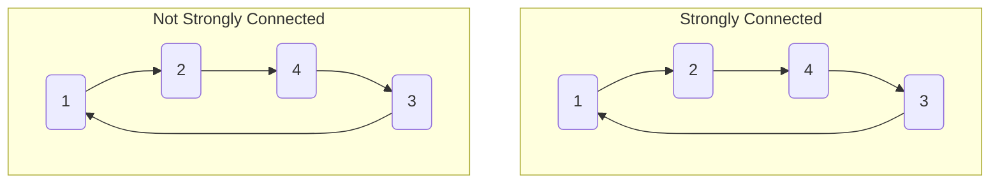

# Strongly Connected Components

## Strong Connectivity

In a **directed graph**, edges can be traversed in one direction only. Even if the graph is connected, there may not be a path from every node to every other node. Thus, we define **strong connectivity**:

- A graph is **strongly connected** if there is a path from any node to all other nodes in the graph.
- If not, the graph may contain **strongly connected components** (SCCs): maximal subgraphs where every node is reachable from every other node in the component.

### Example
Consider two graphs:
- The left graph is strongly connected (every node can reach every other node).
- The right graph is not (e.g., no path from node 2 to node 1).




## Strongly Connected Components (SCCs)

SCCs divide a graph into strongly connected parts. These components form an **acyclic component graph** (DAG) representing the deep structure of the original graph.

Example:
- SCCs: {1,2}, {3,6,7}, {4}, {5}
- Component graph: A = {1,2}, B = {3,6,7}, C = {4}, D = {5}

The component graph is always acyclic and easier to process (e.g., for topological sorting).

---

## Kosaraju's Algorithm

**Kosaraju's algorithm** efficiently finds SCCs in a directed graph using two depth-first searches (DFS):

1. **First DFS:** Process all nodes, recording the order in which nodes finish (post-order).
2. **Reverse the graph:** Reverse all edges.
3. **Second DFS:** Process nodes in reverse finishing order, marking all reachable nodes as part of the same SCC.

**Time complexity:** $O(n + m)$ (two DFS traversals).

### Steps:
1. Run DFS on the original graph, record finishing times.
2. Reverse all edges.
3. Run DFS in reverse finishing order; each DFS marks a new SCC.

---

## Tarjan's Algorithm

**Tarjan's algorithm** finds SCCs in a single DFS traversal using discovery and low-link values:

- For each node, maintain `dfs_num` (discovery time) and `dfs_low` (lowest reachable discovery time).
- Use a stack to track the current path.
- When `dfs_low[u] == dfs_num[u]`, node `u` is the root of an SCC; pop nodes from the stack until `u` is reached.

**Pseudocode:**
```cpp
void tarjanSCC(int u) {
	dfs_low[u] = dfs_num[u] = dfsNumberCounter++;
	S.push_back(u);
	visited[u] = 1;
	for (auto v : AdjList[u]) {
		if (dfs_num[v] == UNVISITED)
			tarjanSCC(v);
		if (visited[v])
			dfs_low[u] = min(dfs_low[u], dfs_low[v]);
	}
	if (dfs_low[u] == dfs_num[u]) {
		// SCC found
		printf("SCC %d:", ++numSCC);
		while (1) {
			int v = S.back(); S.pop_back(); visited[v] = 0;
			printf(" %d", v);
			if (u == v) break;
		}
		printf("\n");
	}
}
```

**Initialization:**
```cpp
dfs_num.assign(V, UNVISITED);
dfs_low.assign(V, 0);
visited.assign(V, 0);
dfsNumberCounter = numSCC = 0;
for (int i = 0; i < V; i++)
	if (dfs_num[i] == UNVISITED)
		tarjanSCC(i);
```

**Time complexity:** $O(V + E)$

---

## Summary
- SCCs are fundamental for analyzing directed graphs.
- Kosaraju's and Tarjan's algorithms are standard methods for finding SCCs efficiently.
- SCC decomposition transforms a graph into a DAG, enabling further analysis (e.g., topological sort).

