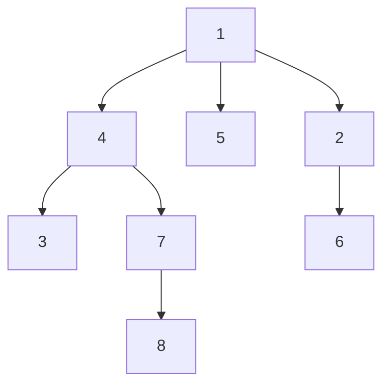
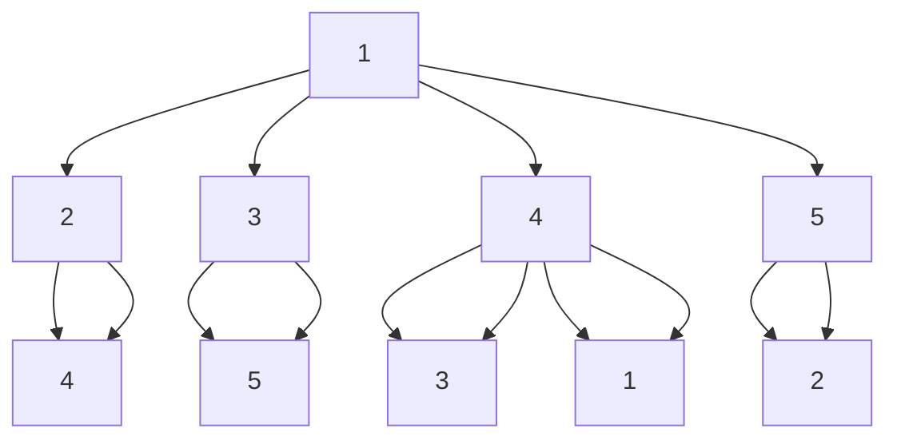
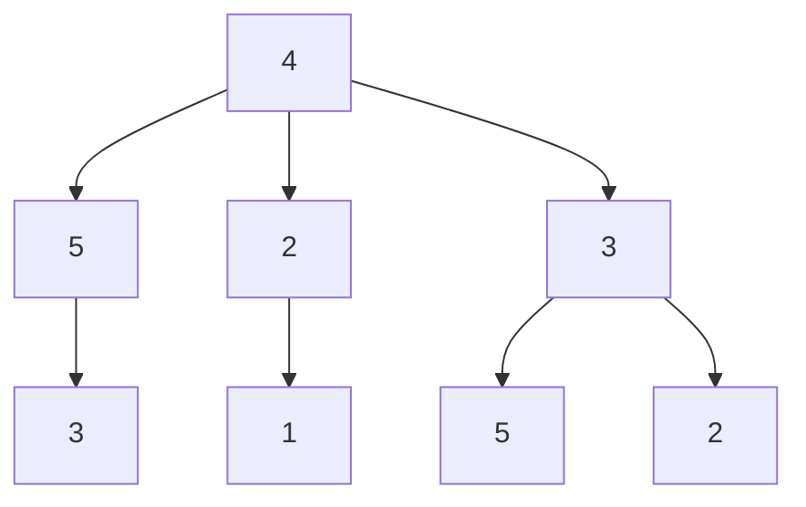
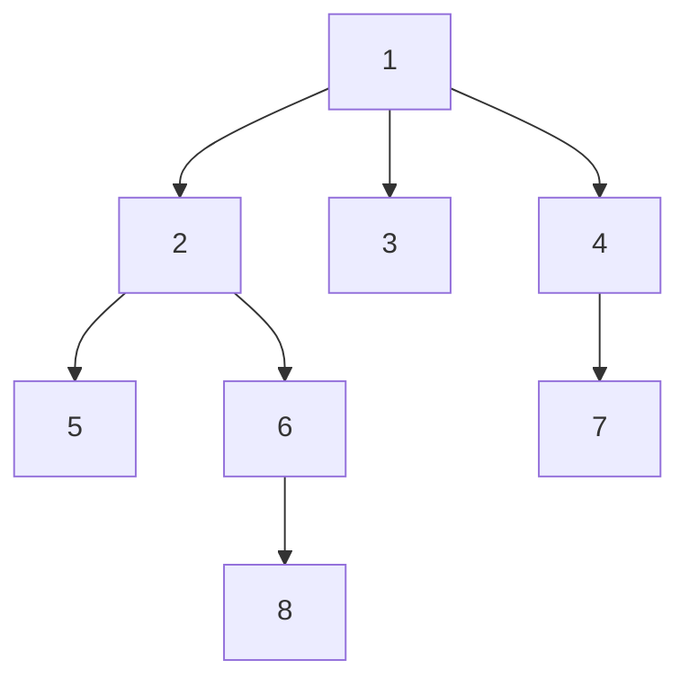

# Tree Queries

---

## 1. Types of Tree Queries
- $k$th ancestor of a node
- Sum of values in a subtree
- Sum of values on a path between two nodes
- Lowest common ancestor (LCA) of two nodes

---

## 2. Finding Ancestors
- The $k$th ancestor of node $x$ is the node reached by moving $k$ levels up.
- Naive: $O(k)$ time by repeated parent jumps.
- Efficient: Precompute ancestors for powers of two (binary lifting).
  - Preprocessing: $O(n \log n)$
  - Query: $O(\log k)$

### Example

- Example: $ancestor(2,1) = 1$, $ancestor(8,2) = 4$
- Binary lifting: Precompute ancestors for powers of two for fast queries.

---

## 3. Subtree Queries
- Use DFS to build a tree traversal array (Euler tour).
- Each subtree corresponds to a contiguous subarray.
- Store values in a segment tree or BIT for fast updates and queries.
  - Update value of a node: $O(\log n)$
  - Sum of values in subtree: $O(\log n)$

### Example

- Subtree of node 4: nodes 4, 8, 9
- Sum: $4 + 3 + 1 = 8$
- Use DFS traversal array for subtree queries.

---

## 4. Path Queries
- Store path sums from root to each node during DFS.
- To update values along a path, use range updates in segment tree/BIT.
- To query sum from root to node: $O(\log n)$

### Example

- Path sum from root (1) to node 7: $4 + 2 + 1 = 7$
- Store path sums during DFS for fast queries.

---

## 5. Lowest Common Ancestor (LCA)
- LCA of nodes $a$ and $b$ is the lowest node whose subtree contains both.

### Method 1: Binary Lifting
- Move both nodes up to the same depth using $k$th ancestor queries.
- Then move up together until they meet.
- Preprocessing: $O(n \log n)$, Query: $O(\log n)$

### Method 2: Euler Tour + RMQ
- Build Euler tour array with node ids and depths.
- LCA is node with minimum depth between first appearances of $a$ and $b$.
- Preprocessing: $O(n \log n)$, Query: $O(1)$

###  Example

- LCA of nodes 5 and 8 is node 2.
- Use binary lifting or Euler tour + RMQ for efficient LCA queries.

---

## 5. Distances in Trees
- Distance between $a$ and $b$:
  $$\text{depth}(a) + \text{depth}(b) - 2 \cdot \text{depth}(\text{LCA}(a, b))$$

---

## 6. Offline Algorithms
- Use DFS and union-find to answer batch LCA queries (Tarjan's algorithm).
- Merge data structures at each node for subtree queries (e.g., maps for counting values).
- Efficient for batch processing, not needed for online queries.

---

## 7. Key Tricks
- Binary lifting for ancestor/LCA queries.
- Euler tour for subtree/path queries.
- Segment tree/BIT for fast updates and queries.
- Union-find for offline LCA.
- Merging maps for subtree statistics.