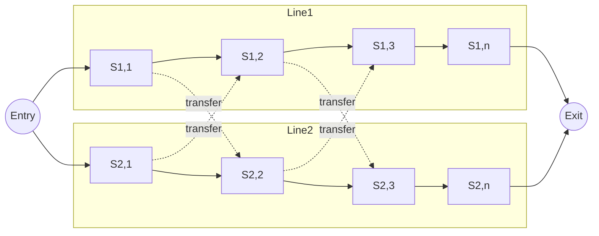
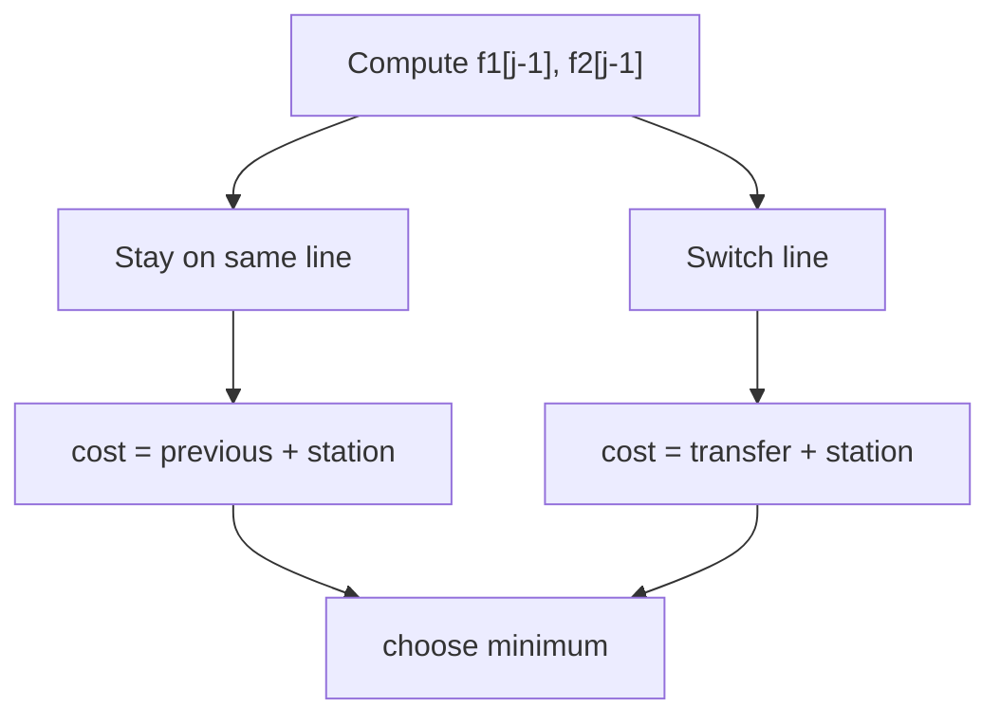

# Assembly Line Scheduling

A factory has **2 assembly lines**, each with **n stations**.

At each station:
- You spend some processing time
- Optionally switch to the other line (costs transfer time)

**Goal:** Find the **minimum total time** for a product to pass through all stations.

---

## Visual Model



---

## Terminology

| Symbol | Meaning                                   |
| ------ | ----------------------------------------- |
| a1,j   | time at station j on line 1              |
| a2,j   | time at station j on line 2              |
| t1,j   | transfer time from line 1 to line 2      |
| t2,j   | transfer time from line 2 to line 1      |
| e1, e2 | entry time for line 1, line 2            |
| x1, x2 | exit time for line 1, line 2             |
| f1[j]  | fastest time to reach station j on line 1|
| f2[j]  | fastest time to reach station j on line 2|

---

## Optimal Substructure

To reach station **j** on line 1, either:
1. Came from previous station on same line
2. Transferred from line 2

Thus solution depends only on best previous solutions — **Dynamic Programming**

---

## Recurrence Relations

### Base Case
```
f1(1) = e1 + a1,1
f2(1) = e2 + a2,1
```

### Transition
```
f1(j) = min(
    f1(j-1) + a1,j,
    f2(j-1) + t2,j-1 + a1,j
)

f2(j) = min(
    f2(j-1) + a2,j,
    f1(j-1) + t1,j-1 + a2,j
)
```

### Final Answer
```
f* = min(f1(n) + x1, f2(n) + x2)
```

---

## DP Table Structure

We compute values left to right:

| j   | f1[j]    | f2[j]    |
| --- | -------- | -------- |
| 1   | base     | base     |
| 2   | min(...) | min(...) |
| 3   | min(...) | min(...) |
| ... | ...      | ...      |
| n   | result   | result   |

**Time complexity:** O(n)
**Space complexity:** O(n) (reducible to O(1))

---

## Algorithm

```pseudo
FASTEST-WAY(a, t, e, x, n):
    f1[1] = e1 + a1,1
    f2[1] = e2 + a2,1

    for j = 2 to n
        f1[j] = min(
            f1[j-1] + a1,j,
            f2[j-1] + t2,j-1 + a1,j
        )

        f2[j] = min(
            f2[j-1] + a2,j,
            f1[j-1] + t1,j-1 + a2,j
        )

    return min(f1[n] + x1, f2[n] + x2)
```

---

## Path Reconstruction

We store decision arrays:
```
l1[j] = line chosen before station j if finishing at line1
l2[j] = line chosen before station j if finishing at line2
```

Backtrack from final answer.

---

## Decision Flow



---

## Why DP Works Here

### Optimal Substructure
Best path to station j uses best path to j-1.

### Overlapping Subproblems
Same sub-results reused many times.

### State Definition
State = minimum time to reach station j on line i.

---

## Pattern Recognition

This problem teaches a general DP pattern:
> Sequential decisions with optional switching cost

Similar patterns appear in:

| Problem                 | Similarity          |
| ----------------------- | ------------------ |
| CPU scheduling          | switching overhead|
| Lane switching         | path optimization |
| Stock trading with fees| switching penalty |
| DP on grid             | multiple paths    |

---

## Minimal Implementation (C++)

```cpp
#include <vector>
#include <algorithm>
using namespace std;

int fastest_way(const vector<int>& a1, const vector<int>& a2,
                const vector<int>& t1, const vector<int>& t2,
                int e1, int e2, int x1, int x2) {
    int n = a1.size();
    
    vector<int> f1(n), f2(n);
    
    f1[0] = e1 + a1[0];
    f2[0] = e2 + a2[0];
    
    for (int j = 1; j < n; j++) {
        f1[j] = min(f1[j-1] + a1[j], f2[j-1] + t2[j-1] + a1[j]);
        f2[j] = min(f2[j-1] + a2[j], f1[j-1] + t1[j-1] + a2[j]);
    }
    
    return min(f1[n-1] + x1, f2[n-1] + x2);
}
```
