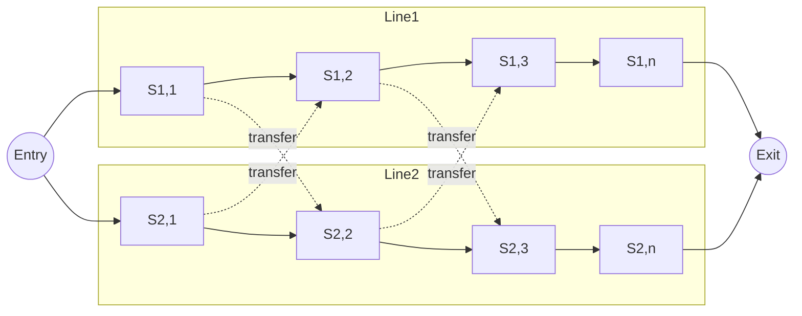
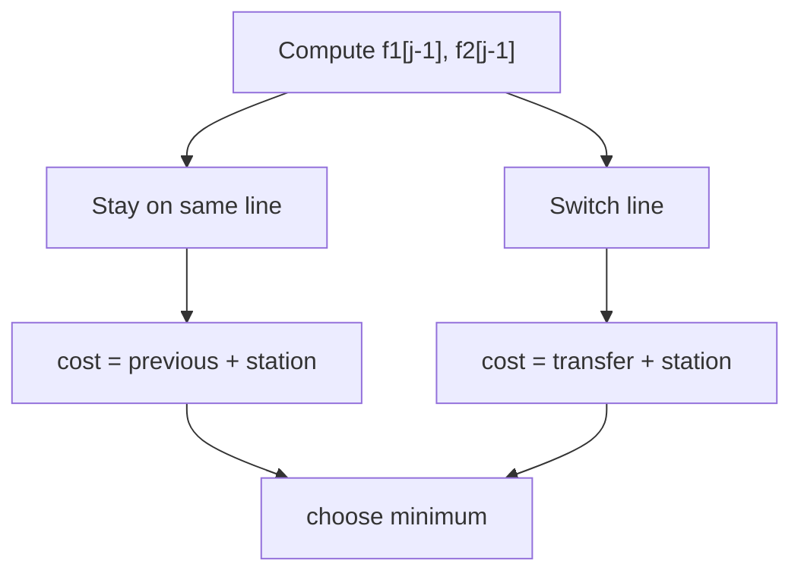

# Assembly Line Scheduling


A factory has **2 assembly lines**, each with **n stations**.

At each station:

* you spend some processing time
* optionally switch to the other line (costs transfer time)

Goal:

> Find the **minimum total time** for a product to pass through all stations.

---

# 2. Visual Model



---

# 3. Terminology 

| Symbol | Meaning                                   |
| ------ | ----------------------------------------- |
| a₁ⱼ    | time at station j on line 1               |
| a₂ⱼ    | time at station j on line 2               |
| t₁ⱼ    | transfer time from line 1 → line 2        |
| t₂ⱼ    | transfer time from line 2 → line 1        |
| e₁, e₂ | entry time for line 1, line 2             |
| x₁, x₂ | exit time for line 1, line 2              |
| f₁[j]  | fastest time to reach station j on line 1 |
| f₂[j]  | fastest time to reach station j on line 2 |

---

# 4. Optimal Substructure 

To reach station **j** on line 1:

Either:

1. came from previous station on same line
2. transferred from line 2

Thus solution depends only on best previous solutions → **Dynamic Programming**

---

# 5. Recurrence Relations 

### Base case

f_1(1)=e_1+a_{1,1}

f_2(1)=e_2+a_{2,1}

---

### Transition

f_1(j)=\min(f_1(j-1)+a_{1,j},; f_2(j-1)+t_{2,j-1}+a_{1,j})

f_2(j)=\min(f_2(j-1)+a_{2,j},; f_1(j-1)+t_{1,j-1}+a_{2,j})

---

### Final Answer

f^*=\min(f_1(n)+x_1,; f_2(n)+x_2)

---

# 6. DP Table Structure 

We compute values left → right:

| j   | f1[j]    | f2[j]    |
| --- | -------- | -------- |
| 1   | base     | base     |
| 2   | min(...) | min(...) |
| 3   | min(...) | min(...) |
| ... | ...      | ...      |
| n   | result   | result   |

Time complexity:

O(n)

Space complexity:

O(n) → reducible to O(1)

---

# 7. Algorithm 

```pseudo
FASTEST-WAY(a, t, e, x, n)

f1[1] = e1 + a1,1
f2[1] = e2 + a2,1

for j = 2 → n

    f1[j] = min(
        f1[j-1] + a1,j,
        f2[j-1] + t2,j-1 + a1,j
    )

    f2[j] = min(
        f2[j-1] + a2,j,
        f1[j-1] + t1,j-1 + a2,j
    )

return min(f1[n] + x1, f2[n] + x2)
```

---

# 8. Path Reconstruction 

We store decision arrays:

```
l1[j] = line chosen before station j if finishing at line1
l2[j] = line chosen before station j if finishing at line2
```

Backtrack from final answer.

---

# 9. Mermaid — Decision Flow



---

# 10. Why DP works here 

Problem exhibits:

### Optimal substructure

Best path to station j uses best path to j-1.

### Overlapping subproblems

Same sub-results reused many times.

### State definition

State = minimum time to reach station j on line i.

---

# 11. Pattern Recognition (Interview Insight) 

This problem teaches a general DP pattern:

> sequential decisions with optional switching cost

Similar patterns appear in:

| Problem                 | similarity         |
| ----------------------- | ------------------ |
| CPU scheduling          | switching overhead |
| lane switching          | path optimization  |
| stock trading with fees | switching penalty  |
| DP on grid              | multiple paths     |

---

# 12. Minimal Implementation (Python)

```python
def fastest_way(a1, a2, t1, t2, e1, e2, x1, x2):
    n = len(a1)

    f1 = [0]*n
    f2 = [0]*n

    f1[0] = e1 + a1[0]
    f2[0] = e2 + a2[0]

    for j in range(1,n):

        f1[j] = min(
            f1[j-1] + a1[j],
            f2[j-1] + t2[j-1] + a1[j]
        )

        f2[j] = min(
            f2[j-1] + a2[j],
            f1[j-1] + t1[j-1] + a2[j]
        )

    return min(f1[n-1] + x1, f2[n-1] + x2)
```

