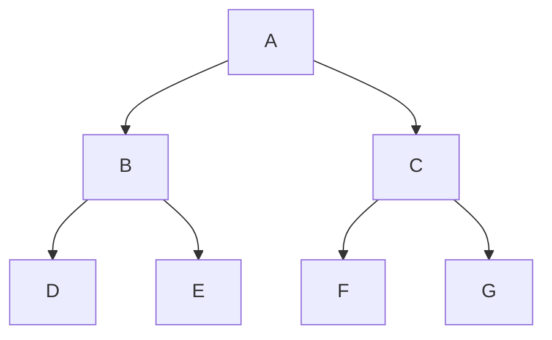
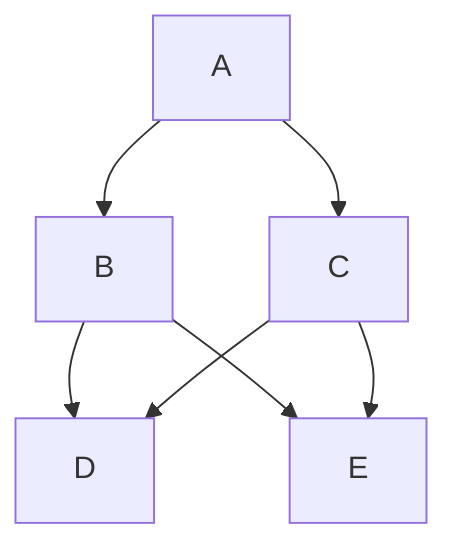

# Dynamic Programming

Dynamic programming combines the **correctness of complete search** with the **efficiency of greedy algorithms**. It applies when a problem can be divided into **overlapping subproblems** that can be solved independently.

---

## Two Key Ingredients

1. **Optimal Substructure** — An optimal solution contains optimal solutions to its subproblems.
2. **Overlapping Subproblems** — The same subproblems are solved repeatedly.

---

# Optimal Substructure

**Optimal Substructure** means that **an optimal solution to the problem can be constructed from optimal solutions to its subproblems**.

In other words:

> If you know the optimal way to solve the smaller subproblems, you can combine them to get the optimal solution for the original problem.

This property justifies why we are allowed to make **locally optimal choices** at each step (in the recurrence) and still guarantee a globally optimal answer.

#### Formal Definition

A problem exhibits optimal substructure if:

- The optimal solution to the instance contains **within it** optimal solutions to one or more sub-instances.

#### Classic Example: Coin Problem (Minimum Number of Coins)

**Problem**: Find the **minimum** number of coins needed to make amount `n` using given denominations.

Let `solve(x)` = minimum coins to make sum `x`.

**Recurrence**:

```text

solve(x) = min_{c ∈ coins} ( solve(x - c) + 1 )    for x > 0

```

**Why this has Optimal Substructure**:

If the overall optimal solution for amount `x` uses coin `c` as the **first** coin, then:

- The remaining amount `x - c` must also be formed using the **minimum possible** number of coins.

- If there existed a better way to make `x - c`, we could replace it and get a better solution for `x`, which contradicts optimality.

Thus, the optimal solution for `x` is built directly from the optimal solution for `x - c`.

**Another way to see it**:

Suppose we have an optimal solution for sum 10 using coins {1,3,4}:

- One optimal solution: 4 + 3 + 3

- The sub-solution for the remaining 6 after taking 4 is 3 + 3, which is also optimal for 6.

If the sub-solution for 6 were not optimal, we could improve the whole solution.

#### More Examples of Optimal Substructure

| Problem                        | Optimal Substructure Explanation |
|--------------------------------|----------------------------------|

| **Fibonacci**                  | `F(n)` is built from `F(n-1) + F(n-2)` — both must be optimal (only one way) |

| **Matrix Chain Multiplication**| Optimal parenthesization of `Ai..Aj` contains optimal parenthesization of sub-chains |

| **Longest Common Subsequence** | LCS of two strings contains LCS of their prefixes/suffixes |

| **0/1 Knapsack**               | Optimal knapsack either includes or excludes item `i`, and the remaining capacity must be optimal |

| **Shortest Path in Graph**     | Shortest path from s to t goes through some vertex v, and s→v + v→t must both be shortest |

#### Why Optimal Substructure Matters

- It allows us to write a **correct recurrence relation**.

- It guarantees that solving subproblems optimally leads to the global optimum.

- Without it, even if subproblems overlap, the DP may give wrong (sub-optimal) answers.

**Counter-example where optimal substructure fails**:

- Finding the **longest path** in a graph (without cycles). Optimal longest path does **not** contain optimal longest sub-paths → DP doesn't work easily.

---

# Overlapping Subproblems

A problem has **overlapping subproblems** when the recursive solution repeatedly solves the **same subproblems** many times instead of generating new ones.

Instead of recomputing the same work, **dynamic programming stores** the results of subproblems (via **memoization** or **tabulation**) and reuses them.

This reduces time complexity **from exponential → polynomial** in many cases.

## Formal Idea

Dynamic programming is applicable when:

- The total number of **distinct subproblems** is small (usually polynomial in the input size).
- The recursive solution **revisits the same subproblems** many times.
- We can **store** subproblem results in a table.

## Key Insight

- **Divide & Conquer**: Generates mostly **new** subproblems with little reuse (e.g., Merge Sort).
- **Dynamic Programming**: Repeatedly solves the **same** subproblems and reuses results (e.g., Fibonacci, Matrix Chain Multiplication, Coin Change, Knapsack).

## Classic Example: Coin Problem (Minimum Number of Coins)

**Problem**: Given coin denominations `coins = {c₁, c₂, ..., cₖ}` and a target sum `n`, find the **minimum** number of coins needed to make exactly sum `n`. (Infinite supply of each coin.)

Greedy works for some sets (e.g., euro coins) but **fails** in the general case.

### Recursive Formulation

Let `solve(x)` = minimum number of coins to make sum `x`.

Base cases:
- `solve(0) = 0` (no coins needed for empty sum)
- `solve(x) = ∞` if `x < 0` (impossible)

Recurrence (for `x > 0`):
```text
solve(x) = min over all coins c ( solve(x - c) + 1 )
```

Example with `coins = {1, 3, 4}`:
- `solve(0) = 0`
- `solve(1) = 1`, `solve(2) = 2`, `solve(3) = 1`, `solve(4) = 1`
- `solve(10) = 3` (optimal: 3 + 3 + 4)

This naive recursion has **exponential** time due to massive overlapping (e.g., `solve(7)` is recomputed many times).

### Using Memoization (Top-Down DP)

Store results in an array `value[x]` and a flag `ready[x]` (or use `-1` for uncomputed).

```cpp
const int INF = 1e9;
int value[1000001];
bool ready[1000001];

int solve(int x) {
    if (x < 0) return INF;
    if (x == 0) return 0;
    if (ready[x]) return value[x];
    
    int best = INF;
    for (int c : coins) {
        best = min(best, solve(x - c) + 1);
    }
    
    ready[x] = true;
    value[x] = best;
    return best;
}
```

**Time complexity**: O(n · k) where n = target sum, k = number of coin types.

### Bottom-Up (Tabulation) — Preferred in Practice

```cpp
vector<int> value(n+1, INF);
value[0] = 0;

for (int x = 1; x <= n; ++x) {
    for (int c : coins) {
        if (x - c >= 0) {
            value[x] = min(value[x], value[x - c] + 1);
        }
    }
}
```

Many competitive programmers prefer this iterative version (no recursion overhead, better cache behavior).

### Constructing the Actual Solution (Which Coins?)

Add an array `first[x]` that records the **first coin** used in an optimal solution for sum `x`.

```cpp
vector<int> value(n+1, INF);
vector<int> first(n+1, -1);
value[0] = 0;

for (int x = 1; x <= n; ++x) {
    for (int c : coins) {
        if (x - c >= 0 && value[x - c] + 1 < value[x]) {
            value[x] = value[x - c] + 1;
            first[x] = c;
        }
    }
}

// Reconstruct the coins
vector<int> used;
int cur = n;
while (cur > 0) {
    used.push_back(first[cur]);
    cur -= first[cur];
}
```

---

## Counting the Number of Solutions (Unbounded Knapsack Style)

Now count the **total number of ways** to make sum `x` (order doesn't matter, or combinations).

Example: `coins = {1,3,4}`, `x=5` → 6 ways:
- 1+1+1+1+1
- 1+1+3
- 1+4
- 3+1+1
- 1+1+1+1+1 (variants depending on order, but we usually count combinations)

Recursive idea:
```text
solve(x) = sum over all c in coins of solve(x - c)   (for x > 0)
solve(0) = 1
solve(x) = 0 for x < 0
```

Bottom-up:
```cpp
vector<long long> count(n+1, 0);
count[0] = 1;

for (int x = 1; x <= n; ++x) {
    for (int c : coins) {
        if (x - c >= 0) {
            count[x] += count[x - c];
            // count[x] %= MOD;  // if needed (e.g., MOD = 1e9+7)
        }
    }
}
```

**Note**: The loop order (`x` outer, coins inner) gives **combinations** (order doesn't matter). Swapping loops gives permutations.

For very large answers, take modulo `m` (commonly `10^9 + 7`):
```cpp
count[x] = (count[x] + count[x - c]) % m;
```

---

## Why Overlapping Subproblems Occur in the Coin Problem

The recursion explores **all possible first coins**, and many different choices lead to the **same remaining sum** (identical subproblems).

Without memoization/tabulation → exponential time.  
With DP → O(n · k) time.

---

## Generalizing Your Original Content

(Your excellent explanations of Fibonacci, Matrix Chain Multiplication, Memoization vs Tabulation, etc., fit perfectly here. The Coin Problem is an ideal **first concrete application** after the theory.)

### Visual Comparison

**Divide & Conquer** (little overlap):


**Dynamic Programming** (heavy overlap):


### Checklist to Detect Overlapping Subproblems

- Recursion with repeated parameters?
- Exponential recursion tree?
- Small number of distinct states?
- Can states be indexed easily (e.g., `dp[x]`, `dp[i][j]`)?

### Summary Table

| Problem                  | Naive Time | DP Time     |
|--------------------------|------------|-------------|
| Fibonacci                | O(2ⁿ)     | O(n)        |
| Matrix Chain Multiplication | O(2ⁿ)   | O(n³)       |
| Coin Change (min coins)  | O(kⁿ)     | O(n·k)      |
| Coin Change (ways)       | O(kⁿ)     | O(n·k)      |
| LCS                      | O(2ⁿ)     | O(n·m)      |
| 0/1 Knapsack             | O(2ⁿ)     | O(n·W)      |

**Key takeaway**: Whenever you see a recursive solution that recomputes the same subproblems many times **and** the number of unique states is manageable, think **Dynamic Programming** — store the results and enjoy the speedup!

These notes now serve as a complete, self-contained introduction to DP using the **Coin Problem** as the running example, while keeping your clean style and structure.
```

