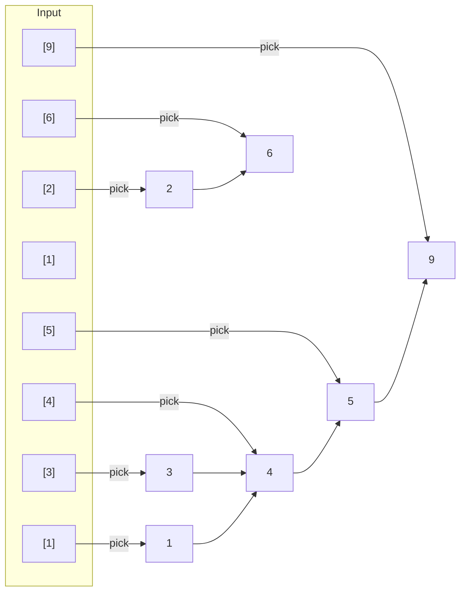

# Longest Increasing Subsequence (LIS)

## What is LIS?

Given an array, find the length of the **longest subsequence** where all elements are in **strictly increasing** order.

> Note: Elements need not be contiguous — we pick elements by their original indices.

### Subsequence vs Substring

| Term | Definition | Example from [3,1,4,1,5,9,2,6] |
|------|------------|--------------------------------|
| **Substring** | Contiguous portion | [1,4,5,9] — must be together |
| **Subsequence** | Can skip elements | [3,4,5,9] — picks indices 0,2,4,5 |

### Key Properties

1. **Not contiguous** — we can skip elements
2. **Preserves order** — indices must increase
3. **Strictly increasing** — each element > previous (use ≤ for non-decreasing)
4. **Multiple solutions** — there can be many LIS of the same length

### Example

```
Array: [3, 1, 4, 1, 5, 9, 2, 6]

LIS options:
  [3, 4, 5, 9]  length = 4  (indices 0→2→4→5)
  [1, 4, 5, 6]  length = 4  (indices 1→2→4→7)  
  [1, 2, 6]     length = 3
  [3, 5, 9]     length = 3

Answer: 4
```

---

# 2. Visual Model

```
Array: [3, 1, 4, 1, 5, 9, 2, 6]

One possible LIS: [3, 4, 5, 9]  (indices 0→2→4→5)
Another LIS:       [1, 4, 5, 6]  (indices 1→2→4→7)
Longest LIS:       [1, 2, 6]     (length = 3)
```



---

# 3. Terminology

| Symbol | Meaning |
| ------ | ------- |
| `nums[i]` | element at index i |
| `dp[i]` | length of LIS ending at index i |
| `LIS` | Longest Increasing Subsequence |
| `LIS[i]` | length of LIS considering first i elements |

---

# 4. Optimal Substructure

For element at index `i`, the LIS ending at `i` depends on:

- All previous elements `j` where `j < i` and `nums[j] < nums[i]`
- We can extend any valid subsequence ending at `j`

This is **optimal substructure** — solution to whole problem depends on solutions to subproblems.

---

# 5. Recurrence Relations

### Approach 1: O(n²) DP

```
dp[i] = 1 + max(dp[j]) for all j < i where nums[j] < nums[i]
```

If no such `j` exists, `dp[i] = 1` (subsequence of just nums[i])

### Approach 2: O(n log n) Binary Search

```
Maintain a "tails" array:
- tails[i] = smallest ending element of all increasing subsequences with length i+1

For each num:
- Find position using binary search (lower_bound)
- If position == length: append (new longer subsequence)
- Otherwise: replace tails[position]
```

---

# 6. DP Table Structure

### O(n²) Approach

| i | nums[i] | dp[i] | Decision |
|---|---------|-------|----------|
| 0 | 3 | 1 | base case |
| 1 | 1 | 1 | base case |
| 2 | 4 | 2 | extend from i=1 (1<4) |
| 3 | 1 | 1 | base case |
| 4 | 5 | 3 | extend from i=2 (4<5) |
| 5 | 9 | 4 | extend from i=4 (5<9) |
| 6 | 2 | 2 | extend from i=1 (1<2) |
| 7 | 6 | 4 | extend from i=2 or 6 |

### O(n log n) Approach

| num | tails | action |
|-----|-------|--------|
| 3 | [3] | append |
| 1 | [1] | replace |
| 4 | [1,4] | append |
| 1 | [1,4] | replace |
| 5 | [1,4,5] | append |
| 9 | [1,4,5,9] | append |
| 2 | [1,2,5,9] | replace |
| 6 | [1,2,5,6] | replace |

Result: `len(tails)` = 4

---

# 7. Algorithm

### O(n²) Version

```cpp
int lis_n2(const vector<int>& nums) {
    int n = nums.size();
    if (n == 0) return 0;
    
    vector<int> dp(n, 1);
    
    for (int i = 1; i < n; i++) {
        for (int j = 0; j < i; j++) {
            if (nums[j] < nums[i]) {
                dp[i] = max(dp[i], dp[j] + 1);
            }
        }
    }
    
    return *max_element(dp.begin(), dp.end());
}
```

### O(n log n) Version

```cpp
#include <algorithm>
#include <vector>

int lis_nlogn(const vector<int>& nums) {
    vector<int> tails;
    
    for (int num : nums) {
        auto pos = lower_bound(tails.begin(), tails.end(), num);
        
        if (pos == tails.end()) {
            tails.push_back(num);
        } else {
            *pos = num;
        }
    }
    
    return tails.size();
}
```

Time: O(n²) or O(n log n)
Space: O(n) or O(n)

---

# 8. Path Reconstruction

To reconstruct the actual subsequence:

```cpp
pair<int, vector<int>> lis_with_path(const vector<int>& nums) {
    int n = nums.size();
    if (n == 0) return {0, {}};
    
    vector<int> dp(n, 1);
    vector<int> parent(n, -1);
    
    for (int i = 1; i < n; i++) {
        for (int j = 0; j < i; j++) {
            if (nums[j] < nums[i] && dp[j] + 1 > dp[i]) {
                dp[i] = dp[j] + 1;
                parent[i] = j;
            }
        }
    }
    
    int max_len = *max_element(dp.begin(), dp.end());
    int max_idx = max_element(dp.begin(), dp.end()) - dp.begin();
    
    vector<int> path;
    while (max_idx != -1) {
        path.push_back(nums[max_idx]);
        max_idx = parent[max_idx];
    }
    
    reverse(path.begin(), path.end());
    return {max_len, path};
}
```

---

# 9. Why DP Works Here

### Optimal Substructure

LIS ending at position `i` is built from best LIS ending at some `j < i`.

### Overlapping Subproblems

Many positions share the same `j` — we reuse computations.

### State Definition

State = length of longest increasing subsequence ending at index `i`.

---

# 10. Pattern Recognition (Interview Insight)

LIS is foundational for many problems:

| Problem | Relation |
|---------|----------|
| Longest Decreasing Subsequence | negate values |
| Longest Bitonic Subsequence | LIS + LDS |
| Building Number of Bridges | sort + LIS |
| Maximum Length of Pair Chain | sort + LIS |
| Envelope Nesting | sort by width, LIS on height |

Key insight: **Sort first** often converts 2D LIS to 1D LIS.

---

# 11. Variations

### Non-decreasing Subsequence (LNDS)

Change `nums[j] < nums[i]` to `nums[j] <= nums[i]`
Use `bisect_right` instead of `bisect_left`

### Minimum Number of Removals

```
LIS length = k
Minimum removals = n - k
```

---

# 12. Comparison

| Approach | Time | Space | Can reconstruct path? |
|----------|------|-------|----------------------|
| O(n²) DP | O(n²) | O(n) | Yes |
| O(n log n) Binary Search | O(n log n) | O(n) | No (without modification) |
| O(n²) with parent array | O(n²) | O(n) | Yes |

---

# 13. Quick Reference

```
dp[i] = 1 + max(dp[j]) for j < i and nums[j] < nums[i]

answer = max(dp[i]) for all i
```

Or use binary search for speed.
