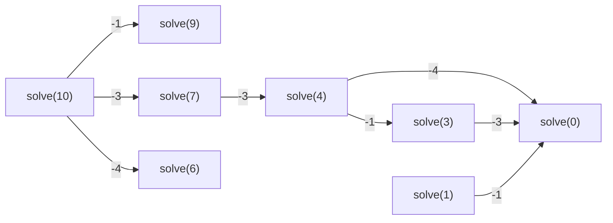

# The Coin Problem

## Problem Statement

Given a set of coin values $\text{coins} = \{c_1, c_2, \ldots, c_k\}$ and a target sum $n$, find the minimum number of coins required to form the sum $n$.

> Greedy (always pick the largest coin) works for euro coins but fails in the general case. DP is required for an optimal general solution.

---

## Recursive Formulation

Let $\text{solve}(x)$ = minimum number of coins needed to form sum $x$.

**Recurrence:**

$$\text{solve}(x) = \begin{cases} \infty & x < 0 \\ 0 & x = 0 \\ \displaystyle\min_{c \in \text{coins}} \text{solve}(x - c) + 1 & x > 0 \end{cases}$$

**Intuition:** Fix the first coin chosen. The remaining task is to form $x - c$ optimally, which is a subproblem of the same form.

### Example — coins = {1, 3, 4}, target = 10

$\text{solve}(10) = \text{solve}(7) + 1 = \text{solve}(4) + 2 = \text{solve}(0) + 3 = 3$

Optimal: $3 + 3 + 4 = 10$ using 3 coins.

---

## Subproblem Dependency



Each node depends on up to $k$ smaller nodes (one per coin denomination).

---

## Implementation

### Naive Recursive (Exponential — Not Efficient)

```cpp
int solve(int x) {
    if (x < 0) return INF;
    if (x == 0) return 0;
    int best = INF;
    for (auto c : coins) {
        best = min(best, solve(x - c) + 1);
    }
    return best;
}
```

Problem: exponential number of redundant recursive calls.

---

### With Memoization (Top-Down DP)

Use two arrays:
- `ready[x]` — whether `solve(x)` has been computed
- `value[x]` — the stored result

```cpp
int solve(int x) {
    if (x < 0) return INF;
    if (x == 0) return 0;
    if (ready[x]) return value[x];
    int best = INF;
    for (auto c : coins) {
        best = min(best, solve(x - c) + 1);
    }
    value[x] = best;
    ready[x] = true;
    return best;
}
```

Each value is computed exactly once. Time complexity: $O(nk)$.

---

### Iterative Bottom-Up DP (Preferred)

```cpp
value[0] = 0;
for (int x = 1; x <= n; x++) {
    value[x] = INF;
    for (auto c : coins) {
        if (x - c >= 0) {
            value[x] = min(value[x], value[x - c] + 1);
        }
    }
}
```

Fills the `value` array from $x = 0$ to $x = n$ left to right. Shorter, lower constant factors, preferred in competitive programming.

**Time:** $O(nk)$ — $n$ values, $k$ coins per value.
**Space:** $O(n)$.

---

## Constructing the Optimal Solution

To recover which coins were used, maintain an auxiliary array `first[x]` = the first coin chosen in an optimal solution for sum $x$.

```cpp
value[0] = 0;
for (int x = 1; x <= n; x++) {
    value[x] = INF;
    for (auto c : coins) {
        if (x - c >= 0 && value[x - c] + 1 < value[x]) {
            value[x] = value[x - c] + 1;
            first[x] = c;
        }
    }
}
```

**Trace back the solution:**

```cpp
while (n > 0) {
    cout << first[n] << "\n";
    n -= first[n];
}
```

---

## Counting the Number of Solutions

**Variant:** Count the total number of ways to form sum $x$ (order matters — sequences, not multisets).

For $\text{coins} = \{1, 3, 4\}$ and $x = 5$: there are 6 ways.

**Recurrence:**

$$\text{solve}(x) = \begin{cases} 0 & x < 0 \\ 1 & x = 0 \\ \displaystyle\sum_{c \in \text{coins}} \text{solve}(x - c) & x > 0 \end{cases}$$

**Iterative implementation:**

```cpp
count[0] = 1;
for (int x = 1; x <= n; x++) {
    for (auto c : coins) {
        if (x - c >= 0) {
            count[x] += count[x - c];
        }
    }
}
```

**Modular arithmetic:** When counts are large, compute modulo $m$ (e.g., $m = 10^9 + 7$):

```cpp
count[x] += count[x - c];
count[x] %= m;
```

---

## Summary

| Variant | Recurrence | Array | Complexity |
|---------|-----------|-------|-----------|
| Minimum coins | $\min_{c} \text{value}[x-c] + 1$ | `value[x]` | $O(nk)$ |
| Count solutions | $\sum_{c} \text{count}[x-c]$ | `count[x]` | $O(nk)$ |
| Reconstruct path | Track `first[x]` alongside `value[x]` | `first[x]` | $O(nk)$ |

---

## Key Observations

1. The recursive structure is the same for both variants — only the combination operator changes ($\min$ vs $\sum$).
2. Bottom-up iterative DP is preferred in competitive programming for lower overhead and simpler code.
3. The solution counts sequences (ordered), not multisets. If unordered combinations are required, the loop structure must change (iterate over coins in the outer loop, sums in the inner loop).
4. Space is $O(n)$ — only a 1D array is needed since each entry $x$ depends only on entries $< x$.
