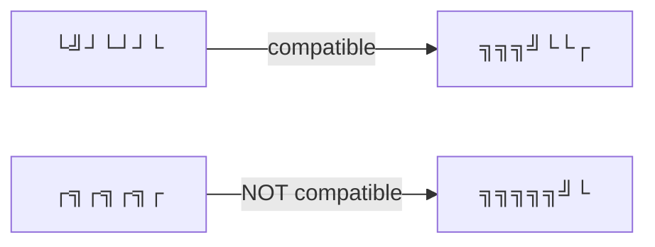

# Counting Tilings

## Problem Statement

Count the number of distinct ways to fill an $n \times m$ grid using $1 \times 2$ and $2 \times 1$ tiles.

For the $4 \times 7$ grid, the total number of valid tilings is **781**.

---

## Key Idea: Profile DP (Row-by-Row)

Process the grid row by row. The state of each row is constrained only by the state of the previous row — this is what makes DP applicable.

Each row is encoded as a string of $m$ characters from the set $\{\ulcorner, \urcorner, \llcorner, \lrcorner\}$ representing how tiles cross row boundaries.

### Example — 4 rows of the 4×7 grid:

```
Row 1: ┌╗┌╗┌╗┌
Row 2: └╝┘└┘┘└
Row 3: ╗╗╗╝└└┌
Row 4: ╗╗╗╗╗╝└
```

---

## State Definition

Let $\text{count}(k, x)$ = number of ways to construct rows $1 \ldots k$ of the grid such that string $x$ corresponds to row $k$.

**Recurrence:** $\text{count}(k, x)$ is the sum of $\text{count}(k-1, y)$ over all strings $y$ that are **compatible** with $x$.

---

## Compatibility

Two consecutive rows $y$ (upper) and $x$ (lower) are **compatible** if the tiles spanning across them fit together correctly — no overlaps, no gaps.

**Validity constraints:**
- Row 1 must not contain a character representing the bottom half of a vertical tile (no $\llcorner$)
- Row $n$ must not contain a character representing the top half of a vertical tile (no $\ulcorner$)
- All consecutive row pairs must be compatible

**Example:**



---

## Complexity Analysis

### Naive 4-symbol representation

Each row has $m$ characters with 4 choices each, giving at most $4^m$ distinct rows.

**Time:** $O(n \cdot 4^{2m})$ — for each of the $n$ rows, iterate over $O(4^m)$ current states, each checking $O(4^m)$ previous states.

### Compact 2-symbol representation (Optimised)

It suffices to track only which columns have the upper square of a vertical tile protruding into the next row. This is a binary flag per column: either a vertical tile extends down (1) or it does not (0).

Represent each row state as a bitmask of length $m$ using only $\ulcorner$ and $\square$ (where $\square$ combines $\urcorner$, $\llcorner$, $\lrcorner$). This gives $2^m$ distinct states.

**Time:** $O(n \cdot 2^{2m})$

**Practical tip:** Always orient the grid so that $m \le n$, i.e., the shorter dimension is used as the profile width, since $2^{2m}$ dominates.

---

## Complexity Comparison

| Representation | Distinct states per row | Time complexity |
|---------------|------------------------|----------------|
| 4-symbol | $4^m$ | $O(n \cdot 4^{2m})$ |
| 2-symbol (bitmask) | $2^m$ | $O(n \cdot 2^{2m})$ |
| Direct formula | — | $O(nm)$ |

---

## Direct Formula (Closed Form)

There exists a closed-form formula for the number of tilings of an $n \times m$ grid:

$$\prod_{a=1}^{\lceil n/2 \rceil}\ \prod_{b=1}^{\lceil m/2 \rceil} 4 \cdot \left(\cos^2 \frac{\pi a}{n+1} + \cos^2 \frac{\pi b}{m+1}\right)$$

**Time:** $O(nm)$ — very efficient.

**Caveat:** The formula produces a product of real numbers. Storing intermediate results accurately is non-trivial, making practical implementation tricky despite the theoretical speed.

---

## Key Observations

1. Profile DP generalises whenever a row's valid configurations depend only on the adjacent row, not the entire grid history.
2. The bitmask optimisation works because horizontal tiles are entirely contained within a single row — only vertical tile boundaries (the protruding top halves) need to be tracked across rows.
3. For competitive programming, rotating the grid to make the shorter side the profile width is a standard trick to minimise the exponent in $2^{2m}$.
4. The closed-form formula is rarely used in competitive programming due to floating-point precision issues.
