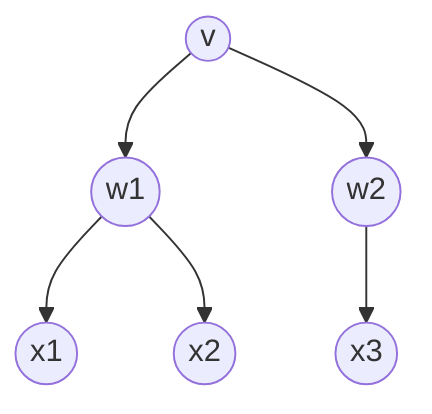
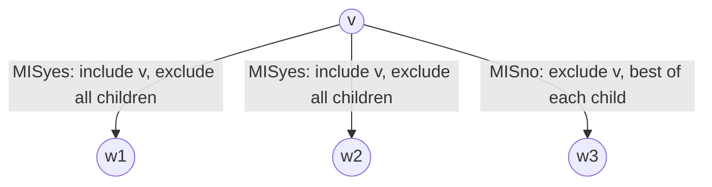

# Dynamic Programming on Trees

## Motivation

All previous DP examples used multidimensional arrays to store subproblem results. When the problem structure is a tree, the tree itself is the natural memoisation data structure.

---

## Problem: Maximum Independent Set on a Tree

An **independent set** in a graph is a subset of vertices with no edges between them.

- Finding the largest independent set in a general graph is NP-hard.
- When the input graph is a **tree** with $n$ vertices, we can compute the largest independent set in $O(n)$ time.

---

## Setup

Let $T$ be a rooted tree with root $r$. All edges are directed away from the root.

- Vertex $w$ is a **descendant** of $v$ if the unique path from $w$ to the root passes through $v$.
- The **subtree rooted at $v$** consists of all descendants of $v$ and the edges between them.
- Notation: $w \downarrow v$ means "$w$ is a child of $v$".

---

## Recurrence

For any node $v$ in $T$, let $MIS(v)$ = size of the largest independent set in the subtree rooted at $v$.

Two cases:

- **Exclude $v$:** The independent set is the union of independent sets in the subtrees rooted at each child of $v$.
- **Include $v$:** We must exclude all children of $v$, so we take independent sets in the subtrees rooted at $v$'s grandchildren.

$$MIS(v) = \max\left\{\sum_{w \downarrow v} MIS(w),\quad 1 + \sum_{w \downarrow v}\sum_{x \downarrow w} MIS(x)\right\}$$

---

## Dependency Diagram



$MIS(v)$ depends on $MIS$ values at children $w_1, w_2$ (for the skip case) and grandchildren $x_1, x_2, x_3$ (for the keep case).

---

## Memoisation Structure

The most natural data structure is **the tree $T$ itself**. For each vertex $v$, store the result of $MIS(v)$ in a new field $v.MIS$.

Using an array would require pointers back and forth between nodes and array indices — unnecessary overhead.

**Evaluation order:** Any post-order traversal of $T$ ensures every vertex is visited before its parent, satisfying all dependencies.

---

## Algorithm — TREEMIS (Version 1)

```
TREEMIS(v):
    skipv <- 0
    for each child w of v
        skipv <- skipv + TREEMIS(w)
    keepv <- 1
    for each grandchild x of v
        keepv <- keepv + x.MIS
    v.MIS <- max{keepv, skipv}
    return v.MIS
```

**Time complexity:** Each vertex $v$ contributes a constant amount of work to its parent and its grandparent. Since each vertex has at most one parent and at most one grandparent, the total work is $O(n)$.

> The algorithm is recursive because post-order traversal is most naturally expressed recursively.

---

## Simplified Formulation — Two Separate Functions

Define:

- $MISyes(v)$ = size of the largest independent set in the subtree rooted at $v$ that **includes** $v$.
- $MISno(v)$ = size of the largest independent set in the subtree rooted at $v$ that **excludes** $v$.

**Mutual recurrences:**

$$MISyes(v) = 1 + \sum_{w \downarrow v} MISno(w)$$

$$MISno(v) = \sum_{w \downarrow v} \max\{MISyes(w),\ MISno(w)\}$$

**Final answer:** $\max\{MISyes(r),\ MISno(r)\}$ where $r$ is the root.

---

## Recurrence as a Diagram



- $MISyes(v)$ pulls $MISno$ from each child.
- $MISno(v)$ pulls $\max(MISyes, MISno)$ from each child.

---

## Algorithm — TREEMIS2 (Version 2, Cleaner)

```
TREEMIS2(v):
    v.MISno  <- 0
    v.MISyes <- 1
    for each child w of v
        v.MISno  <- v.MISno  + TREEMIS2(w)
        v.MISyes <- v.MISyes + w.MISno
    return max{v.MISyes, v.MISno}
```

> In the second line of the inner loop, `w.MISno` uses the value memoised by the recursive call on the previous line — correct by post-order evaluation.

**Time complexity:** $O(n)$ — a straightforward post-order traversal, constant work per node.

**Space complexity:** Two extra fields per node, $O(n)$ total.

---

## Comparison: Array DP vs Tree DP

| Aspect | Array-based DP | Tree DP |
|--------|---------------|---------|
| Data structure | 2D/1D array | Tree nodes (fields) |
| Evaluation order | Diagonal / row / column | Post-order traversal |
| Index management | Explicit $(i, j)$ indices | Implicit via recursion |
| Best suited for | Contiguous-range subproblems | Recursive tree subproblems |

---

## Key Takeaways

1. When subproblems map naturally onto tree nodes, store DP values directly in the tree — no auxiliary array needed.
2. Post-order traversal provides a correct evaluation order: every node is processed after all its descendants.
3. Splitting into $MISyes$ / $MISno$ simplifies the recurrence and eliminates the grandchild loop, making the algorithm cleaner and easier to reason about.
4. Each vertex contributes $O(1)$ work per ancestor level it affects; since the affected levels are bounded by a constant (parent and grandparent), the total time is $O(n)$.
