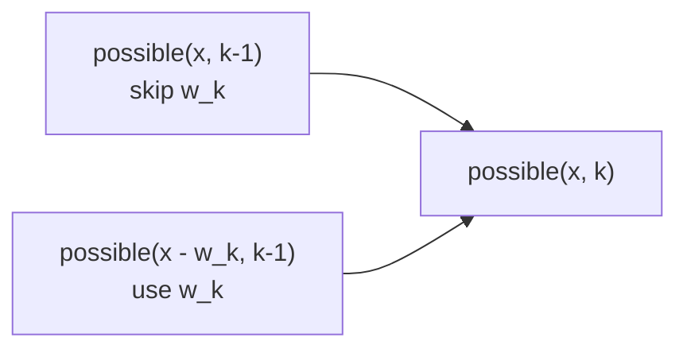
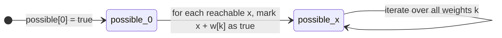

# Knapsack Problems

## Problem Definition

A **knapsack problem** involves a set of objects where subsets with certain properties must be found. The variant covered here:

Given a list of weights $[w_1, w_2, \ldots, w_n]$, determine all sums that can be constructed using the weights (each weight used at most once).

### Example — weights = [1, 3, 3, 5]

| Sum | 0 | 1 | 2 | 3 | 4 | 5 | 6 | 7 | 8 | 9 | 10 | 11 | 12 |
|-----|---|---|---|---|---|---|---|---|---|---|----|----|----|
| Possible | X | X | | X | X | X | X | X | X | X | | X | X |

All sums from 0 to 12 are achievable except 2 and 10. For example, sum 7 = 1 + 3 + 3.

---

## Recursive Formulation

**Subproblem:** $\text{possible}(x, k)$ = true if sum $x$ can be formed using the first $k$ weights, false otherwise.

**Recurrence:**

$$\text{possible}(x, k) = \text{possible}(x - w_k,\ k-1) \lor \text{possible}(x,\ k-1)$$

**Logic:** Either include $w_k$ (reduce the target by $w_k$, move to $k-1$ weights) or skip it (keep target $x$, move to $k-1$ weights).

**Base case:**

$$\text{possible}(x, 0) = \begin{cases} \text{true} & x = 0 \\ \text{false} & x \neq 0 \end{cases}$$

With no weights, only sum 0 is achievable.

---

## DP Table (for weights = [1, 3, 3, 5])

Rows = number of weights considered ($k$), columns = target sum ($x$). "X" = true.

| $k \backslash x$ | 0 | 1 | 2 | 3 | 4 | 5 | 6 | 7 | 8 | 9 | 10 | 11 | 12 |
|-----------------|---|---|---|---|---|---|---|---|---|---|----|----|----|
| 0 | X | | | | | | | | | | | | |
| 1 | X | X | | | | | | | | | | | |
| 2 | X | X | | X | X | | | | | | | | |
| 3 | X | X | | X | X | | X | X | | | | | |
| 4 | X | X | | X | X | X | X | X | X | X | | X | X |

After computing all rows, $\text{possible}(x, n)$ (last row) answers whether sum $x$ is achievable using all weights.

---

## Subproblem Dependency



Each entry depends on at most two entries in the previous row.

---

## Implementation

### 2D Array — $O(nW)$ Time and Space

Let $W$ = total sum of all weights.

```cpp
possible[0][0] = true;
for (int k = 1; k <= n; k++) {
    for (int x = 0; x <= W; x++) {
        if (x - w[k] >= 0) possible[x][k] |= possible[x - w[k]][k-1];
        possible[x][k] |= possible[x][k-1];
    }
}
```

**Time:** $O(nW)$
**Space:** $O(nW)$

---

### 1D Array — $O(nW)$ Time, $O(W)$ Space (Preferred)

The 2D array can be compressed to 1D by updating **right to left** for each new weight. This prevents a weight from being used more than once within the same round.

```cpp
possible[0] = true;
for (int k = 1; k <= n; k++) {
    for (int x = W; x >= 0; x--) {
        if (possible[x]) possible[x + w[k]] = true;
    }
}
```

**Why right to left?** Scanning left to right would allow `possible[x + w[k]]` to be updated and then used again in the same pass, effectively using $w_k$ multiple times. Right-to-left scanning ensures each weight is applied at most once per pass.

---

## State Transition Diagram



---

## Generalisation

The same framework extends to the classic **0/1 Knapsack** where each item has both a weight and a value, and the goal is to maximise total value subject to a weight capacity $C$:

- State: $\text{best}[x]$ = maximum value achievable with weight sum exactly $x$
- Transition: for each item $k$, update right to left: $\text{best}[x + w_k] = \max(\text{best}[x + w_k],\ \text{best}[x] + v_k)$

---

## Complexity Summary

| Implementation | Time | Space |
|---------------|------|-------|
| 2D DP | $O(nW)$ | $O(nW)$ |
| 1D DP (space optimised) | $O(nW)$ | $O(W)$ |

where $W = \sum w_i$ is the total weight sum and $n$ is the number of items.

---

## Key Observations

1. The recurrence captures a binary choice at each step: include the current weight or skip it.
2. The 1D right-to-left trick is the standard space optimisation for 0/1 knapsack. Left-to-right scanning would correspond to the **unbounded knapsack** (each item usable any number of times).
3. The final answer — all achievable sums — is read directly from the 1D `possible` array after processing all weights.
