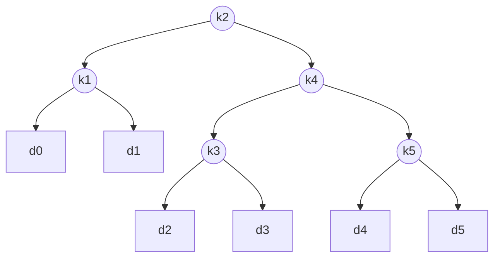
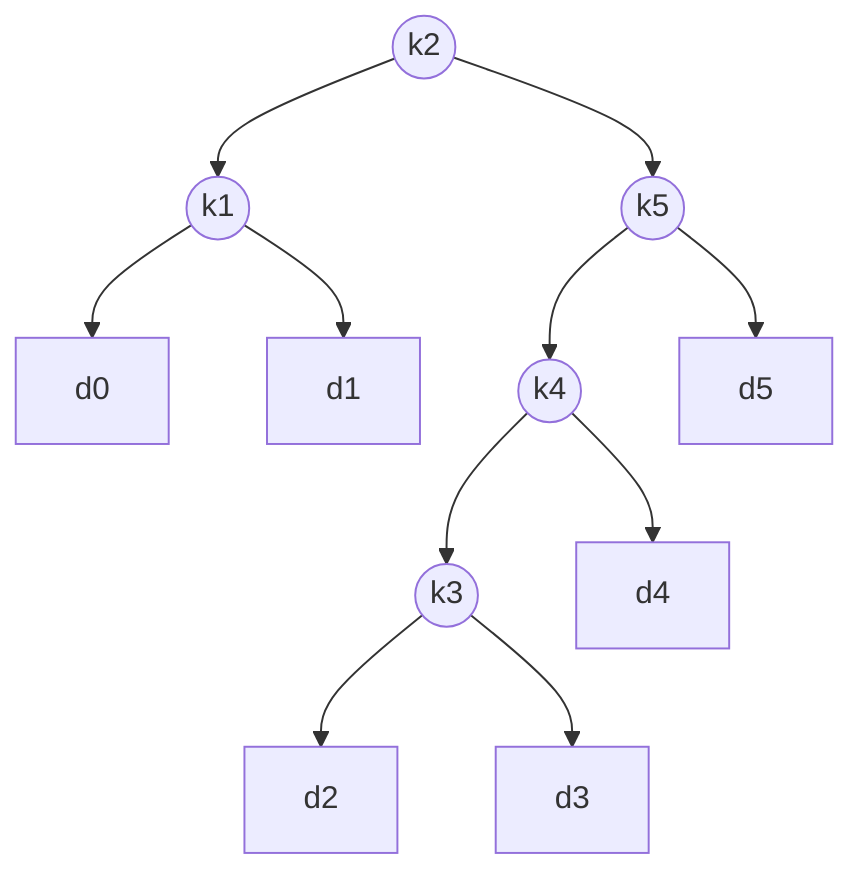
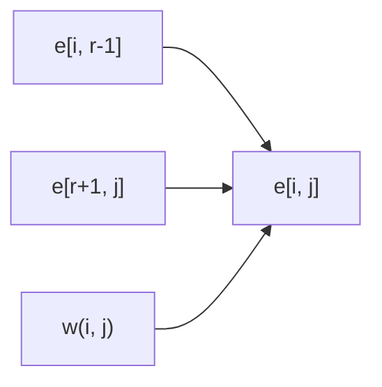

# Optimal Binary Search Trees

## Problem Definition

Given a sorted sequence of $n$ distinct keys $K = \langle k_1, k_2, \ldots, k_n \rangle$ with $k_1 < k_2 < \cdots < k_n$, and:

- $p_i$ = probability that a search is for key $k_i$ (for $i = 1, \ldots, n$)
- $q_i$ = probability that a search falls in the "gap" represented by dummy key $d_i$ (for $i = 0, \ldots, n$)

Dummy keys represent values not in $K$:
- $d_0$ = all values less than $k_1$
- $d_n$ = all values greater than $k_n$
- $d_i$ = values between $k_i$ and $k_{i+1}$ for $i = 1, \ldots, n-1$

Probabilities sum to 1:

$$\sum_{i=1}^{n} p_i + \sum_{i=0}^{n} q_i = 1 \tag{15.15}$$

**Goal:** Build a BST that minimises the expected search cost over all keys and dummy keys.

---

## Expected Search Cost

The cost of a search is defined as the number of nodes examined = depth of node + 1. Therefore:

$$E[\text{search cost in } T] = \sum_{i=1}^{n}(\text{depth}_T(k_i) + 1) \cdot p_i + \sum_{i=0}^{n}(\text{depth}_T(d_i) + 1) \cdot q_i$$

$$= 1 + \sum_{i=1}^{n}\text{depth}_T(k_i) \cdot p_i + \sum_{i=0}^{n}\text{depth}_T(d_i) \cdot q_i \tag{15.16}$$

### Example: n = 5 keys

| $i$ | 0 | 1 | 2 | 3 | 4 | 5 |
|-----|---|---|---|---|---|---|
| $p_i$ | - | 0.15 | 0.10 | 0.05 | 0.10 | 0.20 |
| $q_i$ | 0.05 | 0.10 | 0.05 | 0.05 | 0.05 | 0.10 |

Tree (a) with root $k_2$, expected cost = **2.80**
Tree (b) with root $k_2$ (different structure), expected cost = **2.75** — this is the optimal tree.

> Note: An optimal BST is not necessarily the one with minimum height, nor is it always rooted at the key with highest probability. Here $k_5$ has the highest probability, yet the optimal root is $k_2$.

---

## Tree Structure Diagrams

### Tree (a) — Cost 2.80



### Tree (b) — Cost 2.75 (Optimal)



---

## Step 1: Optimal Substructure

Any subtree of a BST contains keys in a **contiguous range** $k_i, \ldots, k_j$ and dummy keys $d_{i-1}, \ldots, d_j$.

**Optimal substructure property:** If optimal BST $T$ has a subtree $T'$ containing $k_i, \ldots, k_j$, then $T'$ must itself be an optimal BST for the subproblem on keys $k_i, \ldots, k_j$ with dummy keys $d_{i-1}, \ldots, d_j$.

*Proof by cut-and-paste:* If a cheaper $T''$ existed for the subproblem, replacing $T'$ with $T''$ in $T$ would reduce the overall expected cost, contradicting optimality.

**Construction:** For keys $k_i, \ldots, k_j$, one key $k_r$ ($i \le r \le j$) is the root. Then:
- Left subtree contains $k_i, \ldots, k_{r-1}$ and dummy keys $d_{i-1}, \ldots, d_{r-1}$
- Right subtree contains $k_{r+1}, \ldots, k_j$ and dummy keys $d_r, \ldots, d_j$

**Convention for empty subtrees:**
- Selecting $k_i$ as root: left subtree contains no actual keys, only dummy key $d_{i-1}$
- Selecting $k_j$ as root: right subtree contains no actual keys, only dummy key $d_j$

---

## Step 2: Recursive Solution

**Subproblem:** Find an optimal BST containing keys $k_i, \ldots, k_j$ where $i \ge 1$, $j \le n$, $j \ge i - 1$.

Let $e[i, j]$ = expected search cost of an optimal BST for keys $k_i, \ldots, k_j$.

**Base case:** $e[i, i-1] = q_{i-1}$ (subtree has only dummy key $d_{i-1}$)

**Key insight — subtree weight:** When a subtree becomes a child of a node, every node's depth increases by 1. So the expected search cost increases by the sum of all probabilities in the subtree:

$$w(i, j) = \sum_{l=i}^{j} p_l + \sum_{l=i-1}^{j} q_l \tag{15.17}$$

Note the recurrence: $w(i, j) = w(i, r-1) + p_r + w(r+1, j)$

**Recurrence for $e[i, j]$** (when $k_r$ is root):

$$e[i, j] = p_r + (e[i, r-1] + w(i, r-1)) + (e[r+1, j] + w(r+1, j))$$

Using $w(i, j) = w(i, r-1) + p_r + w(r+1, j)$:

$$e[i, j] = e[i, r-1] + e[r+1, j] + w(i, j) \tag{15.18}$$

**Final recurrence (choosing optimal root):**

$$e[i, j] = \begin{cases} q_{i-1} & \text{if } j = i - 1 \\ \displaystyle\min_{i \le r \le j} \{e[i, r-1] + e[r+1, j] + w(i, j)\} & \text{if } i \le j \end{cases} \tag{15.19}$$

**Root table:** $root[i, j]$ stores the index $r$ for which $k_r$ is the root of the optimal BST for keys $k_i, \ldots, k_j$, for $1 \le i \le j \le n$.

---

## Subproblem Dependency



Each entry $e[i, j]$ depends on all entries $e[i, r-1]$ and $e[r+1, j]$ for $i \le r \le j$. The table is filled **diagonal by diagonal**, starting from length-1 subproblems up to length-$n$.

---

## Step 3: Algorithm — OPTIMAL-BST (CLRS)

**Tables used:**
- $e[1..n+1,\ 0..n]$ — expected search costs
- $w[1..n+1,\ 0..n]$ — subtree weights
- $root[1..n,\ 1..n]$ — optimal root indices

```
OPTIMAL-BST(p, q, n)
 1  for i <- 1 to n + 1
 2      do  e[i, i-1] <- q_{i-1}
 3          w[i, i-1] <- q_{i-1}
 4  for l <- 1 to n                        // l = chain length
 5      do  for i <- 1 to n - l + 1
 6              do  j <- i + l - 1
 7                  e[i, j] <- infinity
 8                  w[i, j] <- w[i, j-1] + p_j + q_j
 9                  for r <- i to j        // try each root
10                      do  t <- e[i, r-1] + e[r+1, j] + w[i, j]
11                          if t < e[i, j]
12                              then  e[i, j] <- t
13                                    root[i, j] <- r
14  return e and root
```

**Time complexity:** $\Theta(n^3)$ — three nested loops, each index bounded by $n$.

**Space complexity:** $\Theta(n^2)$ — for the three tables.

---

## Algorithm — OptCost Formulation (Jeff Erickson)

Input: sorted array $A[1..n]$, frequency array $f[1..n]$ where $f[i]$ = number of times $A[i]$ is searched.

**Recurrence:**

$$OptCost(i, k) = \begin{cases} 0 & \text{if } i > k \\ \displaystyle\sum_{j=i}^{k} f[j] + \min_{i \le r \le k} \{OptCost(i, r-1) + OptCost(r+1, k)\} & \text{otherwise} \end{cases}$$

**Precompute prefix frequency sums** to avoid recomputing $\sum f[j]$ each time:

$$F(i, k) := \sum_{j=i}^{k} f[j]$$

Recurrence for $F$:

$$F(i, k) = \begin{cases} f[i] & \text{if } i = k \\ F(i, k-1) + f[k] & \text{otherwise} \end{cases}$$

**Initialisation subroutine:**

```
INITF(f[1..n]):
    for i <- 1 to n
        F[i, i-1] <- 0
        for k <- i to n
            F[i, k] <- F[i, k-1] + f[k]
```

**Simplified recurrence:**

$$OptCost(i, k) = \begin{cases} 0 & \text{if } i > k \\ F[i, k] + \displaystyle\min_{i \le r \le k} \{OptCost(i, r-1) + OptCost(r+1, k)\} & \text{otherwise} \end{cases}$$

**Single-entry computation (assuming dependencies resolved):**

```
COMPUTEOPTCOST(i, k):
    OptCost[i, k] <- infinity
    for r <- i to k
        tmp <- OptCost[i, r-1] + OptCost[r+1, k]
        if OptCost[i, k] > tmp
            OptCost[i, k] <- tmp
    OptCost[i, k] <- OptCost[i, k] + F[i, k]
```

---

## Table Fill Order (Evaluation Orders)

$OptCost[i, k]$ depends on all entries $OptCost[i, j-1]$ and $OptCost[j+1, k]$ for $i \le j \le k$ — i.e., entries **directly to the left** or **directly below** in the 2D array.

Three valid evaluation orders:

**Order 1 — Diagonal (most common):**

```
OPTIMALBST(f[1..n]):
    INITF(f[1..n])
    for i <- 1 to n + 1
        OptCost[i, i-1] <- 0
    for d <- 0 to n - 1
        for i <- 1 to n - d          // d = diagonal offset
            COMPUTEOPTCOST(i, i + d)
    return OptCost[1, n]
```

**Order 2 — Row by row, bottom to top:**

```
OPTIMALBST2(f[1..n]):
    INITF(f[1..n])
    for i <- n + 1 downto 1
        OptCost[i, i-1] <- 0
        for j <- i to n
            COMPUTEOPTCOST(i, j)
    return OptCost[1, n]
```

**Order 3 — Column by column, left to right:**

```
OPTIMALBST3(f[1..n]):
    INITF(f[1..n])
    for j <- 0 to n + 1
        OptCost[j + 1, j] <- 0
        for i <- j downto 1
            COMPUTEOPTCOST(i, j)
    return OptCost[1, n]
```

All three orders run in $O(n^3)$ time and use $O(n^2)$ space.

---

## Complexity Summary

| Aspect | Complexity |
|--------|-----------|
| Time | $\Theta(n^3)$ |
| Space | $\Theta(n^2)$ |
| Subproblems | $O(n^2)$ — all pairs $(i, j)$ |
| Work per subproblem | $O(n)$ — try each root $r$ |
| Exhaustive search | $\Omega(4^n / n^{3/2})$ — exponential, infeasible |

---

## Key Observations

1. Greedy fails: putting the highest-probability key at the root does not yield an optimal BST in general.
2. Minimum-height BST is not necessarily optimal either.
3. The algorithm is structurally identical to Matrix-Chain Multiplication (CLRS 15.2): both involve optimal parenthesisation of contiguous ranges, both fill a triangular table diagonal by diagonal, and both run in $\Theta(n^3)$.
4. The $w(i, j)$ weight table avoids recomputing subtree probability sums from scratch each iteration, reducing per-entry work from $\Theta(j - i)$ additions to $O(1)$.
