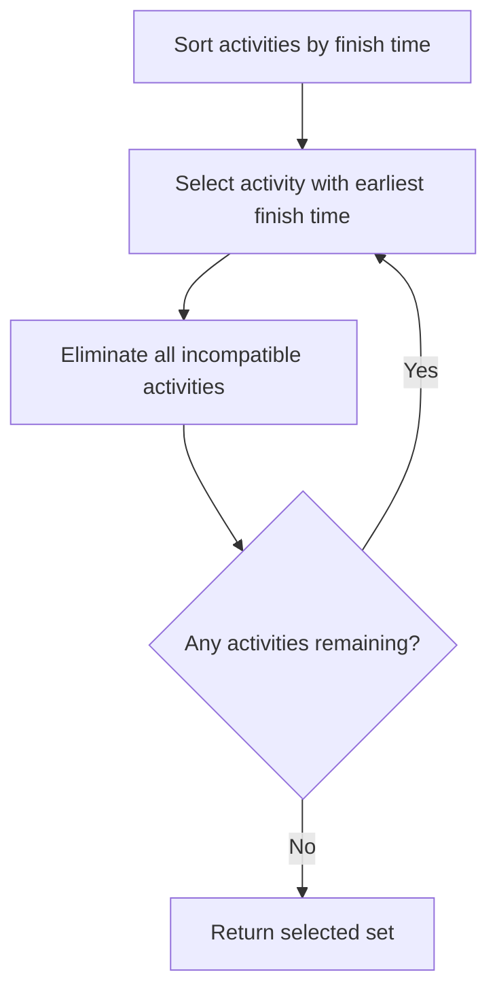

# Activity Selection Problem


## Problem Definition

Given a set $S = \{a_1, a_2, \ldots, a_n\}$ of $n$ activities, each with a **start time** $s_i$ and **finish time** $f_i$ where $0 \leq s_i < f_i < \infty$, select a **maximum-size subset of mutually compatible activities**.

Two activities $a_i$ and $a_j$ are **compatible** if their intervals $[s_i, f_i)$ and $[s_j, f_j)$ do not overlap:
$$s_i \geq f_j \quad \text{or} \quad s_j \geq f_i$$

---

## Subproblem Definition

Define:
$$S_{ij} = \{ a_k \in S : f_i \leq s_k < f_k \leq s_j \}$$

This is the set of activities that start after $a_i$ finishes and finish before $a_j$ starts.

Add fictitious activities $a_0$ and $a_{n+1}$ with $f_0 = 0$ and $s_{n+1} = \infty$. The full problem becomes $S_{0,n+1}$.

Assume activities are sorted in monotonically increasing finish time:
$$f_0 \leq f_1 \leq f_2 \leq \cdots \leq f_n < f_{n+1}$$

**Key observation:** $S_{ij} = \emptyset$ whenever $i \geq j$.

---

## Optimal Substructure

If an optimal solution $A_{ij}$ to $S_{ij}$ includes activity $a_k$, then:
- $A_{ij}$ also contains optimal solutions to $S_{ik}$ and $S_{kj}$
- $A_{ij} = A_{ik} \cup \{a_k\} \cup A_{kj}$

The size of the optimal solution satisfies:
$$c[i, j] = c[i, k] + c[k, j] + 1$$

**Full DP recurrence:**
$$c[i, j] = \begin{cases} 0 & \text{if } S_{ij} = \emptyset \\ \max_{i < k < j} \{ c[i,k] + c[k,j] + 1 \} & \text{if } S_{ij} \neq \emptyset \end{cases} \tag{16.3}$$

---

## Theorem 16.1 — The Greedy Choice

**Theorem:** Consider any nonempty subproblem $S_{ij}$. Let $a_m$ be the activity in $S_{ij}$ with the **earliest finish time**:
$$f_m = \min\{ f_k : a_k \in S_{ij} \}$$

Then:
1. $a_m$ is used in some maximum-size subset of mutually compatible activities of $S_{ij}$.
2. $S_{im} = \emptyset$, so choosing $a_m$ leaves only $S_{mj}$ as the remaining nonempty subproblem.

**Consequence:** Instead of trying all $k$ values (DP), we need only one greedy choice — the activity with the earliest finish time. This reduces both the number of subproblems (from two to one) and the number of choices (from $j-i-1$ to one).

---

## Algorithm Flow



---

## Recursive Greedy Algorithm

**RECURSIVE-ACTIVITY-SELECTOR(s, f, i, j)**

```
m = i + 1
while m < j and s[m] < f[i]:
    m = m + 1
if m < j:
    return {a_m} ∪ RECURSIVE-ACTIVITY-SELECTOR(s, f, m, j)
else:
    return ∅
```

**Initial call:** `RECURSIVE-ACTIVITY-SELECTOR(s, f, 0, n+1)`

**How it works:**
- The while loop scans forward from $a_{i+1}$ to find the first activity $a_m$ in $S_{ij}$ — the one compatible with $a_i$ (i.e., $s_m \geq f_i$).
- If found, returns $\{a_m\}$ unioned with the recursive solution to the remaining subproblem $S_{mj}$.
- If not found ($m \geq j$), $S_{ij} = \emptyset$, return $\emptyset$.

**Time complexity:** $\Theta(n)$ assuming pre-sorted input (each activity examined exactly once across all recursive calls).

---

## Iterative Greedy Algorithm

**GREEDY-ACTIVITY-SELECTOR(s, f)**

```
n = length[s]
A = {a_1}
i = 1
for m = 2 to n:
    if s[m] >= f[i]:
        A = A ∪ {a_m}
        i = m
return A
```

**How it works:**
- Variable $i$ tracks the most recently added activity.
- $f_i$ is always the maximum finish time of any activity in $A$.
- Activity $a_m$ is added if $s_m \geq f_i$ (compatible with the last added activity).
- Equivalent to the recursive version but avoids recursion overhead.

**Time complexity:** $\Theta(n)$ (assuming pre-sorted input, else $O(n \log n)$ with sorting).

---

## Comparison: DP vs Greedy

| Property | Dynamic Programming | Greedy |
|---|---|---|
| Subproblems per step | Two ($S_{ik}$ and $S_{kj}$) | One ($S_{mj}$) |
| Choices per subproblem | $j - i - 1$ | 1 (earliest finish) |
| Direction | Bottom-up | Top-down |
| Complexity | $O(n^3)$ (tabular) | $\Theta(n)$ |

---

## Key Insight

The greedy choice — always selecting the activity with the **earliest finish time** — is optimal because it maximizes the unscheduled time remaining, leaving the most room for future activities. The activity $a_m$ chosen is always the one that can be legally scheduled next and finishes first.

The subproblem structure collapses from a 2D table ($c[i,j]$) to a linear sequence of decisions, each considering activities in monotonically increasing order of finish time, each examined exactly once.
