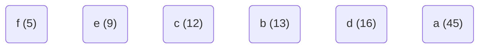
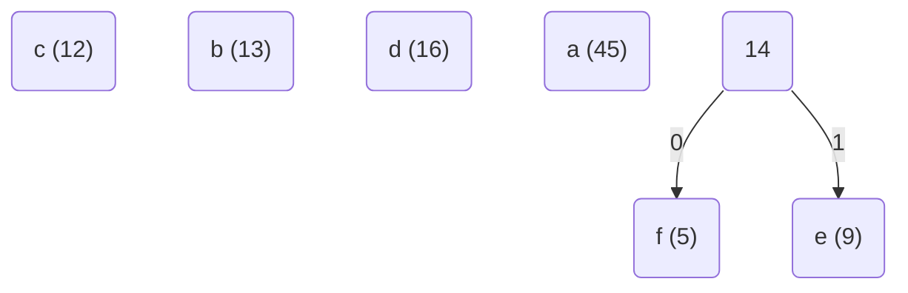
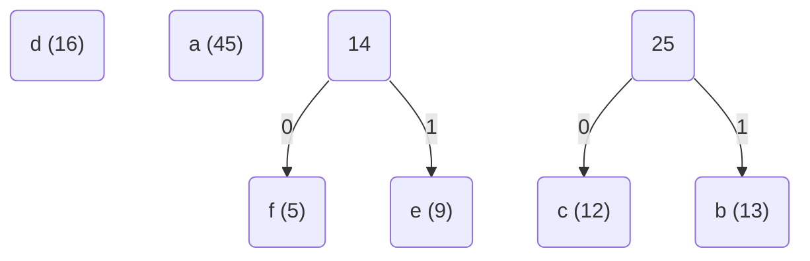
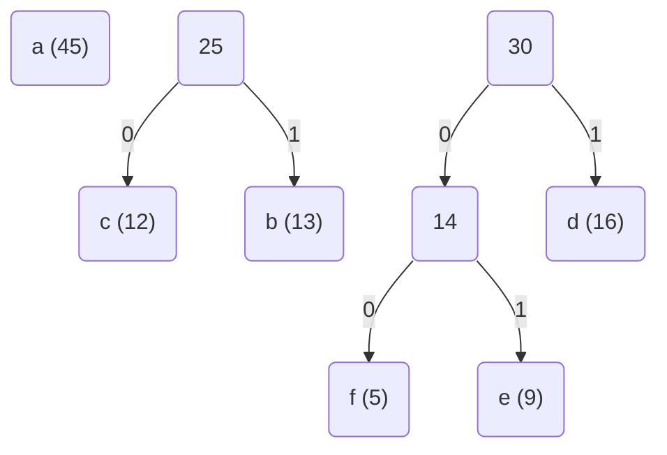
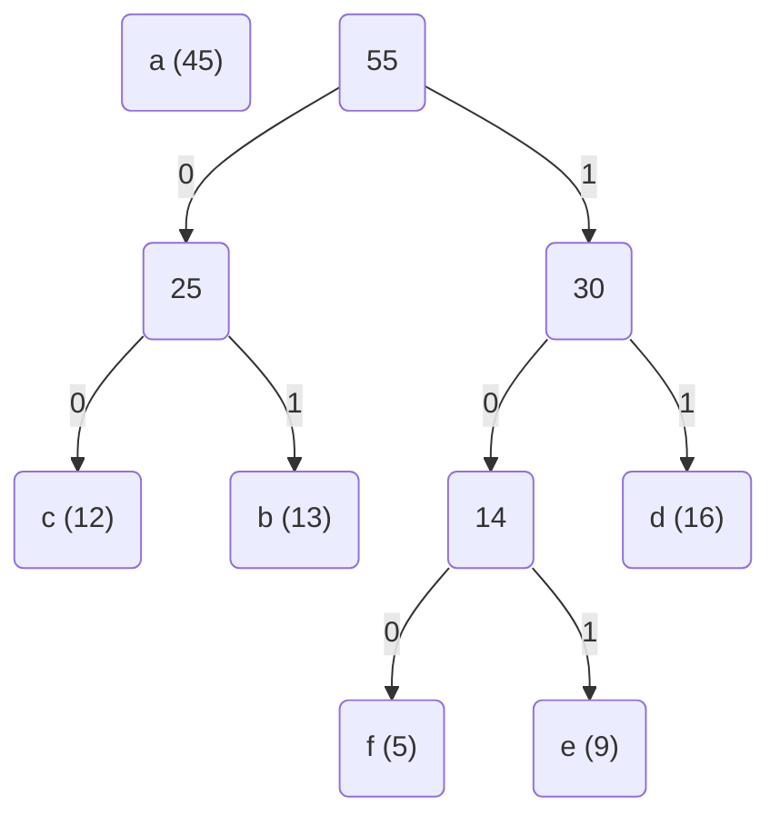
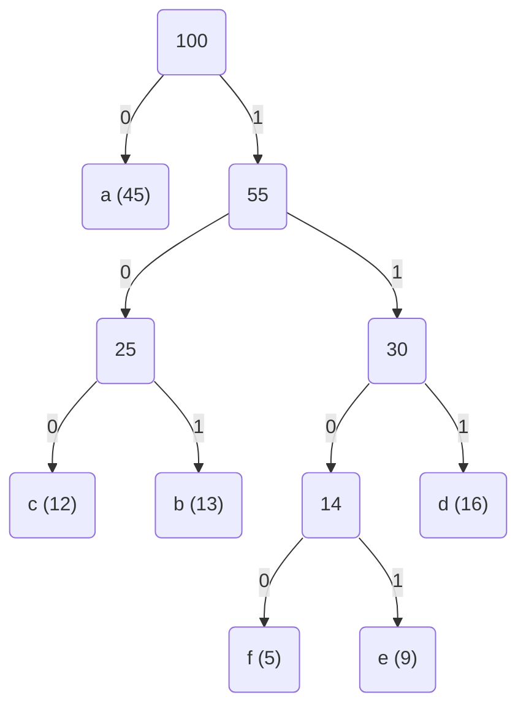

# Huffman Codes

Binary codes assigned for each character of a string as a *codeword* consisting of bits. You can compress a string by replacing each character with its corresponding codeword.

| char | codeword |
|------|----------|
| A | 00 |
| B | 01 |
| C | 10 |
| D | 11 |

This is a **fixed-length** code — every codeword has the same length.
`AABACDACA` → `000001001011001000` → 18 bits.

**More optimisation:** use a **variable-length** code — give short codewords to frequent characters, long ones to rare characters.

| char | codeword |
|------|----------|
| A | 0 |
| B | 110 |
| C | 10 |
| D | 111 |

New optimal encoding: `AABACDACA` → `001100101110100` → 15 bits.

> ⚠️ **Prefix-free constraint:** No codeword may be a prefix of another. The table below violates this — `A=10` is a prefix of `C=1011`:
>
> | char | codeword |
> |------|----------|
> | A | 10 |
> | B | 11 |
> | C | 1011 |
> | D | 111 |

---

## Huffman Coding

A greedy algorithm that constructs an **optimal prefix-free code** for compressing a given string.

The algorithm builds a **full binary tree** (a *trie*) based on character frequencies. Each character's codeword is the path from root to its leaf:
- Left child / left move → bit `0`
- Right child / right move → bit `1`

The cost of a tree T is defined as:

$$B(T) = \sum_{c \in C} f(c) \cdot d_T(c)$$

where $f(c)$ is frequency and $d_T(c)$ is depth of character $c$'s leaf.

**Algorithm:** Repeatedly merge the two least-frequent nodes.

---

**HUFFMAN(C)**
```
Huffman(C):
    n ← |C|
    Q ← C                          // initialize min-priority queue
    for i ← 1 to n-1:
        allocate new node z
        left[z]  ← x ← ExtractMin(Q)
        right[z] ← y ← ExtractMin(Q)
        f[z] ← f[x] + f[y]
        Insert(Q, z)
    return ExtractMin(Q)            // return root of the tree
```

> **Time complexity:** O(n log n) — the queue is a binary min-heap, each of the n−1 iterations does O(log n) heap operations.

---

**BuildHuffman**
```
BuildHuffman(f[1..n]):
    for i ← 1 to n:
        L[i] ← 0
        R[i] ← 0
        Insert(i, f[i])
    for i ← n to 2n-1:
        x ← ExtractMin()
        y ← ExtractMin()
        f[i] ← f[x] + f[y]
        Insert(i, f[i])
        L[i] ← x;  P[x] ← i
        R[i] ← y;  P[y] ← i
    P[2n-1] ← 0
```

**HuffmanEncode**
```
HuffmanEncode(A[1..k]):
    m ← 1
    for i ← 1 to k:
        HuffmanEncodeOne(A[i])

HuffmanEncodeOne(x):
    if x < 2n-1:
        HuffmanEncodeOne(P[x])
        if x == L[P[x]]:
            B[m] ← 0
        else:
            B[m] ← 1
        m ← m + 1
```

**HuffmanDecode**
```
HuffmanDecode(B[1..m]):
    k ← 1
    v ← 2n-1
    for i ← 1 to m:
        if B[i] == 0:
            v ← L[v]
        else:
            v ← R[v]
        if L[v] == 0:
            A[k] ← v
            k ← k + 1
            v ← 2n-1
```

---

## CLRS Example — 100,000 character file

Characters a–f with frequencies (in thousands):

| char | a | b | c | d | e | f |
|------|---|---|---|---|---|---|
| frequency | 45 | 13 | 12 | 16 | 9 | 5 |
| fixed-length | 000 | 001 | 010 | 011 | 100 | 101 |
| variable-length | 0 | 101 | 100 | 111 | 1101 | 1100 |

Fixed-length needs 300,000 bits. Variable-length needs:
$(45·1 + 13·3 + 12·3 + 16·3 + 9·4 + 5·4) · 1000 = 224,000$ bits — a **~25% saving**.

**Stage (a) — Initial 6 nodes (queue sorted by frequency)**


**Stage (b) — Merge f(5) and e(9)**


**Stage (c) — Merge c(12) and b(13)**


**Stage (d) — Merge d(16) and FE(14)**


**Stage (e) — Merge CB(25) and DFE(30)**


**Stage (f) — Final tree: merge a(45) and N55**


Final codewords (path from root to leaf):

| char | codeword |
|------|----------|
| a | 0 |
| b | 101 |
| c | 100 |
| d | 111 |
| e | 1101 |
| f | 1100 |

---

## Correctness

**Lemma 16.2 (Greedy-choice property):** Let x and y be the two lowest-frequency characters. There exists an optimal prefix code where x and y are sibling leaves at maximum depth — so it is always safe to merge them first.

**Lemma 16.3 (Optimal substructure):** After merging x and y into a new character z with $f[z] = f[x] + f[y]$, an optimal code for the reduced alphabet C′ yields an optimal code for C by expanding z back into x and y. Formally: $B(T) = B(T') + f[x] + f[y]$.

**Theorem 16.4:** Procedure HUFFMAN produces an optimal prefix code. *(Proof follows immediately from Lemmas 16.2 and 16.3.)*
