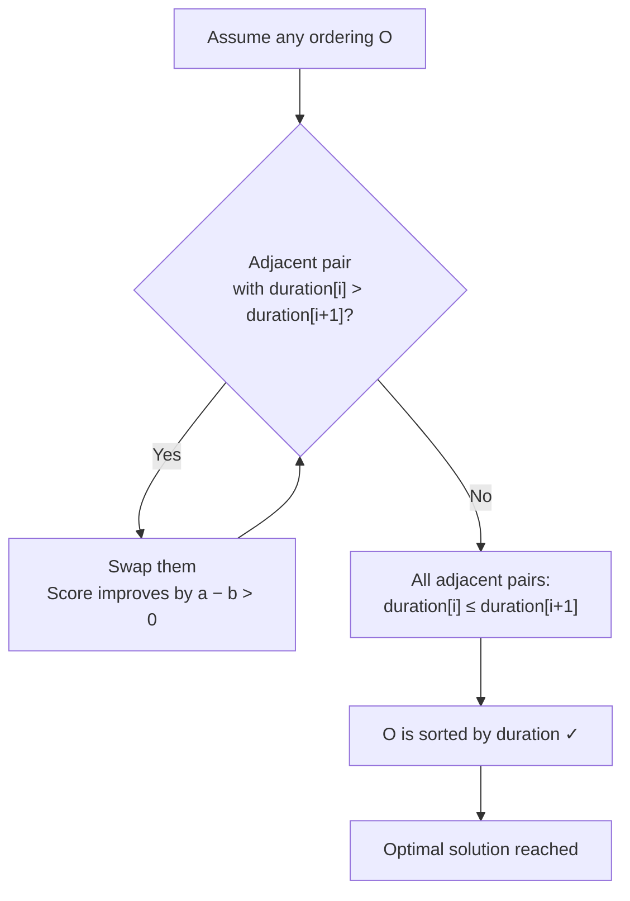

# Tasks and Deadlines

**Tags**: Greedy · Sorting · O(n log n) · 

---

## Problem

Given `n` tasks, each with a **duration** and a **deadline**, choose an order to perform all tasks.

For each task, you earn `d − x` points where:
- `d` = task's deadline
- `x` = moment you finish the task

**Goal**: Maximise the total score.

> Note: Every task must be performed — you cannot skip tasks.

---

## Key Insight

> **Surprising fact**: The optimal solution does **not** depend on the deadlines at all.

A correct greedy strategy is to simply perform the tasks **sorted by their durations in increasing order**.

The deadlines only affect the *value* of the score, not *which ordering* is optimal.

---

## Example

| Task | Duration | Deadline |
|------|----------|----------|
| A    | 4        | 2        |
| B    | 3        | 5        |
| C    | 2        | 7        |
| D    | 4        | 5        |

**Optimal order** (sorted by duration ↑): C → B → A → D

| Task | Finish time (x) | Deadline (d) | Score (d − x) |
|------|-----------------|--------------|----------------|
| C    | 2               | 7            | **+5**         |
| B    | 5               | 5            | 0              |
| A    | 9               | 2            | −7             |
| D    | 13              | 5            | −8             |

**Total = −10** ← this is the maximum achievable score.

---

## Why It Works — Exchange Argument

Consider any two adjacent tasks X (duration `a`) and Y (duration `b`) where `a > b`:

```
Before swap:   [ X (a) ][ Y (b) ]
After swap:    [ Y (b) ][ X (a) ]
```

Let `t` = time before these two tasks start.

**Before swap scores**:
- X earns: `d_X − (t + a)`
- Y earns: `d_Y − (t + a + b)`
- Combined: `d_X + d_Y − 2t − 2a − b`  *(wait, let's be precise)*

**After swap scores**:
- Y earns: `d_Y − (t + b)`
- X earns: `d_X − (t + b + a)`
- Combined: `d_X + d_Y − 2t − a − 2b`

**Difference (after − before)**:
```
= (d_X + d_Y − 2t − a − 2b) − (d_X + d_Y − 2t − 2a − b)
= a − b
> 0   (since a > b)
```

Swapping improves the total score by `a − b > 0`. Therefore, in an optimal solution, no adjacent pair can have the first task longer than the second — the tasks **must be sorted by duration**.

---

## Proof Sketch (Exchange Argument Flow)



---

## Algorithm

### Pseudocode

```
function maxScore(tasks):
    sort tasks by duration ascending        // O(n log n)
    time  ← 0
    score ← 0
    for each task t in sorted order:
        time  ← time + t.duration
        score ← score + (t.deadline − time)
    return score
```

### C++ Implementation

```cpp
#include <bits/stdc++.h>
using namespace std;

int main() {
    int n;
    cin >> n;

    vector<pair<int,int>> tasks(n);  // {duration, deadline}
    for (auto& [d, dl] : tasks)
        cin >> d >> dl;

    // Sort by duration ascending
    sort(tasks.begin(), tasks.end());

    long long time = 0, score = 0;
    for (auto& [duration, deadline] : tasks) {
        time  += duration;
        score += deadline - time;
    }

    cout << score << "\n";
    return 0;
}
```

---

## Complexity

| | |
|---|---|
| **Time**  | O(n log n) — dominated by sort |
| **Space** | O(n) for input, O(1) extra |

---

## Common Mistakes

- **Sorting by deadline** — wrong. Deadlines are irrelevant to ordering.
- **Sorting by `d − duration`** (slack) — also wrong for this variant.
- **Thinking you can skip tasks** — you can't; all tasks must be done.
- **Greedy criterion confusion**: this is *not* the classic EDF (Earliest Deadline First) scheduling. EDF maximises tasks completed on time; this problem maximises a score sum.

---

## Variant: Maximise Tasks Completed On Time

Different problem: you can **skip** tasks, and want to maximise the number of tasks finished by their deadlines.

- Greedy: sort by deadline, greedily pick tasks.
- Use a **min-heap** on durations: if adding a task violates its deadline, check if swapping with the longest task already picked improves things.
- Time: O(n log n)

---

## Summary

| Property | Value |
|----------|-------|
| Greedy criterion | Sort by **duration** ascending |
| Deadlines matter for | Computing the score, not the order |
| Proof technique | Exchange argument |
| Time complexity | O(n log n) |

> **Key takeaway**: Whenever you see a "score = deadline − finish\_time" formulation with no option to skip tasks, sort by duration. The exchange argument proof is the template to verify any greedy ordering claim.
