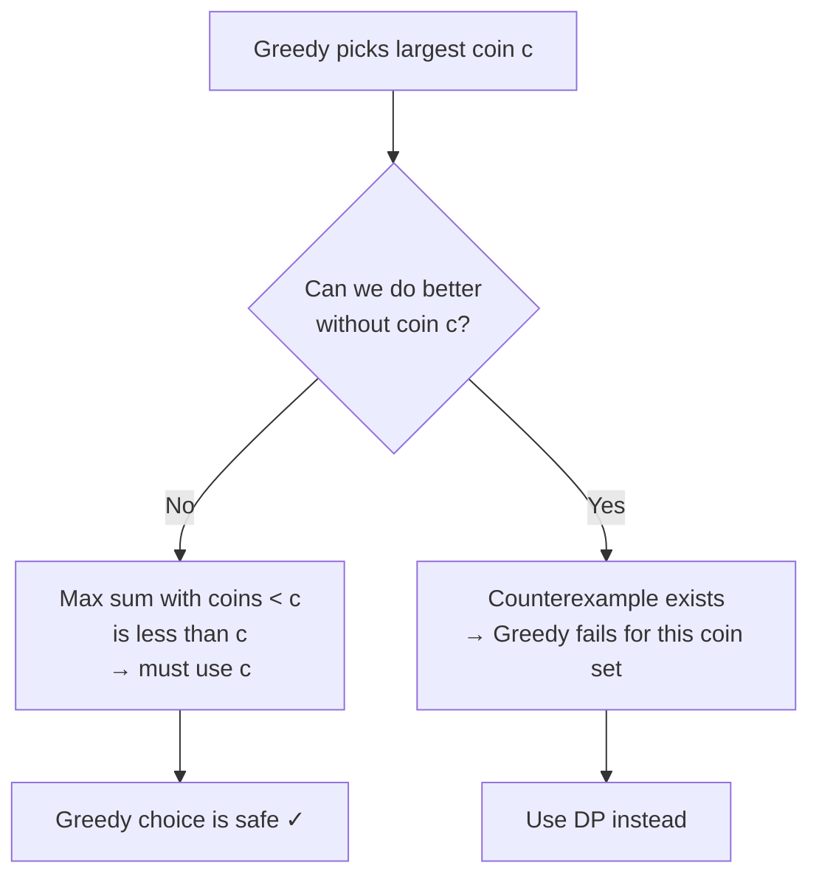

# Coin Problem (Greedy)

**Tags**: Greedy · Coin Change · Counterexample · CSES

---

## Problem

Given a set of coin denominations `coins = {c₁, c₂, ..., cₖ}` and a target sum `n`, find the **minimum number of coins** needed to form exactly `n`. Each coin can be used any number of times.

> This is the **greedy variant** — see [this](../18.Dynamic-Programming/coin.md) for the general DP solution.

---

## Greedy Algorithm

Always pick the **largest coin that does not exceed the remaining sum**, repeat until sum is zero.

### Pseudocode

```
function greedyCoins(coins, n):
    sort coins descending
    count ← 0
    for each coin c in coins:
        while remaining >= c:
            remaining -= c
            count++
    return count
```

### C++ Implementation

```cpp
#include <bits/stdc++.h>
using namespace std;

int main() {
    vector<int> coins = {1, 2, 5, 10, 20, 50, 100, 200};
    sort(coins.rbegin(), coins.rend());   // largest first

    int n;
    cin >> n;

    int count = 0;
    for (int c : coins) {
        count += n / c;
        n %= c;
    }

    cout << count << "\n";
    return 0;
}
```

---

## Example: Euro Coins

Denominations (in cents): `{1, 2, 5, 10, 20, 50, 100, 200}`

**Target: n = 520**

| Step | Coin picked | Remaining |
|------|-------------|-----------|
| 1    | 200         | 320       |
| 2    | 200         | 120       |
| 3    | 100         | 20        |
| 4    | 20          | 0         |

**Answer: 4 coins** (200 + 200 + 100 + 20 = 520) ✓

---

## Why Greedy Works for Euro Coins

The proof relies on showing that no coin is ever "wasted" by the greedy choice. Key observations for euro coins:

**Each of 1, 5, 10, 50, 100 appears at most once** in an optimal solution:
- If solution contains two 5s → replace with one 10 (fewer coins)
- If solution contains two 50s → replace with one 100
- And so on for each denomination

**Coins 2 and 20 appear at most twice** in an optimal solution:
- Three 2s → replace with 5+1 (but `2+2+2=6`, optimal for 6 is `5+1`, same count — actually 2+2+2 is 3 coins, 5+1 is 2 coins ✓)
- Three 20s → replace with 50+10

**Critical bound**: For any coin `x`, the maximum sum achievable *without using `x` or any larger coin* is always less than `x`. So greedy must use `x`.

For example, if `x = 100`:
- Largest sum using only {1,2,5,10,20,50} optimally = 50+20+20+5+2+2 = **99 < 100**
- So the greedy algorithm *must* pick coin 100 whenever possible → optimal.

---

## General Case — Greedy Fails

For arbitrary coin sets, greedy does **not** necessarily produce the optimal solution.

### Counterexample

```
coins = {1, 3, 4},  target n = 6

Greedy:  4 + 1 + 1 = 3 coins   ← greedy picks 4 first
Optimal: 3 + 3     = 2 coins   ← greedy misses this
```

Greedy gives **3 coins**, optimal is **2 coins**. The greedy algorithm is wrong here.

### Why It Fails

The greedy assumption — "picking the largest coin now never hurts" — breaks down when smaller coins combine more efficiently. There is no known greedy algorithm that solves the general coin problem.

> Use **Dynamic Programming** for the general case.

---

## Greedy vs DP Comparison

| | Greedy | DP |
|---|---|---|
| **Works for** | Special coin sets (e.g. euro) | Any coin set |
| **Time complexity** | O(k log k + n/c_min) | O(n · k) |
| **Space** | O(1) extra | O(n) |
| **Proof** | Requires case-by-case argument | Optimal substructure |
| **Can reconstruct coins?** | Yes (track each pick) | Yes (with `first[]` array) |

---

## Proof Technique Summary



---

## Complexity

| | |
|---|---|
| **Time** | O(k log k) to sort + O(n / c_min) picks |
| **Space** | O(1) extra |

For euro coins with c_min = 1, worst case is O(n) — but in practice very fast since we use large coins first.

---

## Common Mistakes

- **Assuming greedy always works** — it only works for specific coin sets. Always verify with a counterexample check.
- **Confusing this with the DP coin problem** — DP gives the correct answer for *any* coin set; greedy is a special-case optimisation.
- **Off-by-one on the bound** — the key claim is max-sum-with-smaller-coins < x, not ≤ x.

---

## Summary

| Property | Value |
|----------|-------|
| Greedy criterion | Always pick the **largest coin ≤ remaining** |
| Works for | Euro coins (and similar canonical sets) |
| Fails for | General coin sets (e.g. `{1,3,4}`) |
| Counterexample technique | Show a target where greedy > optimal |
| General solution | Dynamic Programming — O(n·k) |
| CSES problem | [Coin Problem (DP)](https://cses.fi/problemset/task/1634) |

> **Key takeaway**: Greedy works for coins when you can prove that the maximum sum achievable *without* the current largest coin is strictly less than that coin's value. If you cannot prove this, reach for DP.
