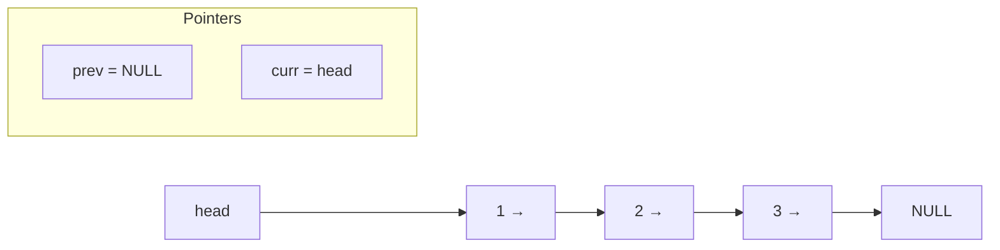
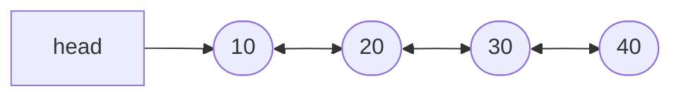
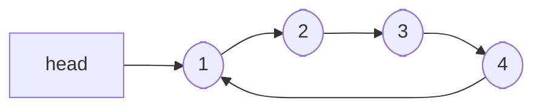

# 📚 Linked List – Complete Revision (With Algorithms)

## 📌 Table of Contents

1. [🔗 Introduction to Linked List](#1-introduction-to-linked-list)
2. [🧠 Understanding Pointers & Referencing](#2-understanding-pointers--referencing)
3. [📒 Types of Linked Lists](#3-types-of-linked-lists)
4. [🛠 Core Operations (with Algorithms)](#4-core-operations-with-algorithms)

   - Insertion at Head
   - Insertion at Tail
   - Deletion by Value
   - Deletion at Head
   - Search
   - Display

5. [🔁 Reversal Techniques](#5-linked-list-reversal)

   - Iterative Reversal
   - Recursive Reversal
   - Reverse in K-Groups

6. [➕ Advanced Operations](#6-advanced-operations)

   - Merge Two Sorted Lists
   - Detect Loop (Cycle Detection)
   - Find Middle Node
   - Length of List

7. [🧷 Doubly Linked List: Concepts & Algo](#7-doubly-linked-list-concepts--algo)
8. [📘 Circular Linked List](#8-circular-linked-list)
9. [🧠 Quick Tips](#9-quick-tips--patterns)

---

## 1. 🔗 Introduction to Linked List

A **Linked List** is a linear data structure where each element (called a node) contains:

- `data` (the value)
- `next` (pointer to next node)

It does **not store elements in contiguous memory**, unlike arrays.

---

## 2. 🧠 Understanding Pointers & Referencing

### ➕ How Pointers Work in Linked List

- Each node is dynamically created using `new` and lives in the heap.
- A pointer (like `head`) holds the **address** of the first node.
- Modifications to nodes must be done via references or pointers (`node* &head`).
- `head` points to the first node. Each node points to the next via `next`.

### 📍 Example: Flow of Pointers

```
head → [data] → [data] → NULL
```

```mermaid
graph LR
    A[head] --> B([1|next]) --> C([2|next]) --> D([3|next]) --> E[NULL]

```

- If `node* temp = head;`, then `temp` is another pointer to the same node.

  ```mermaid
  graph LR
  A[head] --> B([1|next]) --> C([2|next])
  T[temp] --> B

  ```

- If `temp = temp->next;`, then `temp` now points to the next node.

  ```mermaid
  graph LR
  A[head] --> B([1|next]) --> C([2|next]) --> D([3|next])
  T[temp] --> C

  ```

---

## 3. 📒 Types of Linked Lists

| Type               | Description                                   |
| ------------------ | --------------------------------------------- |
| Singly Linked List | Each node points to the next. Ends at `NULL`. |
| Doubly Linked List | Each node has `prev` and `next` pointers.     |
| Circular LL        | Last node’s `next` points back to the first.  |

---

## 4. 🛠 Core Operations (With General Algorithms)

### 🔹 Insertion at Head

```mermaid
graph LR
    subgraph Before
        HEAD[head] --> A([10|next]) --> B([20|next])
    end
    subgraph Insert 5 at Head
        NEW([5|next]) --> A
        HEAD --> NEW
    end

```

#### 📋 Algorithm

1. Create a new node.
2. Set new node’s `next` = current head.
3. Update head = new node.

---

### 🔹 Insertion at Tail

```mermaid
graph LR
    HEAD[head] --> A([10|next]) --> B([20|next]) --> NULL1[NULL]
    B --> C([30|next]) --> NULL2[NULL]

```

#### 📋 Algorithm

1. Create a new node.
2. If head is `NULL`, update head = new node.
3. Else, traverse till `temp->next == NULL`.
4. Set `temp->next` = new node.

---

### 🔹 Deletion by Value

#### 📋 Algorithm

1. Handle empty list case.
2. If head’s data = key, delete head.
3. Traverse till `temp->next->data == key`.
4. Save pointer to node to delete.
5. Set `temp->next = temp->next->next`.
6. Delete the stored node.

---

### 🔹 Deletion at Head

#### 📋 Algorithm

1. Save current head in `todelete`.
2. Move `head` to `head->next`.
3. Delete `todelete`.

---

### 🔹 Search in Linked List

#### 📋 Algorithm

1. Traverse from head to end.
2. If `temp->data == key`, return true.
3. Else, move to `temp->next`.
4. If end is reached, return false.

---

### 🔹 Display Linked List

#### 📋 Algorithm

1. Start from head.
2. Print `temp->data`, then move to next.
3. Stop at `temp == NULL`.

---

## 5. 🔁 Linked List Reversal

### 🔹 Iterative Reversal

#### 📋 Algorithm

1. Initialize 3 pointers: `prev = NULL`, `curr = head`, `next = NULL`.



2. While `curr != NULL`:

   - Store `next = curr->next`.
   - Reverse: `curr->next = prev`.
   - Move `prev = curr`, `curr = next`.

```mermaid
graph LR
    P[prev] --> B([1|next])
    CUR[curr] --> C([2|next]) --> D([3|next])
    B --> PNULL[NULL]

```

3. After loop, set `head = prev`.

```mermaid
graph LR
    NEWHEAD[head] --> D([3|next]) --> C([2|next]) --> B([1|next]) --> NULL

```

---

### 🔹 Recursive Reversal

#### 📋 Algorithm

1. Base Case: if `head == NULL` or `head->next == NULL`, return head.
2. Recursively call: `newHead = reverse(head->next)`
3. Make `head->next->next = head`.
4. Set `head->next = NULL`
5. Return `newHead`.

---

### 🔹 Reverse K Nodes (K-Group Reverse)

#### 📋 Algorithm

1. Use 3 pointers: `curr`, `prev`, `next`.
2. Reverse first `k` nodes as usual.
3. Recursively call for remaining list.
4. Attach previous tail to result of recursion.

---

## 6. ➕ Advanced Operations

---

### 🔹 Merge Two Sorted Lists

#### 📋 Algorithm

1. Create dummy node.
2. Compare nodes from both lists.
3. Append smaller node to current.
4. Move in that list.
5. Attach leftover list at end.

---

### 🔹 Detect Loop in LL (Floyd’s Algo)

#### 📋 Algorithm

1. Use slow and fast pointers.
2. Move slow = slow->next, fast = fast->next->next.
3. If slow == fast, loop exists.
4. Else if fast hits NULL, no loop.

---

### 🔹 Find Middle of List (Tortoise Method)

#### 📋 Algorithm

1. Use slow and fast pointer.
2. slow = head, fast = head.
3. Move slow by 1 step, fast by 2 steps.
4. When fast reaches end, slow is at mid.

---

### 🔹 Length of List

#### 📋 Algorithm

1. Initialize `count = 0`.
2. Traverse through each node.
3. Increment count.
4. Return count at end.

---

## 7. 🧷 Doubly Linked List – Concepts & Algo

- Each node has:

  - `data`
  - `prev` (points to previous node)
  - `next` (points to next node)



### 🔹 Insert at End

#### 📋 Algorithm

1. Create new node.
2. If list is empty, set head = new node.
3. Traverse to end.
4. Set `last->next = new`, `new->prev = last`.

---

### 🔹 Traversal (Both Directions)

#### 📋 Algorithm

1. Forward: `while (temp != NULL)`, print & move `temp = temp->next`.
2. Backward: Start at last node and go `temp = temp->prev`.

---

## 8. 🔁 Circular Linked List

### 🔹 Key Concepts

- Last node’s `next` points back to head.
- Traverse ends when `temp->next == head`.



#### 📋 Insertion at End

1. Create new node.
2. Traverse to last node (`temp->next != head`)
3. Point last->next to new node.
4. new->next = head

---

## 9. 🧠 Quick Tips & Patterns

| Task           | Technique                    |
| -------------- | ---------------------------- |
| Reverse list   | 3-pointer iterative          |
| Middle element | Tortoise method              |
| Detect loop    | Floyd’s Cycle Detection      |
| Merge lists    | Dummy node + two pointer     |
| Palindrome     | Reverse second half, compare |
| K-th from end  | Two pointer: gap = k         |

---
