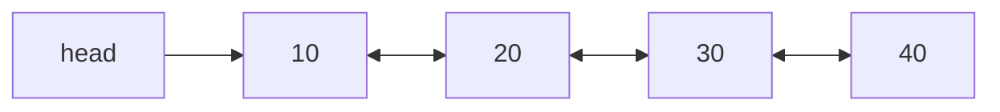
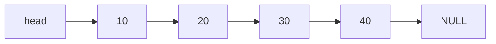
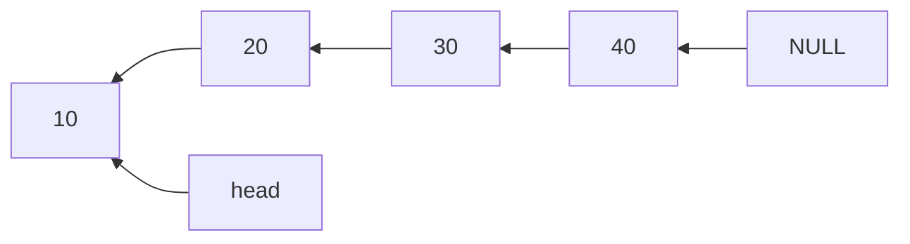

# 🧷 Doubly Linked List – Complete Notes (With Algorithms + Diagrams)

---

## 📌 Table of Contents

1. [📖 Introduction](#1-introduction)
2. [📐 Structure of a Node](#2-structure-of-a-node)
3. [🔁 Pointer Flow Diagram](#3-pointer-flow-diagram)
4. [🛠 Core Operations (With Algorithms)](#4-core-operations-with-algorithms)
   - Insertion at End
   - Insertion at Beginning
   - Deletion by Value
   - Forward Traversal
   - Backward Traversal
5. [🧠 Quick Notes](#5-quick-notes)

---

## 1. 📖 Introduction

A **Doubly Linked List (DLL)** is a linear data structure where each node contains:

- `data` — the value stored
- `prev` — pointer to the previous node
- `next` — pointer to the next node

Unlike singly linked lists, DLLs allow **bidirectional traversal**.

---

## 2. 📐 Structure of a Node

In C++:

```cpp
struct Node {
    int data;
    Node* prev;
    Node* next;

    Node(int val) : data(val), prev(nullptr), next(nullptr) {}
};
```

---

## 3. 🔁 Pointer Flow Diagram

### ✅ Sample DLL: `10 ⇄ 20 ⇄ 30 ⇄ 40`



---

## 4. 🛠 Core Operations (With Algorithms)

---

### 🔹 Insertion at End

#### 📋 Algorithm

1. Create a new node with given data.
2. If the list is empty, set `head = new node`.
3. Else traverse to the end (`while (temp->next != NULL)`).
4. Link new node:

   - `last->next = newNode`
   - `newNode->prev = last`

---

### 🔹 Insertion at Beginning

#### 📋 Algorithm

1. Create a new node.
2. Set `newNode->next = head`
3. If head is not null, `head->prev = newNode`
4. Update `head = newNode`

---

### 🔹 Deletion by Value

#### 📋 Algorithm

1. Handle empty list.
2. If node to delete is `head`, update `head = head->next`.
3. Traverse to find the node.
4. Update links:

   - `node->prev->next = node->next`
   - If `node->next != NULL`: `node->next->prev = node->prev`

5. Delete the node.

---

### 🔹 Forward Traversal

#### 📋 Algorithm

1. Start at `head`.
2. While `temp != NULL`:

   - Print `temp->data`
   - Move `temp = temp->next`



---

### 🔹 Backward Traversal

#### 📋 Algorithm

1. Start at last node (`while (temp->next != NULL)`)
2. Then:

   - Print `temp->data`
   - Move `temp = temp->prev`



---

## 5. 🧠 Quick Notes

| Concept       | Description                                 |
| ------------- | ------------------------------------------- |
| Doubly Linked | Two pointers: `prev` and `next`             |
| Traversal     | Can go both forward and backward            |
| Insertions    | Easier at both ends than singly linked list |
| Deletions     | Don’t need to track previous separately     |

---
