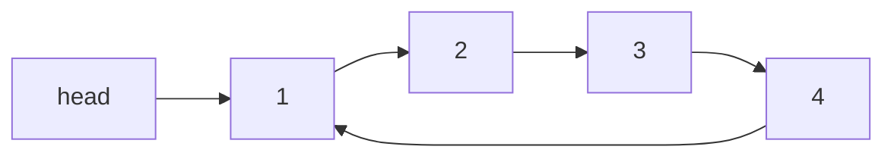

# Circular Linked List – Complete Notes (With Algorithms and Diagram)

## Table of Contents

1. Introduction
2. Structure of a Node
3. How Circular LL Works
4. Core Operations (With Algorithms)
   - Insertion at End
   - Insertion at Beginning
   - Traversal
   - Deletion by Value
5. Pointer Flow Diagram
6. Quick Notes

---

## 1. Introduction

A Circular Linked List is a variation of a singly linked list where the last node points back to the head instead of null. This forms a circular chain of nodes.

- No node in the list points to null.
- Useful for buffer management, round robin, and cyclic scheduling.

---

## 2. Structure of a Node

```cpp
struct Node {
    int data;
    Node* next;

    Node(int value) : data(value), next(nullptr) {}
};
```

---

## 3. How Circular LL Works

- The last node's `next` pointer points to the `head`.
- We can maintain a `tail` pointer to simplify insertions at end.
- The traversal condition is `while (temp->next != head)` or `do-while`.

---

## 4. Core Operations (With Algorithms)

### Insertion at End

Algorithm:

1. Create a new node.
2. If list is empty, set `newNode->next = newNode` and `head = newNode`.
3. Else:

   - Traverse to the last node (`while (temp->next != head)`).
   - `temp->next = newNode`
   - `newNode->next = head`

---

### Insertion at Beginning

Algorithm:

1. Create a new node.
2. If list is empty, set `newNode->next = newNode` and `head = newNode`.
3. Else:

   - Traverse to last node.
   - `newNode->next = head`
   - `last->next = newNode`
   - `head = newNode`

---

### Traversal

Algorithm:

1. If list is empty, return.
2. Use a `do-while` loop:

   - Print `temp->data`
   - `temp = temp->next`
   - Stop when `temp == head`

---

### Deletion by Value

Algorithm:

1. Handle empty list.
2. Use two pointers: `curr` and `prev`.
3. Traverse in a loop until `curr->data == key` or loop ends.
4. If `curr == head`, move head forward and update tail’s next.
5. Else:

   - `prev->next = curr->next`

6. Delete the node.

---

## 5. Pointer Flow Diagram



Note: All arrows form a closed loop, ending back at the head.

---

## 6. Quick Notes

- Use `do-while` for traversal to ensure full loop.
- Maintain `tail` pointer for O(1) insertions at end.
- Special care is needed when deleting the head node.
- For singly circular LL, only one direction of navigation is available.
