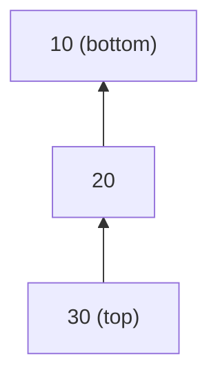
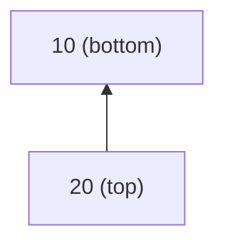
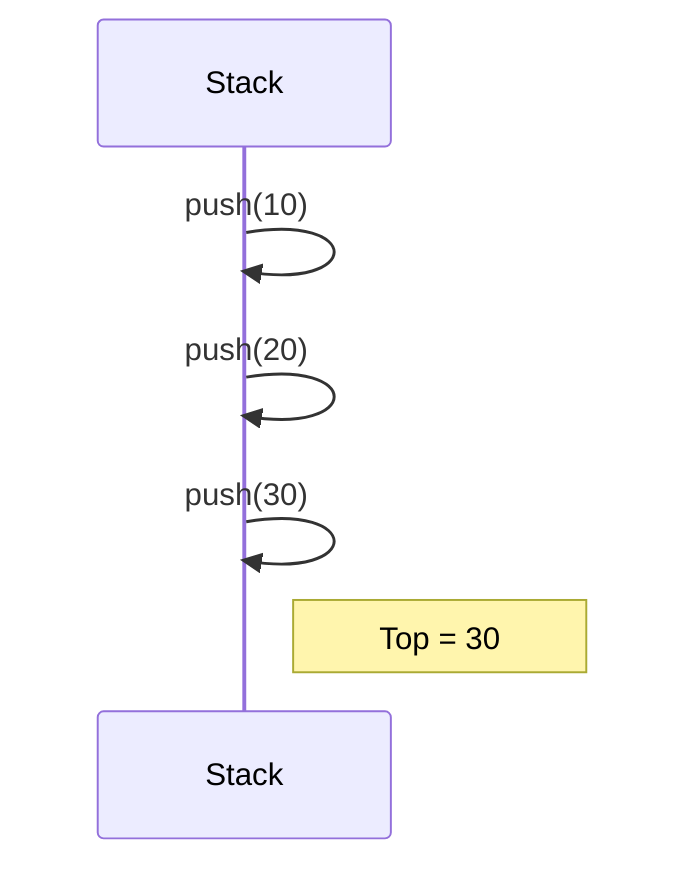
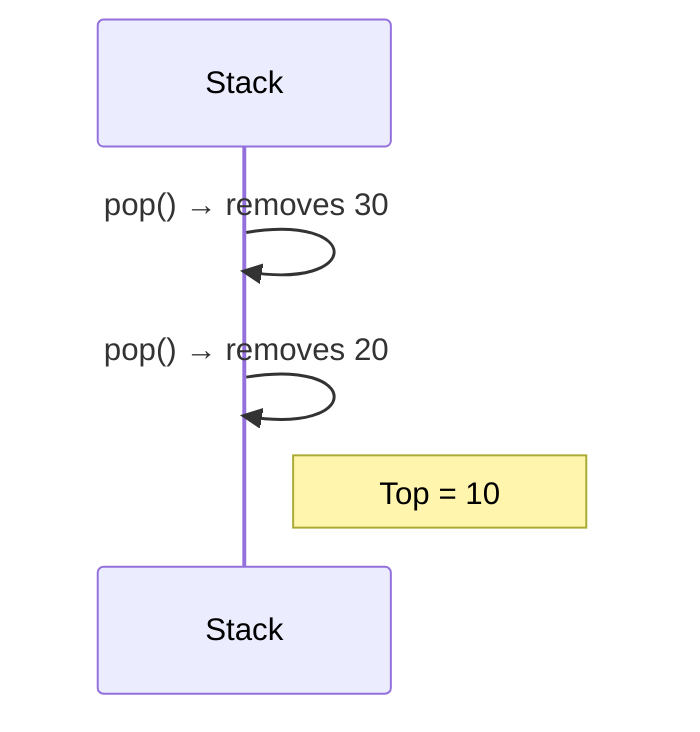

# Stack – Complete Notes (With Algorithms and Diagrams)

## Table of Contents

1. Introduction
2. Stack Operations
   - Push
   - Pop
   - Peek (Top)
   - isEmpty
3. Algorithmic Steps
4. Stack Visual Representation (Mermaid)
5. Stack Behavior Diagrams
6. Applications

---

## 1. Introduction

A **stack** is a linear data structure that follows the **LIFO (Last In, First Out)** principle.

- Elements are inserted and removed from only one end — the **top** of the stack.
- Useful for problems involving **reversal, recursion, expression parsing, and undo features**.

---

## 2. Stack Operations

### Push

Insert an element at the top.

### Pop

Remove the topmost element.

### Peek (Top)

View the element at the top without removing it.

### isEmpty

Check if the stack has no elements.

---

## 3. Algorithmic Steps

### Push(x)

1. Check if stack is full (if using array).
2. Increment the top pointer.
3. Place the value `x` at the new top.

### Pop()

1. Check if stack is empty.
2. Retrieve the element at top.
3. Decrement the top pointer.

### Peek()

1. Check if stack is empty.
2. Return the element at the top index.

### isEmpty()

1. If top is -1 (or NULL for linked list), return true.

---

## 4. Stack Visual Representation (Mermaid)

### Example: Stack After Pushing 10, 20, 30

### After One Pop()

---

## 5. Stack Behavior Diagrams

### Stack Growth (Push Operations)

### Stack Shrink (Pop Operations)

---

## 6. Applications

| Use Case           | Description                        |
| ------------------ | ---------------------------------- |
| Expression Parsing | Convert infix to postfix/prefix    |
| Function Calls     | Call stack stores return addresses |
| Undo Operations    | Revert changes in text editors     |
| Backtracking       | Maze/recursion state storage       |
| Browser History    | Forward/back navigation            |

---
