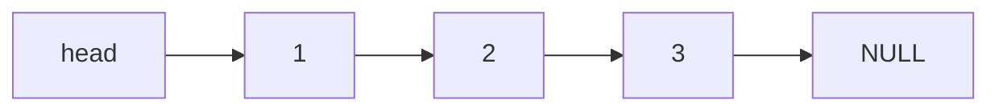
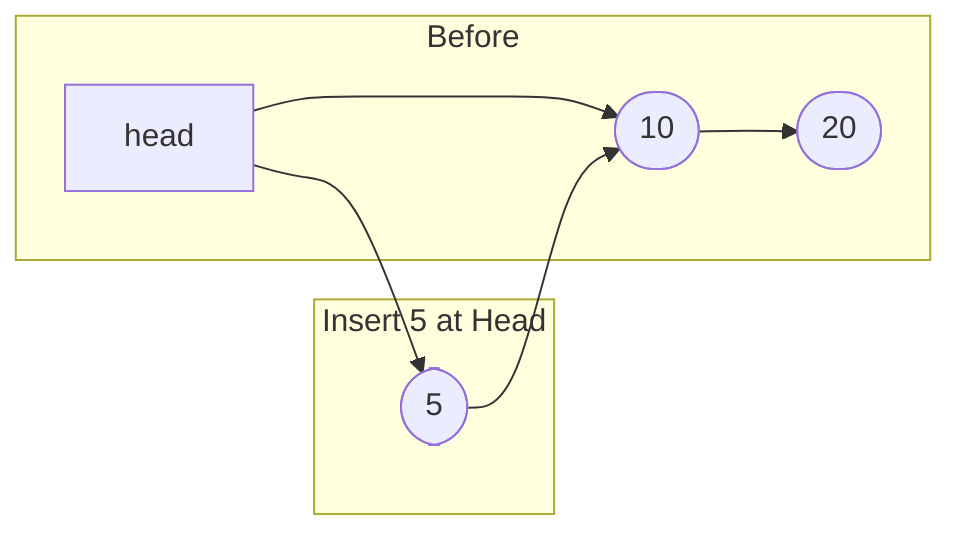
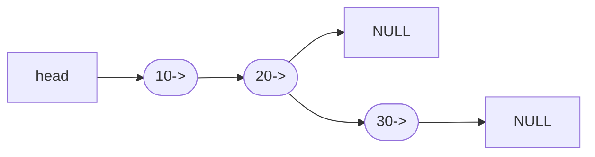
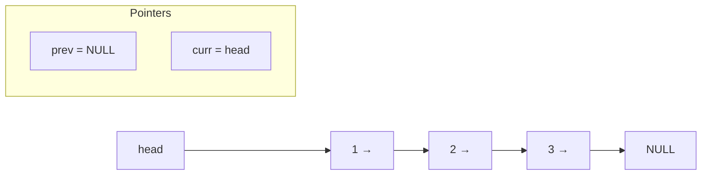
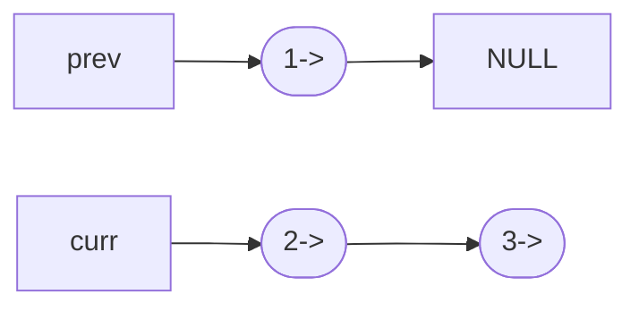
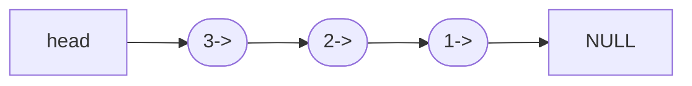
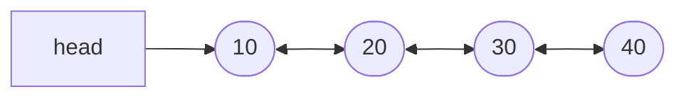
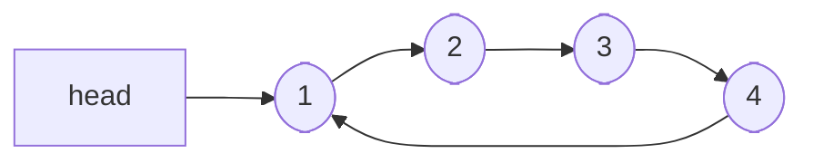

# Linked List

## Table of Contents

1. [ Introduction to Linked List](#1-introduction-to-linked-list)
2. [ Understanding Pointers & Referencing](#2-understanding-pointers--referencing)
3. [ Types of Linked Lists](#3-types-of-linked-lists)
4. [ Core Operations (with Algorithms)](#4-core-operations-with-algorithms)
   - Insertion at Head
   - Insertion at Tail
   - Deletion by Value
   - Deletion at Head
   - Search
   - Display

5. [ Reversal Techniques](#5-linked-list-reversal)
   - Iterative Reversal
   - Recursive Reversal
   - Reverse in K-Groups

6. [ Advanced Operations](#6-advanced-operations)
   - Merge Two Sorted Lists
   - Detect Loop (Cycle Detection)
   - Find Middle Node
   - Length of List

7. [ Doubly Linked List: Concepts & Algo](#7-doubly-linked-list-concepts--algo)
8. [ Circular Linked List](#8-circular-linked-list)
9. [ Quick Tips](#9-quick-tips--patterns)

---

## 1. Introduction to Linked List

A **Linked List** is a linear data structure where each element (called a node) contains:

- `data` (the value)
- `next` (pointer to next node)

Arranged in linear order
It does **not store elements in contiguous memory**, unlike arrays.

```mermaid
classDiagram
class Node {
  int data;
  Node* next;
}

Node --> Node : next;
```

---

## 2. Understanding Pointers & Referencing

### How Pointers Work in Linked List

- Each node is dynamically created using `new` and lives in the heap.
- A pointer (like `head`) holds the **address** of the first node.
- Modifications to nodes must be done via references or pointers (`node* &head`).
- `head` points to the first node. Each node points to the next via `next`.

### Example: Flow of Pointers

```
head → [data] → [data] → NULL
```



- Create another pointer(temp) to same node=> 
 `node* temp = head;`

  ```mermaid
  graph LR
      A[head] --> B["1"] --> C["2"]
  T[temp] --> B

  ```

- If `temp = temp->next;`, then `temp` now points to the next node.

  ```mermaid
  graph LR
  A[head] --> B(["1"]) --> C(["2"]) --> D(["3"])
  T[temp] --> C

  ```


---

## 3. Types of Linked Lists

| Type               | Description                                   |
| ------------------ | --------------------------------------------- |
| Singly Linked List | Each node points to the next. Ends at `NULL`. |
| Doubly Linked List | Each node has `prev` and `next` pointers.     |
| Circular LL        | Last node’s `next` points back to the first.  |

---

## 4. Core Operations

### Search in Linked List

A query that, given a set S and a key value k, returns a pointer x to an element
in S such that key[x]=k, or NIL if no such element belongs to S.

1. Traverse from head to end.
2. If `temp->data == key`, return true.
3. Else, move to `temp->next`.
4. If end is reached, return false.

```
SEARCH(L,k){
    x ←head[L]
    while x !=NIL and key[x] !=k
        do x ←next[x]
    return x
}
```

O(n) time complexity

---

MINIMUM(S)
A query on a totally ordered set S that returns a pointer to the element of S with
the smallest key.

MAXIMUM(S)
A query on a totally ordered set S that returns a pointer to the element of S with
the largest key.

SUCCESSOR(S, x)
A query that, given an element x whose key is from a totally ordered set S,
returns a pointer to the next larger element in S, or NIL if x is the maximum
element.

PREDECESSOR(S, x)
A query that, given an element x whose key is from a totally ordered set S,
returns a pointer to the next smaller element in S, or NIL if x is the minimum
element.

### Insertion at Head



INSERT(S, x)
A modifying operation that augments the set S with the element pointed to by x.
We usually assume that any fields in element x needed by the set implementation have already been initialized.

element x whose key field is already set, then procedure `splices` x onto the front of list
```
LIST-INSERT(L, x)
next[x] ←head[L]
if head[L] !=NIL
    prev[head[L]] ←x
head[L] ←x
prev[x] ←NIL
```

Time: O(1)

#### Algorithm

1. Create a new node.
2. Set `newNode->next = head`
3. If head is not null, `head->prev = newNode`
4. Update `head = newNode`


### Insertion at Tail



#### Algorithm

1. Create a new node.
2. If head is `NULL`, update head = new node.
3. Else, traverse till `temp->next == NULL`.
4. Set `temp->next` = new node.


### Deletion by Value

DELETE(S, x)
A modifying operation that, given a pointer x to an element in the set S, removes x from S.
(Note that this operation uses a pointer to an element x, not a key value.)

```
LIST-DELETE(L, x){
    if (prev[x] !=NIL){
        next[prev[x]] ←next[x]
    }
    else{ 
        head[L] ←next[x]
    }
    if(next[x] !=NIL){
        prev[next[x]] ←prev[x]
    }
}
```

```
Mode deleteNode(Node head, i n t d) {
    Node n = head;
    
    if (n.data == d) {
        r e t u r n head.next; /* moved head */
    }

    while (n.next != null) {
        if (n.next.data == d) {
            n.next = n . n e x t . n e x t ;
            r e t u r n head; /* head d i d n ' t change */
        }
        n = n . n e x t ;
    }
    return head;
}
```

Time: O(1)
delete an element with a given key, then Omega(n)

#### Algorithm

1. Handle empty list case.
2. If head’s data = key, delete head.
3. Traverse till `temp->next->data == key`.
4. Save pointer to node to delete.
5. Set `temp->next = temp->next->next`.
6. Delete the stored node.

```
void deleteList(element *head){
    element *next, *delMe;
    delMe=head;
    while(delMe){
        next=delMe->next;
        free(delMe);
        delMe=next;
    }
}
```

### Deletion at Head

#### Algorithm

1. Save current head in `todelete`.
2. Move `head` to `head->next`.
3. Delete `todelete`.


```
int deleteElem(elem **head, elem *del){
    elem *elem = *head;

    if(del == *head){
        *head=elem->next;
        free(deleteMe);
        return 1;
    }

    while(elem){
        if(elem->next == deleteMe) {
            /* elem is element preceding deleteMe */ 
            elem-›next = deleteMe-›next;
            free (deleteMe) ;
            return 1;
        }
        elem = elem-›next;
    }
    /* deleteMe not found */
}
```


### Display Linked List

#### Algorithm

1. Start from head.
2. Print `temp->data`, then move to next.
3. Stop at `temp == NULL`.

---

## 5. Linked List Reversal

### Iterative Reversal

#### Algorithm

1. Initialize 3 pointers: `prev = NULL`, `curr = head`, `next = NULL`.



2. While `curr != NULL`:
   - Store `next = curr->next`.
   - Reverse: `curr->next = prev`.
   - Move `prev = curr`, `curr = next`.



3. After loop, set `head = prev`.



### Recursive Reversal

#### Algorithm

1. Base Case: if `head == NULL` or `head->next == NULL`, return head.
2. Recursively call: `newHead = reverse(head->next)`
3. Make `head->next->next = head`.
4. Set `head->next = NULL`
5. Return `newHead`.

### Reverse K Nodes (K-Group Reverse)

#### Algorithm

1. Use 3 pointers: `curr`, `prev`, `next`.
2. Reverse first `k` nodes as usual.
3. Recursively call for remaining list.
4. Attach previous tail to result of recursion.

---

## 6. Advanced Operations

### Merge Two Sorted Lists

#### Algorithm

1. Create dummy node.
2. Compare nodes from both lists.
3. Append smaller node to current.
4. Move in that list.
5. Attach leftover list at end.

### Detect Loop in LL (Floyd’s Algo)

#### Algorithm

1. Use slow and fast pointers.
2. Move slow = slow->next, fast = fast->next->next.
3. If slow == fast, loop exists.
4. Else if fast hits NULL, no loop.

### Find Middle of List (Tortoise Method)

#### Algorithm

1. Use slow and fast pointer.
2. slow = head, fast = head.
3. Move slow by 1 step, fast by 2 steps.
4. When fast reaches end, slow is at mid.

### Length of List

#### Algorithm

1. Initialize `count = 0`.
2. Traverse through each node.
3. Increment count.
4. Return count at end.

---

## 7. Doubly Linked List – Concepts & Algo

- Each node has:
  - `data`
  - `prev` (points to previous node)
  - `next` (points to next node)

Given an element x in the list, next[x] points to its
successor in the linked list, and prev[x] points to its predecessor. If prev[x]=NIL,
the element x has no predecessor and is therefore the first element, or head, of the
list.

If next[x]= NIL, the element x has no successor and is therefore the last
element, or tail, of the list.

An attribute head[L] points to the first element of the list. 
If head[L]=NIL, the list is empty.



---

### Traversal (Both Directions)

#### Algorithm

1. Forward: `while (temp != NULL)`, print & move `temp = temp->next`.
```
1. Start at `head`.
2. While `temp != NULL`:

   - Print `temp->data`
   - Move `temp = temp->next`
```

2. Backward: Start at last node and go `temp = temp->prev`.
```

1. Start at last node (`while (temp->next != NULL)`)
2. Then:

   - Print `temp->data`
   - Move `temp = temp->prev`

```
---

## 8. Circular Linked List

### Key Concepts

- Last node’s `next` points back to head.
- Traverse ends when `temp->next == head`.



#### Insertion at End

1. Create new node.
2. Traverse to last node (`temp->next != head`)
3. Point last->next to new node.
4. new->next = head

---

## 9. Quick Tips & Patterns

| Task           | Technique                    |
| -------------- | ---------------------------- |
| Reverse list   | 3-pointer iterative          |
| Middle element | Tortoise method              |
| Detect loop    | Floyd’s Cycle Detection      |
| Merge lists    | Dummy node + two pointer     |
| Palindrome     | Reverse second half, compare |
| K-th from end  | Two pointer: gap = k         |

---

## 10. Runner Techinque/ Slow Fast Pointer
we maintain 2 pointers `slow` and `fast`
`slow` moves 1 step at a time and `fast` moves 2 step at a time

say we have p1 and p2 that are slow and fast
so when p2 reaches end of list, then p1 will be at middle of list