# Queue – Complete Notes (With Algorithms and Diagrams)

## Table of Contents

1. Introduction
2. Queue Operations
   - Enqueue
   - Dequeue
   - Front
   - isEmpty
3. Algorithmic Steps
4. Queue Visual Representation (Mermaid)
5. Queue Behavior Diagrams
6. Applications
7. Variants of Queue

---

## 1. Introduction

A **queue** is a linear data structure that follows the **FIFO (First In, First Out)** principle.

- Elements are inserted at the **rear** and removed from the **front**.
- Think of it like a line at a ticket counter.

---

## 2. Queue Operations

### Enqueue

Insert an element at the rear of the queue.

### Dequeue

Remove an element from the front of the queue.

### Front (Peek)

Returns the front element without removing it.

### isEmpty

Checks whether the queue is empty.

---

## 3. Algorithmic Steps

### Enqueue(x)

1. Check for overflow (if array-based and full).
2. Increase rear pointer.
3. Place value `x` at `rear` position.

### Dequeue()

1. Check for underflow (if queue is empty).
2. Return value at `front`.
3. Increment front pointer.

### Front()

1. Return element at `front`, if queue is not empty.

### isEmpty()

1. Return true if `front > rear` or `front == -1`.

---

## 4. Queue Visual Representation (Mermaid)

### Example: Queue after enqueue(10), enqueue(20), enqueue(30)


### After one dequeue()


---

## 5. Queue Behavior Diagrams

### Queue Growth (Enqueue)


### Queue Shrink (Dequeue)

```mermaid
sequenceDiagram
    participant Queue
    Queue->>Queue: dequeue() → removes 10
    Queue->>Queue: dequeue() → removes 20
    Note right of Queue: front points to 30
```



---

## 6. Applications

| Use Case | Description |
| ------------------- | -------------------------------- |
| OS Task Scheduling | CPU processes scheduled in order |
| BFS in Graphs | Queue stores nodes to visit |
| I/O Buffers | Handle input/output requests |
| Printer Spooling | Queue jobs to be printed |
| Call Center Support | First come, first served logic |

---

## 7. Variants of Queue

| Type            | Description                                            |
| --------------- | ------------------------------------------------------ |
| Circular Queue  | Wraps around on reaching the end of array              |
| Deque           | Insert/Delete at both ends (double-ended queue)        |
| Priority Queue  | Elements dequeued by priority instead of order         |
| Monotonic Queue | Maintains elements in sorted order for sliding windows |

---

# Deque – Double Ended Queue

## 1. Introduction

A **Deque** (Double Ended Queue) allows **insertion and deletion** at both **front** and **rear** ends.

- Can behave like both Stack and Queue.
- Types:
  - **Input Restricted Deque** – insertion only at rear
  - **Output Restricted Deque** – deletion only at front

---

## 2. Core Operations

- `pushFront(x)` – Insert at front
- `pushRear(x)` – Insert at rear
- `popFront()` – Remove from front
- `popRear()` – Remove from rear
- `getFront()` – Peek front element
- `getRear()` – Peek rear element
- `isEmpty()` – Check if deque is empty
- `isFull()` – Check if deque is full (array-based)

---

## 3. Algorithmic Steps

### pushFront(x)

1. Check overflow.
2. Decrement `front` circularly.
3. Place x at front.

### pushRear(x)

1. Check overflow.
2. Increment `rear` circularly.
3. Place x at rear.

### popFront()

1. Check underflow.
2. Increment front circularly.

### popRear()

1. Check underflow.
2. Decrement rear circularly.

---

## 4. Diagram



```mermaid
graph LR
    F["← Front"] --> A["40"] --> B["50"] --> C["60"] --> R["Rear →"]
```

After popRear():

```mermaid
graph LR
    F["← Front"] --> A["40"] --> B["50"] --> R["Rear →"]
```



---

# Circular Queue – Complete Notes

## 1. Introduction

A **Circular Queue** is a queue where the **last position wraps around to the first** if space is available.

- Overcomes the limitation of simple array-based queue wasting space at front.
- Uses modulo (`% size`) for circular indexing.

---

## 2. Core Operations

- `enqueue(x)`
- `dequeue()`
- `front()`
- `rear()`
- `isEmpty()`
- `isFull()`

---

## 3. Algorithmic Steps

### enqueue(x)

1. Check if queue is full: `(rear + 1) % size == front`
2. If empty: set `front = rear = 0`
3. Else: `rear = (rear + 1) % size`
4. Insert x at `rear`

### dequeue()

1. Check if empty.
2. If `front == rear`: only one element → set `front = rear = -1`
3. Else: `front = (front + 1) % size`

---

## 4. Diagram

### Circular Queue Before Wrap:

```mermaid
graph LR
    A["10"] --> B["20"] --> C["30 (rear)"]
    start[front →] --> A
```



### After Dequeue 3 Times and Enqueue 40:

```mermaid
graph LR
    E["40 (rear)"] --> A["10 (old, overwritten)"]
    F[front →] --> E
```



---

````md
# Priority Queue – Complete Notes

## 1. Introduction

A **Priority Queue** is a special queue where **elements are dequeued based on priority**, not just order.

- Higher priority → served first.
- If priorities are equal → served by arrival order.

---

## 2. Types of Implementations

| Method                | Time Complexity                       |
| --------------------- | ------------------------------------- |
| Array (Unsorted)      | Insert: O(1), DeleteMin: O(n)         |
| Array (Sorted)        | Insert: O(n), DeleteMin: O(1)         |
| Binary Heap (Min/Max) | Insert: O(log n), DeleteMin: O(log n) |

---

## 3. Core Operations

- `insert(x, priority)`
- `getHighestPriority()`
- `deleteHighestPriority()`
- `isEmpty()`

---

## 4. Algorithmic Steps (Using Min-Heap)

### insert(x, priority)

1. Insert at bottom (last index).
2. Heapify up to maintain min-heap property.

### getHighestPriority()

1. Return root of heap.

### deleteHighestPriority()

1. Replace root with last element.
2. Remove last.
3. Heapify down from root.

---

## 5. Diagram – Priority Queue as Min-Heap


````

Note: Lower number means higher priority.
