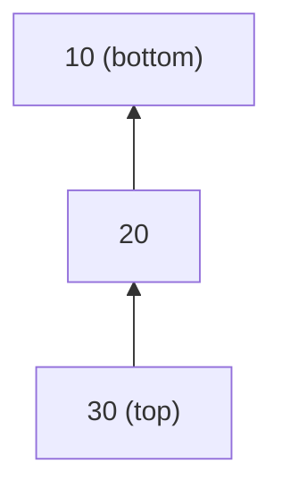
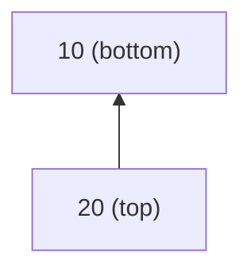
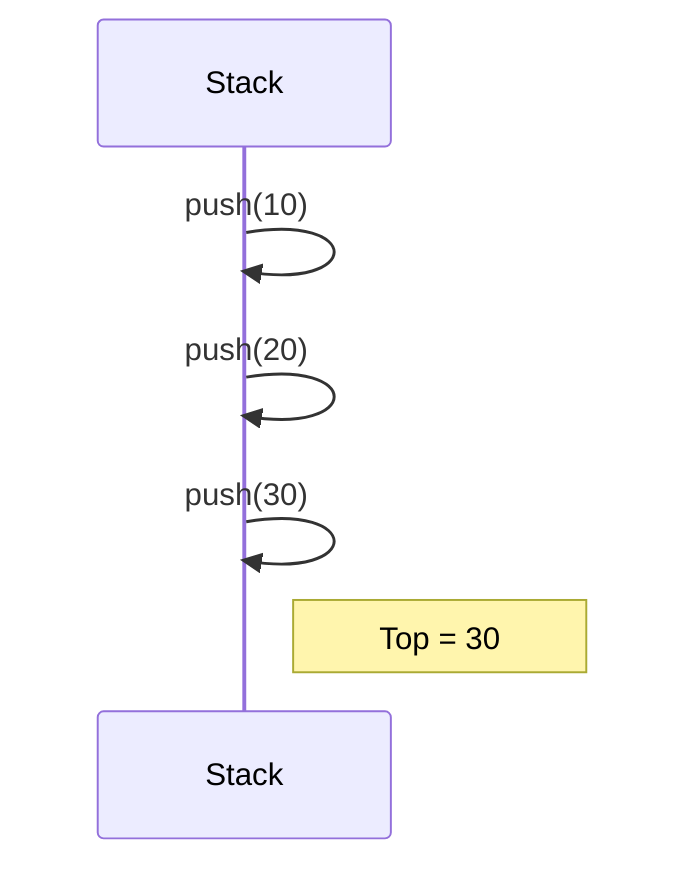
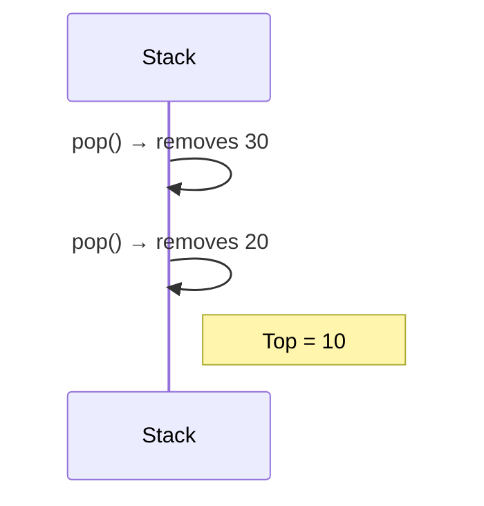

# Stack

## Table of Contents

1. [Introduction](#1-introduction)
2. [Stack Operations](#2-stack-operations)
   - Push
   - Pop
   - Peek (Top)
   - isEmpty
3. [Stack Visual Representation (Mermaid)](#3-stack-visual-representation-mermaid)
4. [Stack Behavior Diagrams](#4-stack-behavior-diagrams)
5. [Applications](#5-applications)

---

## 1. Introduction

A **stack** is a linear data structure that follows the **LIFO (Last In, First Out)** principle.
As in a stack of dinner plates, the most recent item added to the stack is the first item to be removed.

- Elements are inserted and removed from only one end — the **top** of the stack.
- Useful for problems involving **reversal, recursion, expression parsing, and undo features**.

---

## 2. Stack Operations

### Push

Insert an element to top of the stack.
INSERT operation on a stack

1. Check if stack is full (if using array).
2. Increment the top pointer.
3. Place the value `x` at the new top.

```
PUSH(S, x):
    top[S] ← top[S] + 1
    S[top[S]] ← x
```

### Pop

Remove the topmost element.
DELETE operation, which does not take an element argument

1. Check if stack is empty.
2. Retrieve the element at top.
3. Remove top item
4. Decrement the top pointer.

```
POP(S):
    if (STACK-EMPTY(S)){
        error “underflow”
    }
    else {
        top[S] ← top[S]− 1
    }
    return S[top[S] + 1]
```

### Peek (Top)

View the element at the top without removing it.
Return the top element.

1. Check if stack is empty.
2. Return the element at the top index.

when top[S]= 0, the stack contains no elements and is empty.

### isEmpty

Check if the stack has no elements.
Return true if and only if the stack is empty

1. If top is -1 (or NULL for linked list), return true.

```
STACK-EMPTY(S):
    if (top[S]= 0)
        return TRUE
    else
        return FALSE
```

---

## 3. Stack Visual Representation (Mermaid)

### Example: Stack After Pushing 10, 20, 30



### After One Pop()



---

## 4. Stack Behavior Diagrams

### Stack Growth (Push Operations)



### Stack Shrink (Pop Operations)



---

## 5. Applications

| Use Case           | Description                        |
| ------------------ | ---------------------------------- |
| Expression Parsing | Convert infix to postfix/prefix    |
| Function Calls     | Call stack stores return addresses |
| Undo Operations    | Revert changes in text editors     |
| Backtracking       | Maze/recursion state storage       |
| Browser History    | Forward/back navigation            |