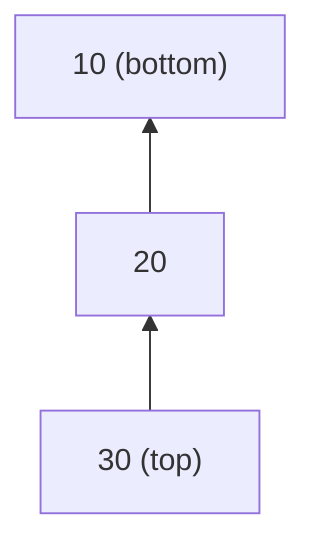
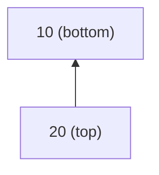
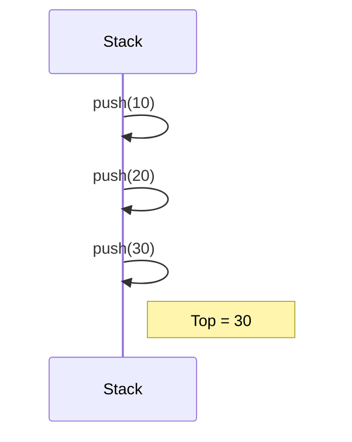
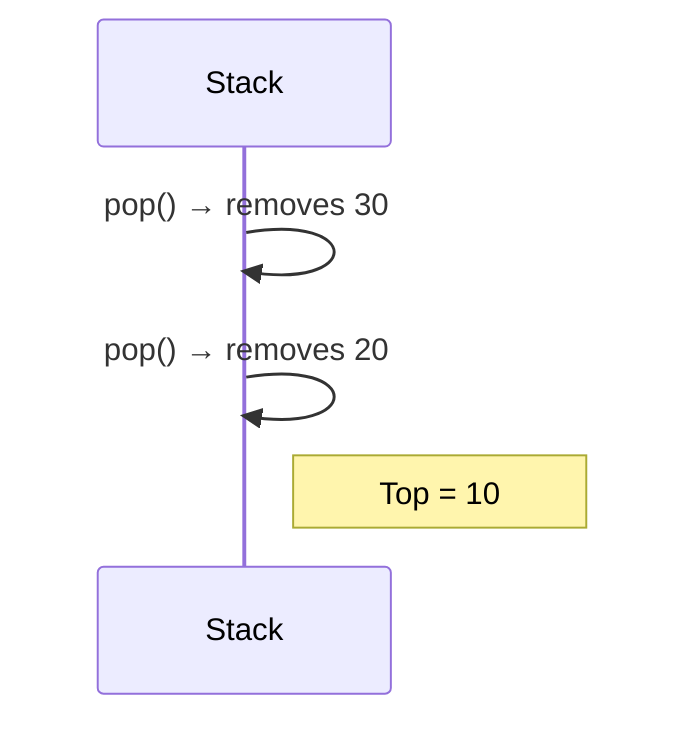

# Stack

## Table of Contents

1. [Introduction](#1-introduction)
2. [Stack Operations](#2-stack-operations)
   - Push
   - Pop
   - Peek (Top)
   - isEmpty
3. [Stack Visual Representation (Mermaid)](#3-stack-visual-representation-mermaid)
4. [Stack Behavior Diagrams](#4-stack-behavior-diagrams)
5. [Applications](#5-applications)

---

## 1. Introduction

A **stack** is a linear data structure that follows the **LIFO (Last In, First Out)** principle.
As in a stack of dinner plates, the most recent item added to the stack is the first item to be removed.

- Elements are inserted and removed from only one end — the **top** of the stack.
- Useful for problems involving **reversal, recursion, expression parsing, and undo features**.

---

## 2. Stack Operations

### Push

Insert an element to top of the stack.
INSERT operation on a stack

1. Check if stack is full (if using array).
2. Increment the top pointer.
3. Place the value `x` at the new top.

```
PUSH(S, x):
    top[S] ← top[S] + 1
    S[top[S]] ← x
```

### Pop

Remove the topmost element.
DELETE operation, which does not take an element argument

1. Check if stack is empty.
2. Retrieve the element at top.
3. Remove top item
4. Decrement the top pointer.

```
POP(S):
    if (STACK-EMPTY(S)){
        error “underflow”
    }
    else {
        top[S] ← top[S]− 1
    }
    return S[top[S] + 1]
```

### Peek (Top)

View the element at the top without removing it.
Return the top element.

1. Check if stack is empty.
2. Return the element at the top index.

when top[S]= 0, the stack contains no elements and is empty.

### isEmpty

Check if the stack has no elements.
Return true if and only if the stack is empty

1. If top is -1 (or NULL for linked list), return true.

```
STACK-EMPTY(S):
    if (top[S]= 0)
        return TRUE
    else
        return FALSE
```

---
---

### Amortized Analysis (Dynamic Stack)

When stack is implemented using dynamic array:

- Push is usually **O(1)**
- But sometimes **O(n)** (when resizing happens)


#### Resizing Logic

When array is full:
```
new_capacity = 2 * old_capacity
```

- Copy all elements → O(n)
- Then insert new element


#### Total Cost Over m Operations

Worst case:
- Some pushes take O(n)
- Most take O(1)

Total cost:
```
T ≤ m + 2m = 3m
```


#### Amortized Cost

```
Amortized push = O(1)
```

Even though individual operation can be O(n),  
**average per operation stays constant**


#### Intuition

Resizing happens rarely:

```
1 + 2 + 4 + 8 + ... + n ≈ 2n
```

Total copying cost is bounded


#### Key Takeaway

- push → O(1) amortized  
- pop → O(1)  
- resizing does NOT affect overall complexity

---

## 3. Stack Visual Representation (Mermaid)

### Example: Stack After Pushing 10, 20, 30


```mermaid
graph BT
    A1["30 (top)"] --> A2["20"] --> A3["10 (bottom)"]
```

### After One Pop()


```mermaid
graph BT
    A1["20 (top)"] --> A2["10 (bottom)"]
```

---

## 4. Stack Behavior Diagrams

### Stack Growth (Push Operations)


```mermaid
sequenceDiagram
    participant Stack
    Stack->>Stack: push(10)
    Stack->>Stack: push(20)
    Stack->>Stack: push(30)
    Note right of Stack: Top = 30
```

### Stack Shrink (Pop Operations)


```mermaid
sequenceDiagram
    participant Stack
    Stack->>Stack: pop() → removes 30
    Stack->>Stack: pop() → removes 20
    Note right of Stack: Top = 10
```

---

### Persistent Stack

A **persistent stack** preserves previous versions after every operation  
(no updates are destructive)


#### Idea

Instead of modifying the stack:
- Create a **new version** on every push/pop
- Old versions remain accessible

Uses **linked structure** (not array)


#### Structure

```
Node {
    value
    next (pointer to previous top)
}
```

Each version is just a pointer to the top node


#### Push

```
new_top = new Node(x)
new_top.next = old_top
```


#### Pop

```
new_top = old_top.next
```


#### Code

```cpp
struct Node {
    int val;
    Node* next;
    Node(int v, Node* n) : val(v), next(n) {}
};

Node* push(Node* top, int x) {
    return new Node(x, top);
}

Node* pop(Node* top) {
    if (!top) return NULL;
    return top->next;
}
```


#### Example

```
version0: empty

version1 = push(version0, 1) → [1]
version2 = push(version1, 2) → [2,1]
version3 = pop(version2)     → [1]

version1 is still intact
version2 is still intact
```


#### Complexity

- push → O(1)
- pop → O(1)
- space → O(n) (new node per operation)


#### Key Insight

- No copying of entire stack
- Only **new nodes are created**
- Old structure is reused (structural sharing)


#### When Used

- Undo/redo systems
- Version control systems
- Functional programming

---

## 5. Applications

| Use Case           | Description                        |
| ------------------ | ---------------------------------- |
| Expression Parsing | Convert infix to postfix/prefix    |
| Function Calls     | Call stack stores return addresses |
| Undo Operations    | Revert changes in text editors     |
| Backtracking       | Maze/recursion state storage       |
| Browser History    | Forward/back navigation            |
