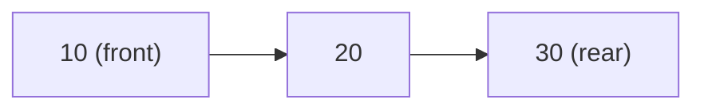
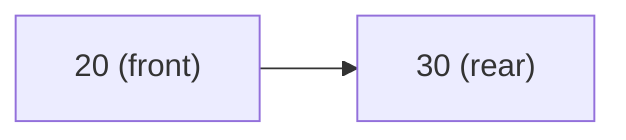
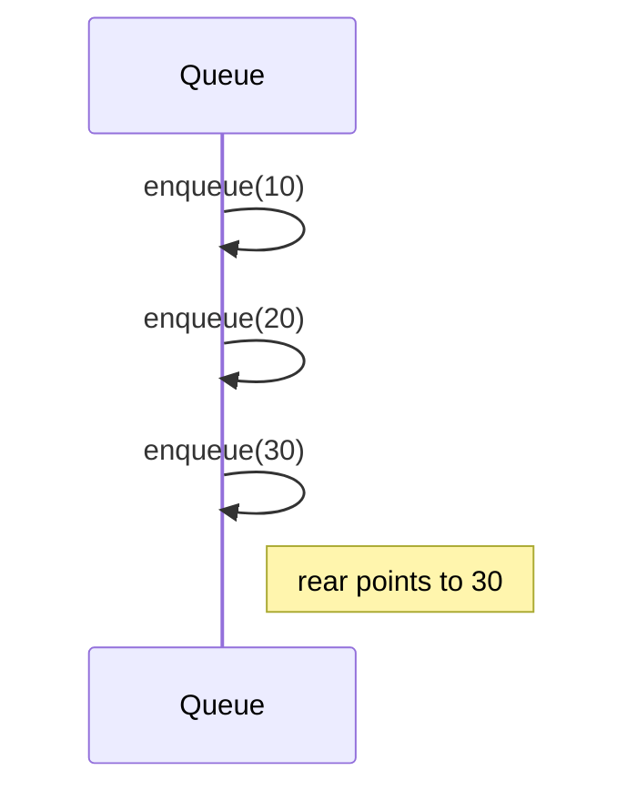
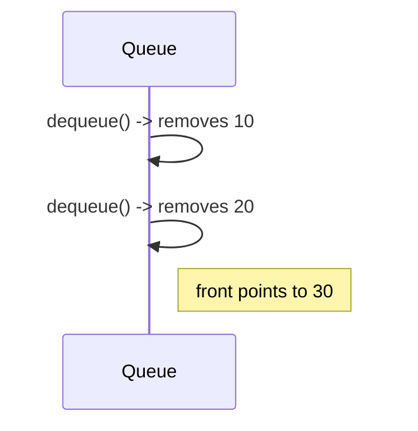
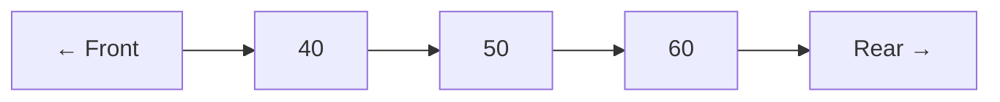
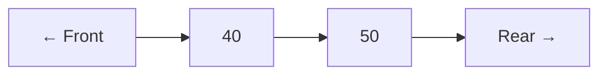
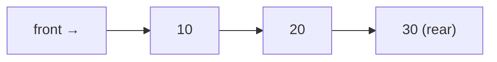
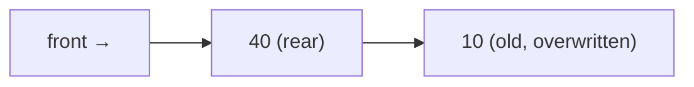
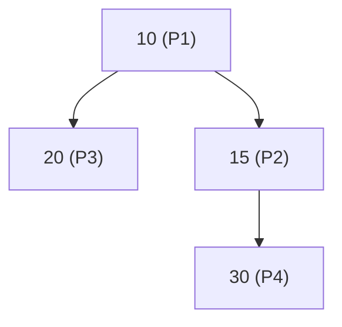

# Queue

## Table of Contents

1. Introduction
2. Queue Operations
   - Enqueue
   - Dequeue
   - Front
   - isEmpty
3. Algorithmic Steps
4. Queue Visual Representation (Mermaid)
5. Queue Behavior Diagrams
6. Applications
7. Variants of Queue

---

## 1. Introduction

A **queue** is a linear data structure that follows the **FIFO (First In, First Out)** principle.

- Elements are inserted at the **rear** and removed from the **front**.
- Think of it like a line at a ticket counter.
- A queue has a head and a tail.

The attribute `head[Q]` indexes (points to) the head. The attribute `tail[Q]` indexes the next location at which a newly arriving element will be inserted into the queue.

---

## 2. Queue Operations

### Enqueue

Insert an element at the rear of the queue (insert at `tail`).

1. Check for overflow (if array-based and full).
2. Increase rear pointer.
3. Place value `x` at the `rear` position.

### Dequeue

Remove an element from the front of the queue (always the element at `head`).

1. Check for underflow (if queue is empty).
2. Return value at `front`.
3. Increment `front` pointer.

### Front (Peek)

Return element at `front` if queue is not empty without removing it.

### isEmpty

Check whether the queue is empty.
Return `true` if `front > rear` or `front == -1` (array-based convention).

---

## 3. Queue Visual Representation (Mermaid)

Example: Queue after `enqueue(10)`, `enqueue(20)`, `enqueue(30)`



After one `dequeue()`:



---

## 5. Queue Behavior Diagrams

### Queue Growth (Enqueue)



**Algorithm:**

```text
ENQUEUE(Q, x)
    Q[tail[Q]] ← x
    if tail[Q] = length[Q]
        then tail[Q] ← 1
    else tail[Q] ← tail[Q] + 1
```

Time complexity: O(1)

### Queue Shrink (Dequeue)



Edge conditions (array-based circular convention):

```text
if (head[Q] = tail[Q]) { the queue is empty }
if (head[Q] = tail[Q] + 1) { the queue is full }
```

**Algorithm**:

```text
DEQUEUE(Q)
    x ← Q[head[Q]]
    if head[Q] = length[Q]
        head[Q] ← 1
    else head[Q] ← head[Q] + 1
    return x
```

Time complexity: O(1)

---

## 6. Applications

| Use Case            | Description                                |
| ------------------- | ------------------------------------------ |
| OS Task Scheduling  | CPU processes scheduled in order           |
| BFS in Graphs       | Queue stores nodes to visit                |
| I/O Buffers         | Handle input/output requests               |
| Printer Spooling     | Queue jobs to be printed                   |
| Call Center Support | First come, first served logic             |

---

## 7. Variants of Queue

| Type            | Description                                             |
| --------------- | ------------------------------------------------------- |
| Circular Queue  | Wraps around on reaching the end of array               |
| Deque           | Insert/Delete at both ends (double-ended queue)         |
| Priority Queue  | Elements dequeued by priority instead of arrival order  |
| Monotonic Queue | Maintains elements in sorted order for sliding windows  |

---

# Deque – Double-Ended Queue (Deque)

## 1. Introduction

A **deque** allows insertion and deletion at both `front` and `rear` ends. It can behave like both a stack and a queue.

Types:

- **Input Restricted Deque** – insertion only at rear.
- **Output Restricted Deque** – deletion only at front.

---

## 2. Core Operations

- `pushFront(x)` – insert at front
- `pushRear(x)` – insert at rear
- `popFront()` – remove from front
- `popRear()` – remove from rear
- `getFront()` – peek front element
- `getRear()` – peek rear element
- `isEmpty()` – check if deque is empty
- `isFull()` – check if deque is full (array-based)

---

## 3. Algorithmic Steps

### pushFront(x)

1. Check overflow.
2. Decrement `front` circularly.
3. Place `x` at `front`.

### pushRear(x)

1. Check overflow.
2. Increment `rear` circularly.
3. Place `x` at `rear`.

### popFront()

1. Check underflow.
2. Increment `front` circularly.

### popRear()

1. Check underflow.
2. Decrement `rear` circularly.

---

## 4. Diagram



After `popRear()`:



---

# Circular Queue – Complete Notes

## 1. Introduction

A **Circular Queue** wraps the last position back to the first when space is available, avoiding wasted slots in array implementations. Use modulo (`% size`) for circular indexing.

---

## 2. Core Operations

- `enqueue(x)`
- `dequeue()`
- `front()`
- `rear()`
- `isEmpty()`
- `isFull()`

---

## 3. Algorithmic Steps

### `enqueue(x)`

1. Check if queue is full: `(rear + 1) % size == front`.
2. If empty: set `front = rear = 0`.
3. Else: `rear = (rear + 1) % size`.
4. Insert `x` at `rear`.

```c
void enqueue(queue *q, int x) {
    if (q->count >= QUEUESIZE) {
        printf("Warning: queue overflow enqueue x=%d\n", x);
    } else {
        q->last = (q->last + 1) % QUEUESIZE;
        q->q[q->last] = x;
        q->count = q->count + 1;
    }
}
```

### `dequeue()`

1. Check if empty.
2. If `front == rear`: only one element -> set `front = rear = -1`
3. Else: `front = (front + 1) % size`

```c
int dequeue(queue *q) {
    int x = -1;
    if (q->count <= 0) {
        printf("Warning: empty queue dequeue.\n");
    } else {
        x = q->q[q->first];
        q->first = (q->first + 1) % QUEUESIZE;
        q->count = q->count - 1;
    }
    return x;
}

int empty(queue *q){
    if (q->count <= 0) return (TRUE);
    else return (FALSE);
}
```

---

## 4. Diagram

### Circular Queue Before Wrap



### After Dequeue 3 Times and Enqueue 40



---

# Priority Queue – Complete Notes

## 1. Introduction

A **Priority Queue** dequeues elements based on priority rather than only arrival order. Higher priority is served first; ties can be broken by arrival order.

---

## 2. Types of Implementations

| Method                | Time Complexity                       |
| --------------------- | ------------------------------------- |
| Array (Unsorted)      | Insert: O(1), DeleteMin: O(n)         |
| Array (Sorted)        | Insert: O(n), DeleteMin: O(1)         |
| Binary Heap (Min/Max) | Insert: O(log n), DeleteMin: O(log n) |

---

## 3. Core Operations

- `insert(x, priority)`
- `getHighestPriority()`
- `deleteHighestPriority()`
- `isEmpty()`

---

## 4. Algorithmic Steps (Using Min-Heap)

### insert(x, priority)

1. Insert at bottom (last index).
2. Heapify up to maintain min-heap property.

### getHighestPriority()

Return the root of the heap.

### deleteHighestPriority()

1. Replace root with last element.
2. Remove last.
3. Heapify down from root.

---

## 5. Diagram – Priority Queue as Min-Heap



Note: Lower number means higher priority.