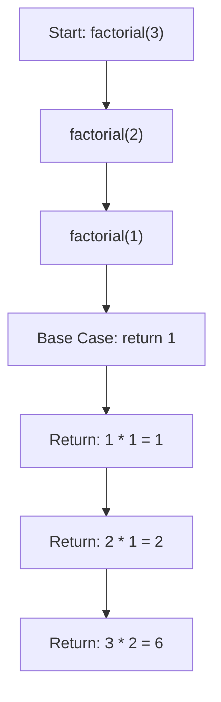
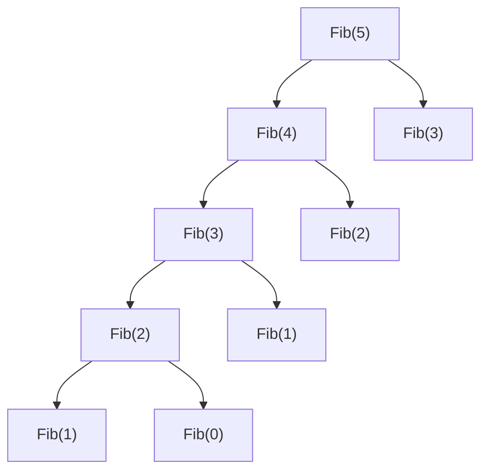

##  1. What is Recursion?

> **Recursion** is a method of solving a problem where a function calls itself.

u solve them by breaking 1 big problem into multiple small problems
then you merge them recursively to get final solution

Reducing one problem X to another problem Y means to write an algorithm
for X that uses an algorithm for Y as a black box or subroutine

powerful kind of reduction:
- if can be solved directly, solve it
- else reduce to more simpler instance of same problem

Every recursive function must have:

- **Base Case** → Stops recursion
- **Recursive Case** → Reduces problem into smaller subproblems

3 approaches:  bottom-up, top-down, and half-and-half.

Bottom Up: like for 1, then for 2, then goes to whole
build the solution for one case off of the previous case

Top Down: divide the problem for case N into subproblems.

Half-Half: like break down into half to solve

recursion is very much space inefficient
each step adds up a new memeory layer of O(n) complexity

hence efficient to implement iteratively

---


## 2. Recursive Flow – Dry Run Diagram



each node gives out 2 child, hence for n node it will be $2^n$ nodes

T (n) = r T (n/c) + f (n).
each node at depth d contains the value f (n/pow(c,d)).

---

## 3. Types of Recursion

| Type                   | Description                                  |
| ---------------------- | -------------------------------------------- |
| **Tail Recursion**     | Recursive call is the last statement         |
| **Head Recursion**     | Recursive call happens before any processing |
| **Tree Recursion**     | Function calls itself multiple times         |
| **Indirect Recursion** | Function A → B → A                           |
| **Nested Recursion**   | Recursive call within a recursive call       |

---

## 4. General Recursive Template

```cpp
returnType func(params) {
    if (base case) return base_value;

    // Processing
    result = func(smaller_input);

    // Combine and return
    return something_using(result);
}
```

---

## 5. Standard Recursive Algorithms

### 1. Factorial (n!)

**Algorithm:**

1. Base case: if n == 0 → return 1
2. Else: return n \* factorial(n - 1)

```
fact(n){
    if(n>1) fact(n-1)*n;
    else return 1;
}
```

---

### 2. Fibonacci(n)

**Algorithm:**

1. Base: 
    if n == 0 return 0
    if n == 1 return 1
2. Else: 
    fib(n - 1) + fib(n - 2)




```
recursion(n){
    if(i==0 || i==1)return 1;
    else recursion(n-1)+recursion(n-2);
}
```

directly shoots down n depth tree
each node has 2 child, so 2n children in total
O(n) linear runtime

use bottom up dynamic programming approach
we already know `fib(1)` and `fib(0)`, hence can easily find `fib(2)`, `fib(3)` etc
```
recursionBottomUp(n){

}
```

it's like a,b

---

### 3. Power (a^b)

**Algorithm:**

1. Base: if b == 0 → return 1
2. Return a \* power(a, b - 1)

**Pingala Algorithm:**

$$
a^n = \begin{cases} 1 & \text{if } n = 0 \\ (a^{n/2})^2 & \text{if } n > 0 \text{ and } n \text{ is even} \\ (a^{\lfloor n/2 \rfloor})^2 \cdot a & \text{otherwise} \end{cases}
$$

```
PingalaPower(a, n):
    if n = 1
        return a
    else
        x ←Pi˙ ngalaPower(a, ⌊n/2⌋)
        if n is even
            return x·x
        else
            return x·x·a
```

T (n) <= T (n/2) + 2.
T (n) = O(log n)

---

### 4. Print Numbers from N to 1

**Algorithm:**

1. Base: if n == 0 return
2. Print n
3. Call function with n - 1

---

### 5. Print 1 to N

**Algorithm:**

1. Base: if n == 0 return
2. Call with n - 1
3. Then print n

---

### 6. Sum of First N Numbers

**Algorithm:**

1. Base: if n == 0 return 0
2. Return n + sum(n - 1)

---

### 7. Reverse an Array

**Algorithm:**

1. Base: if start >= end → return
2. Swap arr\[start], arr\[end]
3. Call reverse(arr, start+1, end-1)

---

### 8. Check Palindrome (String)

**Algorithm:**

1. Base: if left >= right → return true
2. If str\[left] != str\[right] → return false
3. Call with (left+1, right-1)

---

### 9. Binary Search (Recursive)

**Algorithm:**

1. Base: if low > high → not found
2. mid = (low + high)/2
3. If arr\[mid] == key → return mid
4. If key < arr\[mid] → search in left
5. Else → search in right

---

### 10. Permutations (Backtracking + Recursion)

**Algorithm:**

1. If idx == n → store current permutation
2. Loop from idx to n:

   - Swap i with idx
   - Call permute(idx+1)
   - Backtrack: swap again

---

### 11. MergeSort

1. Divide the input array into two subarrays of roughly equal size.
2. Recursively mergesort each of the subarrays.
3. Merge the newly-sorted subarrays into a single sorted array.

merge algo is also recursive:
identify the first element of the output array, and then 
recursively merge the rest of the input arrays.

```
MergeSort(A[1 .. n]):
    if n >1
        m ←⌊n/2⌋
        MergeSort(A[1 .. m]) 〈〈Recurse!〉〉
        MergeSort(A[m + 1 .. n]) 〈〈Recurse!〉〉
        Merge(A[1 .. n], m)

Merge(A[1 .. n], m):
    i ←1; j ←m + 1
    for k ←1 to n
        if j >n
            B[k] ←A[i]; i ←i + 1
        else if i >m
            B[k] ←A[ j]; j ←j + 1
        else if A[i] <A[ j]
            B[k] ←A[i]; i ←i + 1
        else
            B[k] ←A[ j]; j ←j + 1
    
    for k ←1 to n
        A[k] ←B[k]
```

Time: T(n)=T(ceil(n/2))+T(floor(n/2))+O(n)
        T(n)=2T(n/2)+O(n)
        T(n)=O(nlog n)

---

### 12. Quicksort
hard work is to split the array into smaller subarrays before recursion, so that merging the sorted subarrays is trivial.

1. Choose a pivot element from the array.
2. Partition the array into three subarrays containing the elements smaller than the pivot, the pivot element itself, and the elements larger than the pivot.
3. Recursively quicksort the first and last subarrays.

```
QuickSort(A[1 .. n]):
    if (n >1)
        Choose a pivot element A[p]
        r ←Partition(A, p)
        QuickSort(A[1 .. r−1]) 〈〈Recurse!〉〉
        QuickSort(A[r + 1 .. n]) 〈〈Recurse!〉〉

Partition(A[1 .. n], p):
    swap A[p] ↔A[n]
    ℓ←0 〈〈#items <pivot〉〉
    for i ←1 to n−1
        if A[i] <A[n]
            ℓ←ℓ+ 1
            swap A[ℓ] ↔A[i]
    swap A[n] ↔A[ℓ+ 1]
    return ℓ+ 1
```

Time: T (n) = T (r−1) + T (n−r) + O(n)

r=ceil(n/2)
T(n)=T(ceil(n/2)-1)+T(floor(n/2))+O(n)
    <=2T(n/2)+O(n)

T(n)=O(n log n)

since r can go from 1 to n

T(n)=max(T(r-1)+T(n-r)+O(n)) {1<=r<=n}
worst case: r=1 and r=n
 T (n) <=T (n−1) + O(n).

T(n)=O(n^2)


-----

## 6. Tail vs Head Recursion (Comparison)

| Feature        | Head Recursion | Tail Recursion           |
| -------------- | -------------- | ------------------------ |
| Recursive Call | First          | Last                     |
| Stack Usage    | More           | Less (can optimize)      |
| Example        | fib(n), sum(n) | print(n to 1), factorial |

---

## 7. Debugging Tips

- Always write the **base case first**
- Print before & after recursive calls
- Use call stack trace mentally or on paper

---

## 8. Tower of Hanoi
3 tower A,B,C, with n discs of different sizes
now all dics are at tower A, need to move thm to tower C
no disc maybe placed on top of a disc smaller than itself

break into sub problems:
1. Move n− 1 discs from peg A to peg B using peg C as the intermediate peg.
After this recursive step is done, we are left with disc n by itself in peg A.
2. Move disc n from peg A to peg C.
3. Move n− 1 discs from peg B to peg C using peg A as the intermediate peg.
These n− 1 discs will be on top of disc n which is now at the bottom of peg C.

```cpp
#include <cstdio>
using namespace std;
void solve(int count, char source, char destination, char intermediate) {
    if (count == 1)
        printf("Move top disc from pole %c to pole %c\n", source, destination);
    else {
        solve(count-1, source, intermediate, destination);
        solve(1, source, destination, intermediate);
        solve(count-1, intermediate, destination, source);
    }
}

int main() {
    solve(3, ’A’, ’C’, ’B’);
    return 0;
}
```

----
## 9. Substitution Method
1. Guess the form of the solution.
2. Use mathematical induction to find the constants and show that the solution works.

$T(n)=2T(\lfloor(n/2)\rfloor)+n$
T(n)=O(nlog n)

consider: $T (n)=T (\lfloor(n/2)\rfloor) +T (\lceil n/2 \rceil) +1$ ;  T(n)<=cn
$T(n) = T(\lfloor n/2 \rfloor) + T(\lceil n/2 \rceil) + 1$
= cn +1 ,

T(n)=O(n)

**Change Variables**
consider:
$T(n)=2T(\lfloor(n^{1/2})\rfloor)+lg n$
put m=lg n
$T(2^m) = 2T(2^{m/2})+m$
put $S(m)=T(2^m)$
$S(m)=2S(m/2) +m$
$S(m)=O(m lg m)$

$T (n)=T (2^m )=S(m)=O(m lg m)=O(lg n lg lg n)$

## 10. Recursion Tree Method
each node represents the cost of a single subproblem somewhere in the set of recursive function invocations.
sum up each level nodes

consider:
$$
T(n) = 3T(\lfloor n/4 \rfloor) + c n^2
$$

We ignore floors and assume ( n ) is a power of 4 (safe simplification).

**Recursion Tree Analysis**
Height of the Tree

Subproblem size at depth ( i ): $\frac{n}{4^i}$

Base case when: $\frac{n}{4^i} = 1 \Rightarrow i = \log_4 n$

So total levels = $\log_4 n + 1$


**Number of Nodes at Depth ( i )**

Each level triples:

$
3^i
$


**Cost per Node at Depth ( i )**

$
c\left(\frac{n}{4^i}\right)^2
$

**Total Cost at Depth ( i )**

$
3^i \cdot c\left(\frac{n}{4^i}\right)^2
$

$
\left(\frac{3}{16}\right)^i c n^2
$

**Leaf Level Cost**

At depth ( \log_4 n ):

$
3^{\log_4 n} = n^{\log_4 3}
$

Total leaf cost:

$
\Theta(n^{\log_4 3})
$

Since ( \log_4 3 < 1 ),
this is **smaller than ( n^2 )**.

**Total Cost**

Sum over all levels:

$
c n^2 \sum_{i=0}^{\log_4 n -1} \left(\frac{3}{16}\right)^i
$

This is a decreasing geometric series:

$
\sum_{i=0}^{\infty} \left(\frac{3}{16}\right)^i
$

$
 \frac{1}{1 - 3/16}
$
$
\frac{16}{13}
$

So total cost:

$
T(n) = O(n^2)
$

**Why It’s Tight**

* First term already contributes ( $\Omega(n^2)$ )
* So:

$
T(n) = \Theta(n^2)
$

The root dominates the total cost.

---

##  Example 2

### Recurrence:

$
T(n) = T(n/3) + T(2n/3) + cn
$

---

##  Recursion Tree Analysis

###  Cost Per Level

At each level:$cn$

Total work per level remains linear.

---

###  Height of Tree

Longest path:

$
n \to (2/3)n \to (2/3)^2 n \to \dots \to 1
$

Solve:

$
(2/3)^k n = 1
\Rightarrow
k = \log_{3/2} n
$

Height:

$
\Theta(\log n)
$

###  Total Cost

$
\text{(cost per level)} \times \text{(levels)}
cn \cdot \log n
$

$
T(n) = O(n \log n)
$

---

## 11. Master Theorem


The Master Method solves recurrences of the form:

$
T(n) = aT(n/b) + f(n)
$

Where:

* ( a \ge 1 ) = number of subproblems
* ( b > 1 ) = factor by which input shrinks
* ( f(n) ) = cost of divide + combine work
* Assume ( n/b ) means either floor or ceiling (doesn’t affect asymptotics)


Compare:

$
f(n) \quad \text{vs} \quad n^{\log_b a}
$

* ( $n^{\log_b a}$ ) = total work done at leaves
* ( f(n) ) = work done at root level

The **larger function dominates** the solution.


### The Three Cases

Let:

$
d = \log_b a
$


 **Case 1 — Subproblem Work Dominates**

If:

$
f(n) = O(n^{d-\epsilon}) \quad \text{for some } \epsilon > 0
$

(f(n) is polynomially smaller)

Then:

$
T(n) = \Theta(n^d)
$

 Leaves dominate.


**Case 2 — Balanced Case**

If:

$
f(n) = \Theta(n^d)
$

Then:

$
T(n) = \Theta(n^d \log n)
$

 Work evenly distributed across levels.

**Case 3 — Combine Work Dominates**

If:

$
f(n) = \Theta(n^{d+\epsilon}) \quad \text{for some } \epsilon > 0
$

AND regularity condition holds:

$
a f(n/b) \le c f(n) \quad \text{for some } c < 1
$

Then:

$
T(n) = \Theta(f(n))
$

 Root dominates.


### Important Conditions

### 1. Must be polynomial difference

* “Slightly bigger” is NOT enough.
* Must differ by a factor of ( $n^\epsilon$ ).

### 2. Regularity condition (Case 3 only)

Must satisfy:

$
a f(n/b) \le c f(n)
$

This ensures work decreases geometrically.


### Quick Decision Cheat Sheet

1. Compute ( $d = \log_b a$ )
2. Compare ( f(n) ) with ( $n^d$ )
3. Check:

   * Polynomially smaller → Case 1
   * Same order → Case 2
   * Polynomially larger + regularity → Case 3
   * Otherwise → Master theorem not applicable

---

###  Big Picture

| Dominating Term | Result                          |
| --------------- | ------------------------------- |
| Subproblem cost | ( $\Theta(n^{\log_b a})$ )        |
| Equal cost      | ( $\Theta(n^{\log_b a} \log n)$ ) |
| Combine cost    | ( $\Theta(f(n))$ )                |
